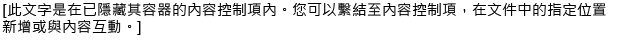
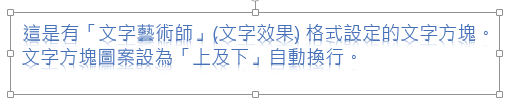
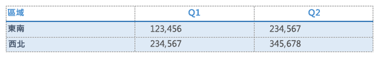
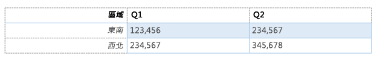
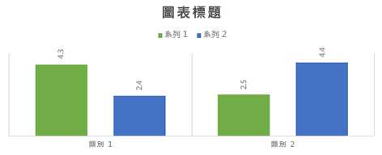
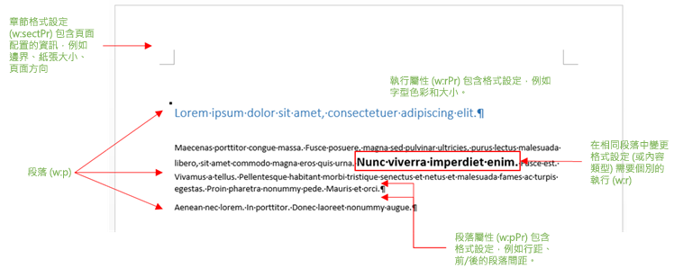
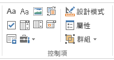

# <a name="create-better-add-ins-for-word-with-office-open-xml"></a>使用 Office Open XML 為 Word 建立更佳的增益集

 **提供者：**Stephanie Krieger，Microsoft Corporation | Juan Balmori Labra，Microsoft Corporation

如果您建置 Office 增益集以在 Word 中執行，您可能已知道 JavaScript API for Office (Office.js) 提供數種格式來讀取及寫入文件內容。這些稱為強制型轉類型，它們包含純文字、表格、HTML 及 Office Open XML。

因此當您要新增豐富內容至文件時，例如影像、格式化表格、圖表或甚至只是格式化文字，您的選擇是什麼？您可以使用 HTML 來插入某些類型的豐富內容，例如圖片。根據您的情況，HTML 強制型轉可能有缺點，例如限制內容可用的格式化和定位選項。由於 Office Open XML 是撰寫 Word 文件 (例如.docx 和.dotx) 的語言，您可以使用使用者可以套用的幾乎任何類型的格式設定，插入使用者可新增至 Word 文件之幾乎任何類型的內容。判斷您需要完成的 Office Open XML 標記比您想像的更容易。

 >**附註**  Office Open XML 也是 PowerPoint 與 Excel (以及 Office 2013、Visio) 文件所使用的語言。不過，目前您只能在針對 Word 建立的 Office 增益集中將內容強制轉型為 Office Open XML。如需有關 Office Open XML 的詳細資訊，包括完整語言參考文件，請參閱[其他資源](../../docs/word/create-better-add-ins-for-word-with-office-open-xml.md#additional-resources)。

若要開始，看看一些您可以使用 Office Open XML 強制型轉插入的內容類型。下載程式碼範例 [Word-Add-in-Load-and-write-Open-XML](https://github.com/OfficeDev/Word-Add-in-Load-and-write-Open-XML)，其中包含將下列任何範例插入 Word 所需的 Office Open XML 標記和 Office.js 程式碼。

 >**備註**  在本文中，字詞**內容類型**和**豐富內容**是指您可以插入 Word 文件的豐富內容類型。


**圖 1.具有直接格式設定的文字。**


您可以使用直接格式設定，準確指定文字的外觀，不論使用者文件中的現有格式。

**圖 2.使用樣式格式化的文字。**


您可以使用樣式來自動調整您插入使用者文件中之文字的外觀。

**圖 3.簡單的影像。**


您可以使用相同的方法來插入任何 Office 支援的影像格式。

**圖 4.使用圖片樣式及效果格式化的影像。**


將高品質格式設定和效果新增至您的影像需要的標記比您預期的還要少。

** 圖 5.內容控制項。**




您可以對您的增益集使用內容控制項，以在指定 (繫結) 的位置新增內容，而不是在選取範圍新增內容。

**圖 6.使用文字藝術師格式設定的文字方塊。**




文字效果可用於 Word 中文字方塊內的文字 (如下所示)，或用於一般本文文字。

**圖 7.圖形。**


您可以插入內建或自訂繪圖圖形，包含或不含文字和格式設定效果。

**圖 8.具有直接格式設定的表格。**




您可以包含文字格式設定、框線、網底、儲存格大小，或您需要的任何表格格式設定。

**圖 9.使用表格樣式格式化的表格。**




您可以使用內建或自訂表格樣式，就像對文字使用段落樣式一樣簡單。

**圖 10.SmartArt 圖表。**


Office 2013 提供各種 SmartArt 圖表版面配置 (您可以使用 Office Open XML 建立您自己的圖表)。

**圖 11.圖表。**




您可以插入 Excel 圖表做為 Word 文件中的即時圖表，這也表示您可以在 Word 的增益集中使用它們。如之前範例所示，您可以使用 Office Open XML 強制型轉來插入基本上是任何類型的內容，使用者可以將該內容插入自己的文件。有兩個簡單的方法可取得您所需要的 Office Open XML 標記。在空白的 Word 2013 文件中加入豐富內容，然後以 Word XML 文件格式儲存檔案，或是搭配使用測試增益集與 [getSelectedDataAsync](http://msdn.microsoft.com/en-us/library/fp142294.aspx) 方法來抓取標記。這兩種方法基本上提供相同的結果。

    
 >**備註**  Office Open XML 文件實際上是檔案的壓縮封裝，代表文件內容。將檔案儲存為 Word XML 文件格式可讓您將整個 Office Open XML 封裝扁平化至一個 XML 檔案，這個檔案也就是當您使用 **getSelectedDataAsync** 擷取 Office Open XML 標記時所取得的檔案。

如果您從 Word 將檔案儲存至 XML 格式，請注意，在 [另存新檔] 對話方塊的 [另存類型] 清單下有 .xml 格式檔案的兩個選項。務必選擇 **Word XML 文件** 而不是 Word 2003 選項。下載名為 [Word-Add-in-Get-Set-EditOpen-XML](https://github.com/OfficeDev/Word-Add-in-Get-Set-EditOpen-XML) 的程式碼範例，您可以做為工具來擷取和測試您的標記。這是它的所有功能？嗯，不完全正確。是的，對於許多案例，您可以使用上述任一方法來使用完整、簡維的 Office Open XML 結果，且其可運作。好消息是，您可能不需要使用該標記的大部分。如果您是第一次看到 Office Open XML 標記的眾多增益集開發人員之一，嘗試理解大量的標記的最簡單內容似乎很困難，但不一定如此。在這個主題中，我們將使用從 Office 增益集開發人員社群中聽到的一些常見案例，告訴您簡化 Office Open XML 以便在增益集中使用的技巧。我們將探討稍早顯示的某些類型的內容之標記，以及最小化 Office Open XML 承載所需要的資訊。也會介紹您將豐富內容插入使用中選取範圍上文件所需要的程式碼，以及如何使用 Office Open XML 與繫結物件來新增或取代指定位置上的內容。

## <a name="exploring-the-office-open-xml-document-package"></a>瀏覽 Office Open XML 文件封裝


當您使用[getSelectedDataAsync](http://msdn.microsoft.com/en-us/library/fp142294.aspx) 以針對內容的選取範圍擷取 Office Open XML (或當您將文件儲存為 Word XML 文件格式時)，您所取得的不只是描述您選取內容的標記；它是整份文件，具有您幾乎完全不需要的許多選項和設定。事實上，如果您從包含工作窗格增益集的文件使用該方法，您取得的標記甚至會包含工作窗格。

即使是簡單的 Word 文件封裝也會包含文件內容、樣式、佈景主題 (格式設定)、Web 設定、字型的組件，以及實際內容以外的一些組件。

例如，假設您想插入具有直接格式設定的文字段落，如先前的「圖 1.」中所示。當您使用 **getSelectedDataAsync** 針對格式化文字取得 Office Open XML 時，您會看到大量的標記。該標記包括代表整個文件的封裝元素，其中包含數個組件 (一般是指文件組件，或者在 Office Open XML 中，是指封裝組件)，如「圖 13.」中所示。每個組件代表封裝中的個別檔案。


 >**提示**  您可以在 [記事本] 之類的文字編輯器中編輯 Office Open XML 標記。如果您在 Visual Studio 2015 中開啟它，您可以使用 [編輯 >進階 >格式文件] (Ctrl+K、Ctrl+D) 以格式化封裝，進行更簡易的編輯。然後您可以摺疊或展開它們的文件組件或區段，如「圖 12.」中所示，以更簡易地檢閱和編輯 Office Open XML 封裝的內容。每個文件組件是以 **pkg:part** 標記開頭。


**圖 12.摺疊及展開封裝組件以在 Visual Studio 2015 中更輕鬆地編輯**


**圖 13.基本 Word Office Open XML 文件封裝中包含的組件**


使用所有這類標記，您可能會驚訝地發現，您插入格式化文字範例所需的元素，實際上只是 .rels 組件和 document.xml 組件的片段。


    
 >**附註**  當您使用 Office Open XML 強制型轉類型時，會假設封裝標記 (版本和 Office 程式識別碼的 XML 宣告) 上有兩行標記，所以您不需要包含它們。如果您想要將編輯的標記開啟為 Word 文件以進行測試，則保留它們。

本主題開頭顯示的幾個其他類型的內容也需要額外的組件 (遠超過「圖 13」所示)，我們會在本主題稍後說明。同時，因為您會在任何 Word 文件封裝的標記中看到「圖 13」中所示的組件，以下是每個組件的目的以及您需要的時機的快速摘要：


- 封裝標記內的第一個組件是 .rels 檔案，可定義封裝 (通常是文件內容、縮圖 (如果有的話)，與主要文件內文) 的最上層組件之間的關係。您的標記中一律需要此組件中的一些內容，因為您必須定義主要文件組件 (您的內容所在的位置) 與文件封裝的關係。
    
- 如果有的話，document.xml.rels 組件會定義 document.xml (主體) 組件所需的其他組件的關係。 
    

    
 >**重要**  在您的封裝中的 .rels 檔案 (例如最上層 .rels、document.xml.rels，和您對於特定類型的內容可能會看到的項目) 是非常重要的工具，可用來做為指引，協助您快速編輯您的 Office Open XML 封裝。若要深入了解如何執行這項操作，請參閱本主題稍後的[建立自己的標記：最佳作法](../../docs/word/create-better-add-ins-for-word-with-office-open-xml.md#creating-your-own-markup-best-practices)。


- document.xml 組件是在文件主體中的內容。您當然需要此組件中的元素，因為這是您的內容出現的位置。但是，您不需要在此組件中看到的所有項目。我們稍後將會詳細探討。
    
- 當使用 Office Open XML 強制型轉將內容插入文件時，許多組件會自動被 Set 方法忽略，所以您可能會將其一併移除。包括 theme1.xml 檔案 (文件的格式設定佈景主題)、文件內容組件 (核心、增益集和縮圖)，以及設定檔案 (包括設定、webSettings 及 fontTable)。
    
- 在「圖 1」範例中，文字格式設定是直接套用 (也就是每個字型及段落格式設定會分別套用)。但是，如果您使用如先前「圖 2」所示的樣式 (例如，如果您想要讓文字自動採用目的文件的 [標題 1] 樣式的格式設定)，則需要 styles.xml 組件部分以及其關係定義。如需詳細資訊，請參閱主題章節＜[新增使用其他 Office Open XML 組件的物件](../../docs/word/create-better-add-ins-for-word-with-office-open-xml.md#adding-objects-that-use-additional-office-open-xml-parts)＞。
    

## <a name="inserting-document-content-at-the-selection"></a>在選取範圍插入文件內容


讓我們看看對於「圖 1」中所示的格式化文字範例所需的最小 Office Open XML 標記，和在文件中的作用選取範圍插入它所需的 JavaScript。


### <a name="simplified-office-open-xml-markup"></a>簡化的 Office Open XML 標記

我們已編輯如下所示的 Office Open XML 範例，如先前的章節所述，只留下必要的文件組件和每個組件內的必要元素。我們會在主題的下一節中逐步解說如何自行編輯標記 (以及多加說明其餘的片段)。


```XML
<pkg:package xmlns:pkg="http://schemas.microsoft.com/office/2006/xmlPackage">
  <pkg:part pkg:name="/_rels/.rels" pkg:contentType="application/vnd.openxmlformats-package.relationships+xml" pkg:padding="512">
    <pkg:xmlData>
      <Relationships xmlns="http://schemas.openxmlformats.org/package/2006/relationships">
        <Relationship Id="rId1" Type="http://schemas.openxmlformats.org/officeDocument/2006/relationships/officeDocument" Target="word/document.xml"/>
      </Relationships>
    </pkg:xmlData>
  </pkg:part>
  <pkg:part pkg:name="/word/document.xml" pkg:contentType="application/vnd.openxmlformats-officedocument.wordprocessingml.document.main+xml">
    <pkg:xmlData>
      <w:document xmlns:w="http://schemas.openxmlformats.org/wordprocessingml/2006/main" >
        <w:body>
          <w:p>
            <w:pPr>
              <w:spacing w:before="360" w:after="0" w:line="480" w:lineRule="auto"/>
              <w:rPr>
                <w:color w:val="70AD47" w:themeColor="accent6"/>
                <w:sz w:val="28"/>
              </w:rPr>
            </w:pPr>
            <w:r>
              <w:rPr>
                <w:color w:val="70AD47" w:themeColor="accent6"/>
                <w:sz w:val="28"/>
              </w:rPr>
              <w:t>This text has formatting directly applied to achieve its font size, color, line spacing, and paragraph spacing.</w:t>
            </w:r>
          </w:p>
        </w:body>
      </w:document>
    </pkg:xmlData>
  </pkg:part>
</pkg:package>
```


 >**附註**  如果您將這裡顯示的標記以及檔案頂端的版本和 mso-application 的 XML 宣告標記 (如「圖 13」所示) 新增至 XML 檔案，您可以在 Word 中將其開啟為 Word 文件。或者，不使用這些標記，您仍然可以使用 Word 中的 [檔案 > 開啟] 開啟。您會在 Word 2013 的標題列上看到 [相容模式]，因為您已移除設定，該設定會告知 Word 這是 2013 文件。因為您是將此標記新增至現有 Word 2013 文件，所以完全不會影響您的內容。


### <a name="javascript-for-using-setselecteddataasync"></a>用於使用 setSelectedDataAsync 的 JavaScript


一旦您將前述的 Office Open XML 儲存為可以從您的解決方案存取的 XML 檔案，您可以使用下列函數，使用 Office Open XML 強制型轉在文件中設定格式化文字內容。 

在此函數中，請注意最後一行以外的所有項目是用來取得您的已儲存標記以用於函數結尾的 [setSelectedDataAsync](http://msdn.microsoft.com/en-us/library/fp142145.aspx) 方法呼叫。**setSelectedDataASync** 只需要您指定要插入的內容和強制型轉類型。


 >**附註**  以您儲存在解決方案中的 XML 檔案的名稱和路徑取代 _yourXMLfilename_。如果您不確定要在解決方案的哪個位置包含 XML 檔案，或如何在程式碼中參考它們，請參閱 [Word-Add-in-Load-and-write-Open-XML](https://github.com/OfficeDev/Word-Add-in-Load-and-write-Open-XML) 程式碼範例，以取得範例和如下所示的標記與 JavaScript 的工作範例。


```js
function writeContent() {
    var myOOXMLRequest = new XMLHttpRequest();
    var myXML;
    myOOXMLRequest.open('GET', 'yourXMLfilename', false);
    myOOXMLRequest.send();
    if (myOOXMLRequest.status === 200) {
        myXML = myOOXMLRequest.responseText;
    }
    Office.context.document.setSelectedDataAsync(myXML, { coercionType: 'ooxml' });
}
```


## <a name="creating-your-own-markup:-best-practices"></a>建立自己的標記：最佳作法


讓我們更進一步來看看您插入先前格式化文字範例所需的標記。

對於這個範例，只要從刪除封裝中 .rels 及 document.xml 以外的所有文件組件開始。然後，我們要編輯這兩個必要的組件以更進一步簡化。


 >**重要**  使用 .rels 組件做為對應，快速量測封裝中包含的內容，並判斷您可以完全刪除哪些組件 (也就是，與您的內容不相關或不被其參考的任何組件)。請記住，每個文件組件必須在封裝中定義關係，且這些關係出現在 .rels 檔案。因此您應該會看到所有項目列在 .rels、document.xml.rels 或特定內容 .rels 檔案中。

下列標記顯示編輯之前需要的 .rels 組件。由於我們要刪除增益集和核心文件內容組件和縮圖組件，我們也必須從 .rels 刪除這些關係。請注意，這只會保留 document.xml 的關係 (在下列範例中關係識別碼為 "rID1")。


```XML
  <pkg:part pkg:name="/_rels/.rels" pkg:contentType="application/vnd.openxmlformats-package.relationships+xml" pkg:padding="512">
    <pkg:xmlData>
      <Relationships xmlns="http://schemas.openxmlformats.org/package/2006/relationships">
        <Relationship Id="rId3" Type="http://schemas.openxmlformats.org/package/2006/relationships/metadata/core-properties" Target="docProps/core.xml"/>
        <Relationship Id="rId2" Type="http://schemas.openxmlformats.org/package/2006/relationships/metadata/thumbnail" Target="docProps/thumbnail.emf"/>
        <Relationship Id="rId1" Type="http://schemas.openxmlformats.org/officeDocument/2006/relationships/officeDocument" Target="word/document.xml"/>
        <Relationship Id="rId4" Type="http://schemas.openxmlformats.org/officeDocument/2006/relationships/extended-properties" Target="docProps/app.xml"/>
      </Relationships>
    </pkg:xmlData>
  </pkg:part>
```


 >**重要**  針對您從封裝完全移除的任何組件，移除關係 (也就是 **Relationship** 標記)。包含沒有對應關係的組件，或排除組件並且在封裝中保留其關係，將導致錯誤。

下列標記顯示 document.xml 組件，其中包含編輯之前我們的範例格式化文字內容。


```XML
<pkg:part pkg:name="/word/document.xml" pkg:contentType="application/vnd.openxmlformats-officedocument.wordprocessingml.document.main+xml">
    <pkg:xmlData>
      <w:document mc:Ignorable="w14 w15 wp14" xmlns:wpc="http://schemas.microsoft.com/office/word/2010/wordprocessingCanvas" xmlns:mc="http://schemas.openxmlformats.org/markup-compatibility/2006" xmlns:o="urn:schemas-microsoft-com:office:office" xmlns:r="http://schemas.openxmlformats.org/officeDocument/2006/relationships" xmlns:m="http://schemas.openxmlformats.org/officeDocument/2006/math" xmlns:v="urn:schemas-microsoft-com:vml" xmlns:wp14="http://schemas.microsoft.com/office/word/2010/wordprocessingDrawing" xmlns:wp="http://schemas.openxmlformats.org/drawingml/2006/wordprocessingDrawing" xmlns:w10="urn:schemas-microsoft-com:office:word" xmlns:w="http://schemas.openxmlformats.org/wordprocessingml/2006/main" xmlns:w14="http://schemas.microsoft.com/office/word/2010/wordml" xmlns:w15="http://schemas.microsoft.com/office/word/2012/wordml" xmlns:wpg="http://schemas.microsoft.com/office/word/2010/wordprocessingGroup" xmlns:wpi="http://schemas.microsoft.com/office/word/2010/wordprocessingInk" xmlns:wne="http://schemas.microsoft.com/office/word/2006/wordml" xmlns:wps="http://schemas.microsoft.com/office/word/2010/wordprocessingShape">
        <w:body>
          <w:p>
            <w:pPr>
              <w:spacing w:before="360" w:after="0" w:line="480" w:lineRule="auto"/>
              <w:rPr>
                <w:color w:val="70AD47" w:themeColor="accent6"/>
                <w:sz w:val="28"/>
              </w:rPr>
            </w:pPr>
            <w:r>
              <w:rPr>
                <w:color w:val="70AD47" w:themeColor="accent6"/>
                <w:sz w:val="28"/>
              </w:rPr>
              <w:t>This text has formatting directly applied to achieve its font size, color, line spacing, and paragraph spacing.</w:t>
            </w:r>
            <w:bookmarkStart w:id="0" w:name="_GoBack"/>
            <w:bookmarkEnd w:id="0"/>
          </w:p>
          <w:p/>
          <w:sectPr>
            <w:pgSz w:w="12240" w:h="15840"/>
            <w:pgMar w:top="1440" w:right="1440" w:bottom="1440" w:left="1440" w:header="720" w:footer="720" w:gutter="0"/>
            <w:cols w:space="720"/>
          </w:sectPr>
        </w:body>
      </w:document>
    </pkg:xmlData>
  </pkg:part>
```

由於 document.xml 是主要文件組件，您在其中放置您的內容，讓我們快速逐一檢查該組件。(圖 14，遵循這份清單，提供視覺化的參照以顯示這裡說明的部分核心內容和格式化標記如何與您在 Word 文件中看到的項目相關聯)。 


- 開頭的 **w:document** 標記包含數個命名空間 (**xmlns**) 清單。許多此類命名空間是指特定類型的內容，您只有在它們與您的內容相關時才需要它們。
    
    請注意，在整個文件部分的標記前置詞是參照命名空間。在這個範例中，在 document.xml 組件標記中唯一使用的前置詞是 **w:**，因此開頭 **w:document** 標記中唯一需要保留的命名空間是 **xmlns:w**。
    

 >**提示**  如果您正在 Visual Studio 2015 中編輯標記，在您於任何組件中刪除命名空間之後，尋找該組件的所有標記。如果您已經移除標記所需的命名空間，您會在受影響標記的相關前置詞上看到紅色彎曲底線。如果您移除 **xmlns:mc** 命名空間，您也必須移除命名空間清單前面的 **mc:Ignorable** 屬性。


- 在開頭本文標記內，您會看到段落標記 (**w:p**)，其中包括此範例的範例內容。
    
- **w:pPr** 標記包含直接套用段落格式設定的屬性，例如段落前後的空間、段落對齊或縮排。(直接格式設定是指您個別套用至內容而套用為樣式組件的屬性。) 此標記也包括直接字型格式設定，該設定套用至巢狀 **w:rPr** (執行屬性) 標記中的整個段落，其中包含我們的範例中設定的字型色彩和大小。
    

 >**附註**  您可能會注意到 Word Office Open XML 標記中的字型大小及其他一些格式設定，看起來像是它們實際放大兩倍。這是因為段落與行列間距，以及先前標記中顯示的一些區段格式屬性，如 Twip 中指定 (1/20 個點)。根據您在 Office Open XML 中使用的內容類型，您可能會看到其他幾個度量單位，包括英制度量單位 (914,400 EMU 至英吋)，其使用於某些 Office Art (drawingML) 值和 100,000 倍實際值 (用於 drawingML 和 PowerPoint 標記)。PowerPoint 也將某些實際值表示為 100 倍，Excel 通常會使用實際值。


- 段落中具有類似屬性的任何內容都會包含在執行中 (**w:r**)，例如範例文字的案例。每當格式設定或內容類型中有變更，就會啟動新的執行。(也就是，如果範例文字中只有一個字是粗體，它會分隔到自己的執行。) 在此範例中，內容只包含一個文字執行。
    
    請注意，因為此範例中包含的格式設定是字型格式設定 (亦即，可套用至小到一個字元的格式設定)，所以它也會出現在個別執行的屬性。 
    
- 另請注意隱藏 "_GoBack" 書籤 (**w:bookmarkStart** 和 **w:bookmarkEnd**) 的標記，依預設會在 Word 2013 文件中出現。您可以隨時從您的標記刪除 GoBack 書籤的開始和結束標記。
    
- 文件本文的最後一項是 **w:sectPr** 標記或區段屬性。此標記包含邊界和頁面方向等設定。您使用 **setSelectedDataAsync** 插入的內容預設需要目的文件中的作用中區段屬性。因此，除非您的內容包含分節符號 (在此情況下您會看到多個 **w:sectPr** 標記)，您可以刪除此標記。
    

**圖 14.document.xml 中的常見標記如何與 Word 文件的內容和版面配置相關聯。**


    
**提示：**在您所建立的標記中，您可能會在數個標記中看到包括 **w:rsid** 的其他屬性，而在本主題使用的範例中看不到。這些是修訂版識別碼。它們使用於合併文件的 Word 功能中，而且預設會開啟。您在使用增益集插入的標記中永遠不會用到它們，且關閉它們可得到更簡潔的標記。您可以輕易地移除現有的 RSID 標記或停用功能 (如下列程序所述)，讓它們不會加入至新內容的標記。
 
請注意，如果您在 Word 中使用共同撰寫功能 (例如同時與其他人編輯文件的能力)，當完成產生您的增益集的標記時，您應該再次啟用此功能。
   
若要在 Word 中針對您建立的文件關閉 RSID 屬性，請執行下列動作： 

1. 在 Word 2013 中選擇 [**檔案**] ，然後選擇 [**選項**]。
2. 在 [**Word 選項**] 對話方塊中選擇 [**信任中心**]，然後選擇 [信任中心設定]。
3. 在 [**信任中心**] 對話方塊中選擇 [**隱私權選項**]，然後停用設定 [儲存亂數以改善合併的正確性]。

若要從現有的文件移除 RSID 標記，請在 Office Open XML 中開啟文件以嘗試下列捷徑︰


1. 在文件主體中使用插入點，按 **Ctrl+Home** 以移至文件頂端。
2. 在鍵盤上，按**空白鍵**、**Delete** 鍵、**空白鍵**。然後，儲存文件。

從此封裝中移除大部分的標記之後，我們留下插入範例所需的最少標記，如前一節中所示。


## <a name="using-the-same-office-open-xml-structure-for-different-content-types"></a>針對不同的內容類型使用同一個 Office Open XML 結構


豐富內容的數個類型只需要先前範例所示的 .rels 和 document.xml 元件，包括內容控制項、Office 繪圖圖形和文字方塊以及表格 (除非樣式套用至表格)。事實上，您可以重複使用相同的已編輯封裝組件，只是針對內容標記更換 document.xml 中的 **body** 內容。

若要針對先前在圖 5 至 8 所示的每個內容類型範例，取出 Office Open XML 標記，請探索[概觀](https://github.com/OfficeDev/Word-Add-in-Load-and-write-Open-XML)一節中參考的 [Word-Add-in-Load-and-write-Open-XML](../../docs/word/create-better-add-ins-for-word-with-office-open-xml.md#bk_Overview) 程式碼範例。

在繼續之前，讓我們看看這些內容類型的一些要注意的差異，以及如何換成您需要的部分。


### <a name="understanding-drawingml-markup-(office-graphics)-in-word:-what-are-fallbacks?"></a>了解 Word 中的 drawingML 標記 (Office 圖形)：後援為何？

如果圖案或文字方塊方塊的標記看起來遠比預期的更複雜，這是有原因的。在 Office 2007 版中，我們看到 Office Open XML 格式的引進，以及 PowerPoint 和 Excel 完全採用的新 Office 圖形引擎的引進。在 2007 版本中，Word 只包含該圖形引擎的一部分，採用已更新的 Excel 圖表引擎、SmartArt 圖形和進階的圖片工具。對於圖案和文字方塊，Word 2007 繼續使用舊版的繪圖物件 (VML)。在 2010 版本中，Word 對圖形引擎採取其他步驟，以包含更新的圖形和繪圖工具

因此，以 Word 2007 開啟時，若要支援 Office Open XML 格式的圖形和文字方塊，圖形 (包括文字方塊) 需要後援 VML 標記。

一般而言，如同您在 [Word-Add-in-Load-and-write-Open-XML](https://github.com/OfficeDev/Word-Add-in-Load-and-write-Open-XML) 程式碼範例中看到的圖形和文字方塊範例，後援標記是可以被移除的。在儲存文件時，Word 2013 會自動將遺失的後援標記新增至圖形。不過，如果您偏好保留後援標記，以確保對所有使用者案例的支援，這麼做並不會造成任何損害。

如果您已經群組內容中包含的繪圖物件，您會看到其他 (看似重複) 標記，但是這必須保留。當物件包含在群組中時，會複製繪製圖形的標記部分。


 >**重要**  當使用文字方塊與繪製圖形時，務必在從 document.xml 移除之前，先仔細檢查命名空間。(或者，如果您要從另一個物件類型重複使用標記，請務必將您先前可能已從 document.xml 移除的任何必要命名空間新增回來)。預設包含在 document.xml 的大部分命名空間是繪圖物件的必要項目。


#### <a name="about-graphic-positioning"></a>關於圖形位置

在程式碼範例 [Word-Add-in-Load-and-write-Open-XML](https://github.com/OfficeDev/Word-Add-in-Load-and-write-Open-XML) 和 [Word-Add-in-Get-Set-EditOpen-XML](https://github.com/OfficeDev/Word-Add-in-Get-Set-EditOpen-XML) 中，文字方塊和圖形使用不同類型的文字換行及位置設定。(另請注意這些程式碼範例中的影像範例是使用文字格式設定，將圖形物件放在文字基線上。)

這些程式碼範例中的圖形的位置與頁面的右邊和下方邊界相對。相對位置可讓您更輕鬆地協調使用者未知的文件設定，因為它會調整至使用者的邊界，並且讓因為紙張大小、方向或邊界設定而造成外觀怪異的風險較小。若要在您插入圖形物件時保留相對位置設定，您必須保留段落標記 (w:p)，在該處儲存位置 (在 Word 中稱為錨點)。如果您將內容插入現有段落標記而非納入您自己的標記，您可以保留相同的初始視覺，但是讓位置可以自動調整至使用者的版面配置的許多類型的相對參照可能會遺失。


### <a name="working-with-content-controls"></a>使用內容控制項

內容控制項是 Word 2013 中的一項重要功能，可以用多種方式大幅提高 Word 中您的增益集的能力，包括讓您能夠在文件的指定位置插入內容而不只是在選取範圍。

在 Word 中，在功能區的 [開發人員] 索引標籤上尋找內容控制項，如「圖 15」中所示。


**圖 15.在 Word 中的 [開發人員] 索引標籤上的 [控制項] 群組。**



Word 中的內容控制項類型包含 RTF 文字、純文字、圖片、建置組塊庫、核取方塊、下拉式清單、下拉式方塊、日期選擇器和重複區段。 


- 使用 [屬性] 命令，如「圖 15」所示，以編輯控制項的標題及設定如隱藏控制項容器的喜好設定。
    
- 啟用 [設計模式] 以在控制項中編輯預留位置內容。
    
如果您的增益集是與 Word 範本搭配使用，您可以在該範本納入控制項以增強內容的行為。您也可以在 Word 文件中使用 XML 資料繫結以將內容控制項繫結至資料，例如文件屬性，以輕易完成表單或類似工作。(在 [快速組件] 底下的 [插入] 索引標籤上尋找已繫結至 Word 中內建文件屬性的控制項。)

當您搭配使用內容控制項與您的增益集時，您也會使用不同類型的繫結，大幅擴展您的增益集可以執行的選項。您可以繫結至增益集內的內容控制項，然後將內容寫入繫結而非作用選取範圍。


    
 >**附註**  請勿混淆 Word 中的 XML 資料繫結與透過您的增益集繫結至控制項的能力。這些是完全不同的功能。不過，您可以透過您的增益集，使用 OOXML 強制型轉在您插入的內容中包含具名內容控制項，然後在增益集中使用程式碼以繫結至這些控制項。

同時請注意 XML 資料繫結和 Office.js 可以與您的應用程式中的自訂 XML 組件互動，因此可以整合這些功能強大的工具。若要了解如何使用 Office JavaScript API 中的自訂 XML 組件，請參閱本主題的[其他資源 ](../../docs/word/create-better-add-ins-for-word-with-office-open-xml.md#additional-resources)一節。

在您的 Word 增益集中使用繫結涵蓋於本主題的下一節。首先，我們來看看您可以使用您的增益集繫結之 RTF 文字內容控制項所需的 Office Open XML 範例。


    
 >**重要**  RTF 文字控制項是您可以用來繫結至增益集內內容控制項的唯一類型內容控制項。


```XML
<pkg:package xmlns:pkg="http://schemas.microsoft.com/office/2006/xmlPackage">
  <pkg:part pkg:name="/_rels/.rels" pkg:contentType="application/vnd.openxmlformats-package.relationships+xml" pkg:padding="512">
    <pkg:xmlData>
      <Relationships xmlns="http://schemas.openxmlformats.org/package/2006/relationships">
        <Relationship Id="rId1" Type="http://schemas.openxmlformats.org/officeDocument/2006/relationships/officeDocument" Target="word/document.xml"/>
      </Relationships>
    </pkg:xmlData>
  </pkg:part>
  <pkg:part pkg:name="/word/document.xml" pkg:contentType="application/vnd.openxmlformats-officedocument.wordprocessingml.document.main+xml">
    <pkg:xmlData>
      <w:document xmlns:w="http://schemas.openxmlformats.org/wordprocessingml/2006/main" xmlns:w15="http://schemas.microsoft.com/office/word/2012/wordml" >
        <w:body>
          <w:p/>
          <w:sdt>
              <w:sdtPr>
                <w:alias w:val="MyContentControlTitle"/>
                <w:id w:val="1382295294"/>
                <w15:appearance w15:val="hidden"/>
                <w:showingPlcHdr/>
              </w:sdtPr>
              <w:sdtContent>
                <w:p>
                  <w:r>
                  <w:t>[This text is inside a content control that has its container hidden. You can bind to a content control to add or interact with content at a specified location in the document.]</w:t>
                </w:r>
                </w:p>
              </w:sdtContent>
            </w:sdt>
          </w:body>
      </w:document>
    </pkg:xmlData>
  </pkg:part>
 </pkg:package>
```

如先前所述，內容控制項 (像是格式化文字) 不需要其他文件組件，因此只會包含 .rels 和 document.xml 組件的已編輯版本。 

您在 document.xml 本文內看到的 **w:sdt** 標記代表內容控制項。如果您針對內容控制項產生 Office Open XML 標記，您會看到已從這個範例移除的數個屬性，包括標記和文件組件屬性。只會保留基本 (與幾個最佳作法) 元素，包括下列項目：


- **alias** 是 Word 中 [內容控制項屬性] 對話方塊的標題屬性。如果您計劃要繫結至增益集內的控制項，則這是必要屬性 (代表項目的名稱)。
    
- 唯一的 **id** 是必要屬性。如果您繫結至增益集內的控制項，識別碼是在文件中用來識別可用具名內容控制項的屬性。
    
- **appearance** 屬性是用來隱藏控制項容器，讓外觀簡潔。這是 Word 2013 中的新功能，如同使用 w15 命名空間時所見。因為已使用這個屬性，所以會在 document.xml 組件的開頭保留 w15 命名空間。
    
- **showingPlcHdr** 屬性是選用設定，它會將您在控制項 (此範例為文字) 內包含的預設內容設定為預留文字內容。因此，如果使用者按一下或點選控制區域，則會選取整個內容，而不是類似使用者可在其中進行變更的可編輯內容的行為。
    
- 雖然新增內容控制項時 **sdt** 標記前面的空白段落標記 (**w:p/**) 不是必要項目 (並且會在 Word 文件的控制項上新增垂直空間)，但是它可確保控制項置於它自己的段落。依據控制項中新增的內容類型和格式設定，這可能相當重要。
    
- 如果您想要繫結至控制項，控制項的預設內容 (**sdtContent** 標記內的項目) 必須包含至少一個完整的段落 (如本範例所示)，讓您的繫結接受多個段落豐富內容。
    

    
 >**附註** 從這個範例  **w:sdt** 標記移除的文件組件屬性可能會出現在內容控制項中，以參考封裝中的個別組件，可以在該封裝中儲存預留位置內容資訊 (位於 Office Open XML 封裝之詞彙目錄中的組件)。雖然文件組件是用於 Office Open XML 封裝內 XML 組件 (也就是檔案) 的字詞，sdt 屬性中使用的字詞文件組件是指 Word 中用來描述部分內容類型的相同字詞，這些內容類型包括建置組塊和文件屬性快速組件 (例如，內建 XML 資料繫結控制項)。如果您在 Office Open XML 封裝的詞彙目錄底下看到組件，當您插入的內容包含這些功能時，您可能需要保留它們。對於您要用來繫結至增益集項目的典型內容控制項，它們不是必要項目。請記住，如果您確實從封裝刪除詞彙組件，您也必須從 w:sdt 標記移除文件組件屬性。

下一節將討論如何在您的 Word 增益集中建立和使用繫結。


## <a name="inserting-content-at-a-designated-location"></a>在指定的位置插入內容


我們剛才看到如何在 Word 文件中的作用選取範圍插入內容。如果您繫結至文件中的具名內容控制項，您可以將相同內容類型的任何項目插入該控制項。 

因此您何時可能想要使用此方法？


- 當您需要在範本中的指定位置新增或取代內容時，例如從資料庫填入文件的部分
    
- 當您想要選擇取代在作用選取範圍插入的內容時，例如提供設計元素選項給使用者
    
- 當您想要讓使用者在您可以存取以使用增益集的文件中新增資料時，例如根據使用者在文件中新增的資訊，在工作窗格中填入欄位
    
下載程式碼範例 [Word-Add-in-JavaScript-AddPopulateBindings](https://github.com/OfficeDev/Word-Add-in-JavaScript-AddPopulateBindings)，該範例提供如何插入並繫結至內容控制項，以及如何填入繫結的工作範例。


### <a name="add-and-bind-to-a-named-content-control"></a>新增並繫結至具名內容控制項


檢查後續的 JavaScript 時，請考慮這些需求：


- 如先前所述，您必須使用 RTF 文字內容控制項以繫結至 Word 增益集的控制項。
    
- 內容控制項必須有名稱 (這是 [內容控制項屬性] 對話方塊中的 [標題] 欄位，對應至 Office Open XML 標記中的 **Alias** 標記)。這是程式碼識別放置繫結位置的方式。
    
- 您可以有數個具名控制項，並且視需要繫結。使用唯一的內容控制項名稱、唯一的內容控制項識別碼和唯一的繫結識別碼。
    

```js
function addAndBindControl() {
        Office.context.document.bindings.addFromNamedItemAsync("MyContentControlTitle", "text", { id: 'myBinding' }, function (result) {
            if (result.status == "failed") {
                if (result.error.message == "The named item does not exist.")
                    var myOOXMLRequest = new XMLHttpRequest();
                    var myXML;
                    myOOXMLRequest.open('GET', '../../Snippets_BindAndPopulate/ContentControl.xml', false);
                    myOOXMLRequest.send();
                    if (myOOXMLRequest.status === 200) {
                        myXML = myOOXMLRequest.responseText;
                    }
                    Office.context.document.setSelectedDataAsync(myXML, { coercionType: 'ooxml' }, function (result) {
                        Office.context.document.bindings.addFromNamedItemAsync("MyContentControlTitle", "text", { id: 'myBinding' });
                    });
            }
            });
        }
```

此處所示的程式碼會採用下列步驟：


- 嘗試使用 [addFromNamedItemAsync](http://msdn.microsoft.com/en-us/library/fp123590.aspx)繫結至具名內容控制項。 
    
    如果程式碼執行時，增益集的文件中可能已存在具名的控制項，請先執行此步驟。例如，如果增益集已插入，並與設計來使用增益集的範本一起儲存，而該增益集中已事先放置控制項，則您會要執行這個動作。如果需要繫結至增益集事先放置的控制項時，您也需要執行此動作。
    
- 第一次呼叫 **addFromNamedItemAsync** 方法的回呼會檢查結果狀態以查看繫結是否失敗，因為具名項目不存在於文件中 (也就是此範例中名為 MyContentControlTitle 的內容控制項)。若是如此， 程式碼會在作用選取範圍點新增控制項 (使用 **setSelectedDataAsync**)，然後繫結它。
    

 >**附註**  如先前所述及上述程式碼所示，內容控制項的名稱是用來決定要在何處建立繫結。不過，在 Office Open XML 標記中，程式碼會使用內容控制項的名稱和識別碼屬性，將繫結新增至文件。

程式碼執行之後，如果您檢查增益集建立之繫結所在的文件中的標記，您會看到每個繫結有兩個組件。在已新增繫結之內容控制項的標記中 (在 document.xml)，您會看到屬性 **w15:webExtensionLinked/**。

在名為 webExtensions1.xml 的文件組件中，您會看到您已建立的繫結的清單。每一個項目是使用繫結識別碼和適用控制項的識別碼屬性來識別，如下所示，其中 **appref** 屬性是內容控制項識別碼：** **we:binding id="myBinding" type="text" appref="1382295294"/**。


 >**重要**  您必須在您想要對其執行動作時新增繫結。請勿在用來插入內容控制項的 Office Open XML 中包含繫結的標記，因為插入該標記的處理程序會刪除繫結。


### <a name="populate-a-binding"></a>填入繫結


將內容寫入繫結的程式碼類似於將內容寫入選取範圍的程式碼。


```js
function populateBinding(filename) {
        var myOOXMLRequest = new XMLHttpRequest();
        var myXML;
        myOOXMLRequest.open('GET', filename, false);
            myOOXMLRequest.send();
            if (myOOXMLRequest.status === 200) {
                myXML = myOOXMLRequest.responseText;
            }
            Office.select("bindings#myBinding").setDataAsync(myXML, { coercionType: 'ooxml' });
        }
```

使用 **setSelectedDataAsync** 時，您指定要插入的內容和強制型轉類型。寫入繫結的唯一其他需求是根據識別碼識別繫結。當繫結是以上一個函數建立時，請注意繫結識別碼如何用於此程式碼 (bindings#myBinding)，對應至已建立的繫結識別碼 (myBinding)。


 >**附註**  無論您是初次填入或是取代繫結中的內容，您所需要的就是上述的程式碼。當您在繫結的位置插入一段新內容，該繫結中的現有內容會自動被取代。請參閱先前所參照的程式碼範例 [Word-Add-in-JavaScript-AddPopulateBindings](https://github.com/OfficeDev/Word-Add-in-JavaScript-AddPopulateBindings) 的此類範例，其中提供兩個不同的內容範例，讓您可以交替使用以填入相同的繫結。


## <a name="adding-objects-that-use-additional-office-open-xml-parts"></a>加入使用其他 Office Open XML 組件的物件


許多類型的內容需要 Office Open XML 封裝中的其他文件組件，這表示它們會參照另一個組件中的資訊，或內容本身是儲存在一或多個其他組件並且在 document.xml 中參照。

例如，請考慮下列各項：


- 使用樣式進行格式設定的內容 (如先前的圖 2 中所示的樣式化文字，或圖 9 所示的樣式化表格) 需要 styles.xml 組件。
    
- 影像 (如圖 3 和 4 所示) 在一個 (有時候是兩個) 額外組件中包含二進位影像資料。
    
- SmartArt 圖表 (如圖 10 所示) 需要多個額外組件以說明版面配置與內容。
    
- 圖表 (如圖 11 所示) 需要多個其他組件，包括其本身的關係 (.rels) 組件。
    
您可以在先前參考的程式碼範例 [Word-Add-in-Load-and-write-Open-XML](https://github.com/OfficeDev/Word-Add-in-Load-and-write-Open-XML) 中看到所有此類內容類型之標記的已編輯範例。您可以使用如先前所示的相同 JavaScript 程式碼 (並且在參考的程式碼範例中提供) 插入所有此類內容類型，使用繫結以在作用選取範圍插入內容，以及將內容寫入指定位置。

探索範例之前，讓我們看看使用每一種內容類型的一些秘訣。


 >**重要**  請記住，如果您要保留 document.xml 中參照的任何其他組件，您必須針對您保留的適用組件保留 document.xml.rels 和關係定義，例如 styles.xml 或影像檔案。


### <a name="working-with-styles"></a>使用樣式

用於編輯我們在具有直接格式化文字的上述範例中看到的標記的相同方法，適用於當使用段落樣式或表格樣式以格式化您的內容時。不過，使用段落樣式的標記相當簡單，所以這裡用它做為範例說明。


#### <a name="editing-the-markup-for-content-using-paragraph-styles"></a>使用段落樣式編輯內容的標記

下列標記代表「圖 2」中顯示之樣式化文字範例的本文內容。


```XML
<w:body>
  <w:p>
    <w:pPr>
      <w:pStyle w:val="Heading1"/>
    </w:pPr>
    <w:r>
      <w:t>This text is formatted using the Heading 1 paragraph style.</w:t>
    </w:r>
  </w:p>
</w:body>
```


 >**附註**  如您所見，document.xml 中格式化文字的標記比起使用樣式簡單許多，因為樣式包含您需要個別參考的所有段落和字型格式設定。不過，如先前所述，您可能會想要針對不同目的使用樣式或直接格式設定：使用直接格式設定來指定文字的外觀，不論使用者文件中的格式設定；使用段落樣式 (尤其是內建段落樣式名稱，例如以下所示的 [標題 1]) 以讓文字格式設定自動與使用者的文件協調。

使用樣式是很好的範例，讓您知道讀取及了解您要插入之內容的標記的重要性，因為這裡參考的其他文件組件不明確。如果您在此標記中包含樣式定義，但是不包含 styles.xml 組件，則 document.xml 中的樣式資訊將會忽略，無論該樣式是否在使用者的文件中使用。

不過，如果您看一下 styles.xml 組件，您會看到當編輯標記以用於您的增益集時，只需要一大段標記的一小部分：


- styles.xml 組件預設包含數個命名空間。如果您只要保留內容所需的樣式資訊，在大多數情況下您只需要保留 **xmlns:w** 命名空間。
    
- 當您的標記是透過增益集插入且可以移除時，會略過落在樣式組件頂端的 **w:docDefaults** 標記內容。
    
- styles.xml 組件中的最大部分標記是針對 docDefaults 之後出現的 **w:latentStyles** 標記，它為所有可用樣式提供資訊 (例如 [樣式] 窗格和樣式庫的外觀屬性)。當透過您的增益集插入內容且可移除時，也會略過此資訊。
    
- 在潛伏樣式資訊後面，您會看到文件 (標記從其中產生) 中使用之每個樣式的定義。這包括當您建立新文件且不要與內容相關時，正在使用中的某些預設樣式。您可以刪除您的內容未使用的任何樣式的定義。
    

 >**附註**  每個內建標題樣式有相關的字元樣式，那是相同標題格式的字元樣式版本。除非您已將標題樣式套用為字元樣式，否則您可以將它移除。如果使用樣式做為字元樣式，它會出現在 document.xml 中的執行屬性標記 (**w:rPr**) 而不是段落屬性 (**w:pPr**) 標記。應該只有在您已將樣式套用至段落的組件時才會這樣，但是如果樣式未正確套用，它可能會在無意中發生。


- 如果您對內容使用內建樣式，您不需要包含完整的定義。您只須包含樣式名稱、樣式識別碼和至少一個格式設定屬性，讓強制型轉 Office Open XML 在插入內容時將樣式套用到內容。
    
    不過，最佳作法是包括完整的樣式定義 (即使它是內建樣式的預設值)。如果目的地文件中已有正在使用的樣式，您的內容會採用該樣式的現存定義，而忽略您在 styles.xml 中所包含的項目。如果目的地文件中沒有使用樣式，您的內容將使用在標記中提供的樣式定義。
    
因此，舉例來說，我們唯一需要針對如「圖 2」所示之範例文字 (使用 [標題 1] 樣式格式化) 從 styles.xml 組件保留的內容，是下列項目。 


 >**附註**  在此範例中已保留 [標題 1] 樣式的完整 Word 2013 定義。


```XML
<pkg:part pkg:name="/word/styles.xml" pkg:contentType="application/vnd.openxmlformats-officedocument.wordprocessingml.styles+xml">
  <pkg:xmlData>
    <w:styles xmlns:w="http://schemas.openxmlformats.org/wordprocessingml/2006/main" >
      <w:style w:type="paragraph" w:styleId="Heading1">
        <w:name w:val="heading 1"/>
        <w:basedOn w:val="Normal"/>
        <w:next w:val="Normal"/>
        <w:link w:val="Heading1Char"/>
        <w:uiPriority w:val="9"/>
        <w:qFormat/>
        <w:pPr>
          <w:keepNext/>
          <w:keepLines/>
          <w:spacing w:before="240" w:after="0" w:line="259" w:lineRule="auto"/>
          <w:outlineLvl w:val="0"/>
        </w:pPr>
        <w:rPr>
          <w:rFonts w:asciiTheme="majorHAnsi" w:eastAsiaTheme="majorEastAsia" w:hAnsiTheme="majorHAnsi" w:cstheme="majorBidi"/>
          <w:color w:val="2E74B5" w:themeColor="accent1" w:themeShade="BF"/>
          <w:sz w:val="32"/>
          <w:szCs w:val="32"/>
        </w:rPr>
      </w:style>
    </w:styles>
  </pkg:xmlData>
</pkg:part>
```


#### <a name="editing-the-markup-for-content-using-table-styles"></a>編輯使用表格樣式之內容的標記


當您的內容使用表格樣式時，您需要如針對使用段落樣式所述的相同相對 styles.xml 組件。也就是說，您只需要保留在您的內容中使用的樣式的資訊，且您必須包含名稱、識別碼及至少一個格式設定屬性，但是最好能夠包括完整樣式定義，以解決所有潛在的使用者案例。

不過，當您查看 document.xml 中表格的標記和 styles.xml 中表格樣式定義的標記時，您會看到比使用段落樣式時還要多的標記。


- 在 document.xml 中，格式設定是由儲存格套用，即使是包含在樣式中。使用表格樣式不會減少標記的磁碟區。針對內容使用表格樣式的好處是容易更新，並且可以輕易地協調多個表格的外觀。
    
- 在 styles.xml 中，對於單一表格樣式您也會看到大量標記，因為表格樣式對於每個表格區域包含數個類型的可能格式設定屬性，例如整張表格、標題列、奇數和偶數帶狀資料列和資料行 (分別)、第一個資料行等等。 
    

### <a name="working-with-images"></a>使用影像


影像的標記包含至少一個組件的參考，該組件包含說明您的影像的二進位資料。對於複雜的影像，可能會有數百頁的標記，且您無法編輯。因為您未曾觸控二進位組件，如果您使用如 Visual Studio 的結構化編輯器，您可以摺疊它，如此您仍可以輕鬆檢閱和編輯封裝的其餘部分。

如果您取出的簡單影像的範例標記，如「圖 3」所示，是用於先前參考的程式碼範例 [Word-Add-in-Load-and-write-Open-XML](https://github.com/OfficeDev/Word-Add-in-Load-and-write-Open-XML)，您會看見 document.xml 中的影像標記包含大小和位置資訊，以及組件的關係參考，該組件包含二進位影像資料。該參考包含在 **a:blip** 標記中，如下所示：


```XML
<a:blip r:embed="rId4" cstate="print">
```

請注意，因為明確使用關係參考 (**r:embed="rID4"**)，且需要相關組件以轉譯影像，如果您未在您的 Office Open XML 封裝中包含二進位資料，您會收到錯誤。這與先前所述的 styles.xml 不同，如果略過則不會擲回錯誤，因為未明確參考關係且關係是針對組件，該組件將屬性提供給內容 (格式設定)，而不是內容本身的組件。


 >**附註**  當您檢閱標記時，請注意 a:blip 標記中使用的其他命名空間。您會在 document.xml 中看到 **xlmns:a** 命名空間 (主要 drawingML 命名空間) 是動態地放置在使用 drawingML 參考的開頭，而不是 document.xml 組件的頂端。不過，在關係命名空間 (r) 出現在 document.xml 開頭的位置，必須保留它。請檢查您的圖片標記以取得其他命名空間需求。請記住，您不必記憶哪種類型的內容需要哪個命名空間，您可以藉由檢閱整個 document.xml 的標記前置詞，輕易地分辨。


### <a name="understanding-additional-image-parts-and-formatting"></a>了解其他影像組件和格式設定


當您在您的影像上使用某些 Office 圖片格式設定效果，例如針對「圖 4」所示的影像，使用調整的亮度與對比設定 (除了圖片樣式之外)，可能需要影像資料的 HD 格式複本的第二個二進位資料組件。需要此額外的 HD 格式，才能進行視為分層效果的格式設定，且其參考會出現在如下所示的 document.xml 中：


```XML
<a14:imgLayer r:embed="rId5">
```

在 [Word-Add-in-Load-and-write-Open-XML](https://github.com/OfficeDev/Word-Add-in-Load-and-write-Open-XML) 程式碼範例中查看「圖 4」中顯示之格式化影像的必要標記 (使用分層效果)。


### <a name="working-with-smartart-diagrams"></a>使用 SmartArt 圖表


SmartArt 圖表有四個相關聯的組件，但是只有兩個組件永遠必要。您可以檢查 [Word-Add-in-Load-and-write-Open-XML](https://github.com/OfficeDev/Word-Add-in-Load-and-write-Open-XML) 程式碼範例中的 SmartArt 標記的範例。首先，查看每個組件的簡短描述，以及為何該組件是必要或不必要：


 >**附註**  如果您的內容包含一或多個圖表，它們會有連續的編號，取代這裡列出的檔案名稱中的 1。


- layout1.xml：這個組件是必要項目。它包含版面配置外觀和功能的標記定義。
    
- data1.xml：這個組件是必要項目。它包含在您的圖表執行個體中使用的資料。
    
- drawing1.xml：這個組件並非必要項目，但是如果您將自訂格式設定套用至圖表的執行個體中的元素，例如直接格式設定個別圖案，您可能需要保留它。
    
- colors1.xml：這個組件不是必要項目。它包括色彩樣式資訊，但是圖表的色彩預設會與目的文件中的作用中格式設定佈景主題的色彩協調，根據您在儲存 Office Open XML 標記之前，在 Word 中從 [SmartArt 工具設計] 索引標籤套用的 SmartArt 色彩樣式。
    
- quickStyles1.xml：這個組件不是必要項目。類似於色彩組件，您可以移除它，您的圖表將採用目的文件中可用的已套用 SmartArt 樣式的定義 (亦即，它會自動與目的文件中的格式設定佈景主題協調)。
    

 >**提示** SmartArt layout1.xml 檔案是很好的範例，您可以進一步修剪標記但是不會耗費額外時間來執行這項操作 (因為相對於整個封裝，它會移除此類少量標記)。如果您想要移除每個標記的最後一行，您可以刪除 **dgm:sampData** 標記和其內容。此範例資料會定義圖表的縮圖預覽在 SmartArt 樣式庫中的顯示方式。不過，如果省略，則會使用預設範例資料。

請注意，document.xml 中 SmartArt 圖表的標記包含版面配置、資料、色彩和快速樣式組件的關係識別碼參考。當您刪除這些組件和其關係定義時，您可以刪除 document.xml 中色彩和樣式組件的參考 (這當然是最佳作法，因為您會刪除這些關係)，但是如果您保留，也不會收到錯誤，因為它們不是要插入文件之圖表的必要項目。在 document.xml 中的 **dgm:relIds** 標記中找到這些參考。不論您是否採取這個步驟，保留必要版面配置和資料組件的關係識別碼參考。


### <a name="working-with-charts"></a>使用圖表


與 SmartArt 圖表類似，圖表包含幾個額外組件。不過，圖表的設定與 SmartArt 有點不同，該設定中圖表具有自己的關係檔案。以下是圖表的必要和可移除文件組件的說明：


 >**附註**  使用 SmartArt 圖表時，如果您的內容包含多個圖表，它們會有連續編號，取代這裡列出的檔案名稱中的 1。


- 在 document.xml.rels 中，您會看到必要組件的參考，該必要組件包含說明圖表 (chart1.xml) 的資料。
    
- 您也會在您的 Office Open XML 封裝中看到每個圖表的個別關係檔案，例如 chart1.xml.rels。
    
    在 chart1.xml.rels 中參考三個檔案，但是只有一個是必要項目。包括二進位 Excel 活頁簿資料 (必要) 和您可以移除的色彩及樣式組件 (colors1.xml 和 styles1.xml)。
    
您可以在 Word 2013 中原生建立和編輯的圖表是 Excel 2013 圖表，其資料是在 Excel 工作表上維護，該工作表在您的 Office Open XML 封裝中內嵌為二進位資料。就像影像的二進位資料組件一樣，此 Excel 二進位資料是必要項目，但是這個組件中沒有要編輯的項目。因此您可以在編輯器中摺疊組件，以避免手動捲動它而檢查 Office Open XML 封裝中的其餘部分。

不過，類似於 SmartArt，您可以刪除色彩和樣式組件。如果您已使用可用的的圖表樣式和色彩樣式以格式化您的圖表，圖表會在插入目的文件時自動採用適用格式設定。

請參閱 [Word-Add-in-Load-and-write-Open-XML](https://github.com/OfficeDev/Word-Add-in-Load-and-write-Open-XML) 程式碼範例中，如「圖 11」所示之範例圖表的已編輯標記。


## <a name="editing-the-office-open-xml-for-use-in-your-task-pane-add-in"></a>編輯 Office Open XML 以用於您的工作窗格增益集


您已經看到如何識別並編輯標記中的內容。如果當您查看針對文件產生的大量 Office Open XML 封裝時工作看起來仍然相當困難，下列是建議步驟的簡短摘要，協助您快速編輯該封裝：


 >**附註**  請記住，您可以使用封裝中的所有 .rels 組件做為對應，以快速檢查您可以移除的文件組件。


1. 在 Visual Studio 2015 中開啟扁平化的 XML 檔案，按 Ctrl+K、Ctrl+D。然後使用左側的摺疊/展開按鈕以摺疊您知道需要移除的組件。您可能也想要摺疊您需要的長組件，但是知道您不需要編輯 (例如影像檔案的 base64 二進位資料)，讓標記可以更快速且更輕易地進行視覺掃描。
    
2. 當您準備 Office Open XML 標記以用於增益集時，有數個文件封裝的組件您幾乎都可以移除。您可能想要從移除這些項目 (和其相關聯的關係定義) 開始，這樣會立即大幅減少封裝。包括 theme1、fontTable、設定、webSettings、縮圖、核心和增益集屬性檔案，及任何工作窗格或 webExtension 組件。
    
3. 移除不與您的內容相關的任何組件，例如您不需要的註腳、頁首或頁尾。同樣地，請記得也刪除其關聯的關係。
    
4. 檢閱 document.xml.rels 組件，以查看該組件中參考的任何檔案是否為您的內容的必要項目，例如影像檔案、樣式組件或 SmartArt 圖表組件。刪除您的內容不需要的任何組件的關係，並且確認您也刪除相關聯的組件。如果您的內容不需要 document.xml.rels 中參考的任何文件組件，您也可以刪除該檔案。
    
5. 如果您的內容有其他 .rels 組件 (例如 chart#.xml.rels)，檢閱以查看是否有您可以移除的其他已參考組件 (例如圖表的快速樣式)，並且從該檔案刪除關係以及相關聯的組件。
    
6. 編輯 document.xml 以移除組件中未參考的命名空間，如果您的內容不包含分節符號，則移除區段屬性，以及移除與您要插入的內容不相關的任何標記。如果插入圖案或文字方塊，您可能也想要移除大量後援標記。
    
7. 編輯任何其他必要組件，您知道您可以移除大量標記而不會影響您的內容，例如樣式組件。
    
在您採取上述的七個步驟之後，您已經可以根據您的內容，剪下可以移除的 90% 至 100% 之間的標記。在大部分情況下，這可能是您要修剪的最大值。

不論您是保留或選擇進一步深入內容以尋找可以剪下的標記的每個最後一行，請記住，您可以使用先前參考的程式碼範例 [Word-Add-in-Get-Set-EditOpen-XML](https://github.com/OfficeDev/Word-Add-in-Get-Set-EditOpen-XML) 做為草稿區，以快速且輕鬆地測試已編輯的標記。


 >**提示**  如果您在開發時更新現有解決方案中的 Office Open XML 程式碼片段，請先清除網際網路暫存檔，再重新執行解決方案以更新程式碼所使用的 Office Open XML。XML 檔中解決方案所包含的標記是在您的電腦上快取。當然您可以從預設的網頁瀏覽器清除網際網路暫存檔。若要存取網際網路選項，並從 Visual Studio 2015 刪除這些設定，請在 [偵錯] 功能表上選擇 [選項和設定]。然後在 [環境] 下，依序選擇 [網頁瀏覽器] 和 [Internet Explorer 選項]。


## <a name="creating-an-add-in-for-both-template-and-stand-alone-use"></a>針對範本與獨立用途建立增益集


在本主題中，您已看到可在增益集中使用 Office Open XML 執行哪些操作的數個範例。我們已看過廣泛的豐富內容類型範例，您可以藉由使用 Office Open XML 強制型轉類型插入文件，以及 JavaScript 方法，以在選取範圍或指定 (繫結) 位置插入該內容。

因此，如果您是針對獨立用途建立增益集 (也就是從儲存區或專屬伺服器位置插入)，以及針對在預先建立的範本 (指定與您的增益集搭配使用) 中建立增益集，還需要知道哪些事項？答案可能是您已知道您需要的所有項目。

指定內容類型的標記和插入的方法，無論您的增益集是設計為獨立或使用範本，都是相同的。如果您是使用設計來搭配增益集使用的範本，只要確定您的 JavaScript 包含會說明案例的回呼，其中參考的內容可能已存在於文件中 (例如＜[新增並繫結至具名內容控制項](../../docs/word/create-better-add-ins-for-word-with-office-open-xml.md#add-and-bind-to-a-named-content-control)＞一節中所示的繫結範例)。

當搭配使用範本與您的應用程式時，不論增益集會在使用者建立文件時駐留在範本中，或者增益集會插入範本，您可能也想要合併 API 的其他元素，以協助建立更強大的互動式體驗。例如，您可能想要在自訂 XML 組件中包含可以用來判斷範本類型的識別資料，以提供範本特定選項給使用者。若要深入了解如何在您的增益集中使用自訂 XML，請參閱後續的其他資源。


## <a name="additional-resources"></a>其他資源


- 
  [適用於 Office 的 JavaScript API ](http://msdn.microsoft.com/en-us/library/fp142185.aspx)
    
- [ 標準 ECMA-376：Office Open XML 檔案格式](http://www.ecma-international.org/publications/standards/Ecma-376.md) (在這裡的 Open XML 上存取完整的語言參考和相關文件)
    
- [OpenXMLDeveloper.org](http://www.openxmldeveloper.org)
    
- [探索適用於 Office 的 JavaScript API：資料繫結和自訂 XML 組件](http://msdn.microsoft.com/en-us/magazine/dn166930.aspx)
    
