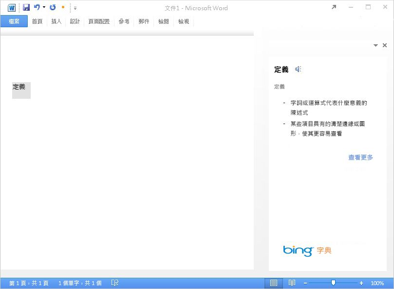
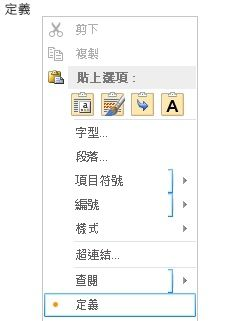
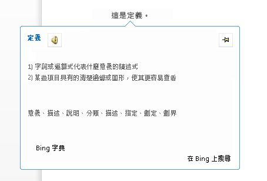
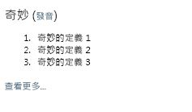

# 建立字典工作窗格增益集


本文將告訴您工作窗格增益集的範例，並隨附 Web 服務來提供使用者在 Word 2013 文件中目前選取範圍的字典定義或同義字。 

字典 Office 增益集是根據標準的工作窗格增益集，包含額外的功能以支援查詢和顯示字典 XML Web 服務的定義 (除了 Office 應用程式的 UI 中的其他位置)。 

在典型的字典工作窗格增益集，使用者在他們的文件中選取單字或片語，增益集背後的 JavaScript 邏輯接著會將此選項傳遞至字典提供者的 XML Web 服務。 接著會更新字典提供者的網頁，向使用者顯示選項的定義。
XML Web 服務元件最多會以 OfficeDefinitions XML 結構描述所定義的格式傳回定義，隨後在裝載 Office 應用程式的 UI中，向其他位置的使用者顯示。 圖 1 顯示在 Word 2013 中執行的 Bing 品牌字典增益集的選項和顯示經驗。

**圖 1. 顯示所選字定義的字典增益集**




取決於您按一下字典增益集的 HTML UI 的 [查看更多]**** 連結以顯示工作窗格中的詳細資訊，或開啟另一個瀏覽器視窗來顯示所選單字或片語的完整網頁。
圖 2 顯示 [定義]**** 內容功能表命令，可讓使用者快速啟動安裝字典。 數字 3 到 5 會顯示 Office UI 中的位置，其中的字典 XML 服務可用於在 Word 2013 中提供定義。

**圖 2. 定義在內容功能表中的命令**




**圖 3. [拼字及文法檢查] 窗格中的定義**


![[拼字及文法檢查] 窗格中的定義](../../images/DictionaryAgave03.jpg)

**圖 4. [同義字] 窗格中的定義**


![[同義字] 窗格中的定義](../../images/DictionaryAgave04.jpg)

**圖 5. 閱讀模式中的定義**




若要建立工作窗格增益集來提供字典查閱，您可以建立兩個主要元件︰ 


- XML Web 服務查閱字典服務的定義，然後以 XML 格式傳回這些值，以便由字典增益集使用和顯示。
    
- 工作窗格增益集會將使用者目前的選項提交給字典 Web 服務、顯示定義，並可選擇性地將這些值插入文件中。
    
下列章節提供如何建立這些元件的範例。

## 建立字典 XML Web 服務


XML Web 服務必須將查詢傳回 Web 服務，做為符合 OfficeDefinitions XML 結構描述的 XML。下列兩節描述 OfficeDefinitions XML 結構描述，並提供如何撰寫 XML Web 服務程式碼，以該 XML 格式傳回查詢的範例。


### OfficeDefinitions XML 結構描述

下列程式碼顯示 OfficeDefinitions XML 結構描述的 XSD。


```XML
<?xml version="1.0" encoding="utf-8"?>
<xs:schema
  xmlns:xsi="http://www.w3.org/2001/XMLSchema-instance"
  xmlns:xs="http://www.w3.org/2001/XMLSchema"
  targetNamespace="http://schemas.microsoft.com/NLG/2011/OfficeDefinitions"
  xmlns="http://schemas.microsoft.com/NLG/2011/OfficeDefinitions">
  <xs:element name="Result">
    <xs:complexType>
      <xs:sequence>
        <xs:element name="SeeMoreURL" type="xs:anyURI"/>
        <xs:element name="Definitions" type="DefinitionListType"/>
      </xs:sequence>
    </xs:complexType>
  </xs:element>
  <xs:complexType name="DefinitionListType">
    <xs:sequence>
      <xs:element name="Definition" maxOccurs="3">
        <xs:simpleType>
          <xs:restriction base="xs:normalizedString">
            <xs:maxLength value="400"/>
          </xs:restriction>
        </xs:simpleType>
      </xs:element>
    </xs:sequence>
  </xs:complexType>
</xs:schema>
```

傳回符合 OfficeDefinitions 結構描述的 XML，包含根 **Result** 元素，其包含由 零到三個 **Definition** 子元素的 **Definitions** 元素，每一個包含長度不超過 400 個字元的定義。此外，必須在 **SeeMoreURL** 元素中提供字典網站上的整頁 URL。下列範例示範符合 OfficeDefinitions 結構描述所傳回的 XML 結構。


```XML
<?xml version="1.0" encoding="utf-8"?>
<Result xmlns="http://schemas.microsoft.com/NLG/2011/OfficeDefinitions">
  <SeeMoreURL xmlns="">www.bing.com/dictionary/search?q=example</SeeMoreURL>
  <Definitions xmlns="">
    <Definition>Definition1</Definition>
    <Definition>Definition2</Definition>
    <Definition>Definition3</Definition>
  </Definitions>
 </Result>

```


### 字典 XML Web 服務範例

下列 C# 程式碼提供簡單的範例，說明如何撰寫 XML Web 服務的 程式碼，以 OfficeDefinitions XML 格式傳回字典查詢的結果。


```C#
using System;
using System.Collections.Generic;
using System.Linq;
using System.Web;
using System.Web.Services;
using System.Xml;
using System.Text;
using System.IO;
using System.Net;

/// <summary>
/// Summary description for _Default
/// </summary>
[WebService(Namespace = "http://tempuri.org/")]
[WebServiceBinding(ConformsTo = WsiProfiles.BasicProfile1_1)]
// To allow this web service to be called from script, using ASP.NET AJAX, uncomment the following line. 
// [System.Web.Script.Services.ScriptService]
public class WebService : System.Web.Services.WebService {

    public WebService () {

        // Uncomment the following line if using designed components 
        // InitializeComponent(); 
    }

    // You can replace this method entirely with your own method that gets definitions
    // from your data source, and then formats it into the OfficeDefinitions XML format. 
    // If you need a reference for constructing the returned XML, you can use this example as a basis.
    [WebMethod]
    public XmlDocument Define(string word)
    {

        StringBuilder sb = new StringBuilder();
        XmlWriter writer = XmlWriter.Create(sb);
        {
            writer.WriteStartDocument();
            
                writer.WriteStartElement("Result", "http://schemas.microsoft.com/NLG/2011/OfficeDefinitions");

            // See More URL should be changed to the dictionary publisher's page for that word on their website.
                    writer.WriteElementString("SeeMoreURL", "http://www.bing.com/search?q=" + word);

                    writer.WriteStartElement("Definitions");
            
                        writer.WriteElementString("Definition", "Definition 1 of " + word);
                        writer.WriteElementString("Definition", "Definition 2 of " + word);
                        writer.WriteElementString("Definition", "Definition 3 of " + word);
                   
                    writer.WriteEndElement();


                writer.WriteEndElement();
            
            writer.WriteEndDocument();
        }
        writer.Close();

        XmlDocument doc = new XmlDocument();
        doc.LoadXml(sb.ToString());

        return doc;
    }
   

}
```


## 建立字典增益集的元件


字典增益集包含三個主要元件檔案。


- 描述增益集的 XML 資訊清單檔案。
    
- 提供增益集 UI 的 HTML 檔案。
    
- JavaScript 檔案，其提供邏輯以取得文件的使用者選項、傳回選項做為 Web 服務的查詢，然後在增益集的 UI 中顯示傳回的結果。
    

### 建立字典增益集的資訊清單檔

以下是字典增益集的範例資訊清單檔。


```XML
<?xml version="1.0" encoding="utf-8"?>
<OfficeApp xmlns="http://schemas.microsoft.com/office/appforoffice/1.0" xmlns:xsi="http://www.w3.org/2001/XMLSchema-instance" xsi:type="TaskPaneApp">
  <Id>DemoDict</Id>
  <Version>15.0</Version>
  <ProviderName>Microsoft Office Demo Dictionary</ProviderName>
  <DefaultLocale>en-us</DefaultLocale>
  <!--DisplayName is the name that will appear in the user's list of applications.-->
  <DisplayName DefaultValue="Microsoft Office Demo Dictionary" />
  <!--Description is a 2-3 sentence description of this dictionary. -->
  <Description DefaultValue="The Microsoft Office Demo Dictionary is an example built to demonstrate how a publisher could create a dictionary that integrates with Office. It does not return real definitions." />
  <!--IconUrl is the URI for the icon that will appear in the user's list of applications.-->
  <IconUrl DefaultValue="http://officeimg.vo.msecnd.net/_layouts/images/general/office_logo.jpg" />
  <!--Capabilities specifies the kind of host application your dictionary add-in will support. You shouldn't have to modify this area.-->
  <Capabilities>
    <Capability Name="Workbook"/>
    <Capability Name="Document"/>
    <Capability Name="Project"/>
  </Capabilities>
  <DefaultSettings>
    <!--SourceLocation is the URL for your dictionary-->
    <SourceLocation DefaultValue="http://christophernlg/ExampleDictionary/DictionaryHome.html" />
  </DefaultSettings>
  <!--Permissions is the set of permissions a user will have to give your dictionary. If you need write access, such as to allow a user to replace the highlighted word with a synonym, use ReadWriteDocument. -->
  <Permissions>ReadDocument</Permissions>
  <Dictionary>
    <!--TargetDialects is the set of dialects your dictionary contains. For example, if your dictionary applies to Spanish (Mexico) and Spanish (Peru), but not Spanish (Spain), you can specify that here. This is for different dialects of the same language. Please do NOT put more than one language (for example, Spanish and English) here. Publish separate languages as separate dictionaries. -->
    <TargetDialects>
      <TargetDialect>EN-AU</TargetDialect>
      <TargetDialect>EN-BZ</TargetDialect>
      <TargetDialect>EN-CA</TargetDialect>
      <TargetDialect>EN-029</TargetDialect>
      <TargetDialect>EN-HK</TargetDialect>
      <TargetDialect>EN-IN</TargetDialect>
      <TargetDialect>EN-ID</TargetDialect>
      <TargetDialect>EN-IE</TargetDialect>
      <TargetDialect>EN-JM</TargetDialect>
      <TargetDialect>EN-MY</TargetDialect>
      <TargetDialect>EN-NZ</TargetDialect>
      <TargetDialect>EN-PH</TargetDialect>
      <TargetDialect>EN-SG</TargetDialect>
      <TargetDialect>EN-ZA</TargetDialect>
      <TargetDialect>EN-TT</TargetDialect>
      <TargetDialect>EN-GB</TargetDialect>
      <TargetDialect>EN-US</TargetDialect>
      <TargetDialect>EN-ZW</TargetDialect>
    </TargetDialects>
    <!--QueryUri is the address of this dictionary's XML web service (which is used to put definitions in additional contexts, such as the spelling checker.)-->
    <QueryUri DefaultValue="http://christophernlg/ExampleDictionary/WebService.asmx/Define?word="/>
    <!--Citation Text, Dictionary Name, and Dictionary Home Page will be combined to form the citation line (for example, this would produce "Examples by: Microsoft", where "Microsoft" is a hyperlink to http://www.microsoft.com).-->
    <CitationText DefaultValue="Examples by: " />
    <DictionaryName DefaultValue="Microsoft" />
    <DictionaryHomePage DefaultValue="http://www.microsoft.com" />
  </Dictionary>
</OfficeApp>
```

用於建立字典增益集的資訊清單檔的 **Dictionary** 元素及其子元素將在下列各節說明。如需資訊清單檔中其他元素的相關資訊，請參閱 [Office 增益集的 XML 資訊清單](../../docs/overview/add-in-manifests.md)。


### Dictionary 項目


指定字典增益集的設定。

 **父元素**

 `<OfficeApp>`

 **子元素**

 `<TargetDialects>`,  `<QueryUri>`,  `<CitationText>`,  `<DictionaryName>`,  `<DictionaryHomePage>`

 **備註**

建立字典增益集時，**Dictionary** 元素及其子元素會加入至工作窗格增益集的資訊清單。


#### TargetDialects 項目


指定這個字典所支援的用語。 必要 (適用於字典增益集)。

 **父元素**

 `<Dictionary>`

 **子元素**

 `<TargetDialect>`

 **備註**

**TargetDialects** 元素及其子元素指定字典包含的方言集合。比方說，如果您的字典套用至西班牙文 (墨西哥) 和西班牙文 (秘魯) 方言，但不是西班牙文 (西班牙) 中，您可以在此元素中指定它。這個元素只是用來指定相同語言的不同方言。不要在此資訊清單中指定一種以上的語言 (例如，西班牙文和英文)。將不同的語言發行為個別的字典。

 **範例**


```XML
<TargetDialects>
  <TargetDialect>EN-AU</TargetDialect>
  <TargetDialect>EN-BZ</TargetDialect>
  <TargetDialect>EN-CA</TargetDialect>
  <TargetDialect>EN-029</TargetDialect>
  <TargetDialect>EN-HK</TargetDialect>
  <TargetDialect>EN-IN</TargetDialect>
  <TargetDialect>EN-ID</TargetDialect>
  <TargetDialect>EN-IE</TargetDialect>
  <TargetDialect>EN-JM</TargetDialect>
  <TargetDialect>EN-MY</TargetDialect>
  <TargetDialect>EN-NZ</TargetDialect>
  <TargetDialect>EN-PH</TargetDialect>
  <TargetDialect>EN-SG</TargetDialect>
  <TargetDialect>EN-ZA</TargetDialect>
  <TargetDialect>EN-TT</TargetDialect>
  <TargetDialect>EN-GB</TargetDialect>
  <TargetDialect>EN-US</TargetDialect>
  <TargetDialect>EN-ZW</TargetDialect>
</TargetDialects>
```


#### TargetDialect 項目


指定這個字典所支援的方言。 必要 (適用於字典增益集)。

 **父元素**

 `<TargetDialects>`

 **備註**

為 RFC1766 `language` 標記格式中的方言指定值，例如 EN-US。

 **範例**


```XML
<TargetDialect>EN-US</TargetDialect>
```


#### QueryUri 項目


指定字典查詢服務的端點。 必要 (適用於字典增益集)。

 **父元素**

 `<Dictionary>`

 **備註**

這是字典提供者的 XML Web 服務的 URI。 正確地逸出查詢將附加至此 URI。 

 **範例**


```XML
<QueryUri DefaultValue="http://msranlc-lingo1/proof.aspx?q="/>
```


#### CitationText 項目


指定要用於引文的文字。 必要 (適用於字典增益集)。

 **父元素**

 `<Dictionary>`

 **備註**

這個元素會指定從 Web 服務傳回的內容下方的行所顯示的引文文字開頭 (例如，「Results by: 」或「Powered by: 」)。

對於這個元素，您可以使用 **Override** 元素來指定其他地區設定的值。例如，如果使用者正在執行 Office 的西班牙文 SKU，但使用英文字典，這會導出引文行「Resultados por:Bing」 而非「Results by:Bing」。如需有關如何指定其他地區設定值的詳細資訊，請參閱 [Office 增益集 XML 資訊清單](../../docs/overview/add-in-manifests.md)中的「提供不同地區設定的設定」。

 **範例**


```XML
<CitationText DefaultValue="Results by: " />
```


#### DictionaryName 項目


指定此字典的名稱。 必要 (適用於字典增益集)。

 **父元素**

 `<Dictionary>`

 **備註**

這個元素指定引文文字中的連結文字。引文文字是顯示在 Web 服務傳回的內容下方的列中。

對於這個元素，您可以指定其他地區設定的值。

 **範例**


```XML
<DictionaryName DefaultValue="Bing Dictionary" />
```


#### DictionaryHomePage 項目


指定字典首頁的 URL。 必要 (適用於字典增益集)。

 **父元素**

 `<Dictionary>`

 **備註**

這個元素指定引文文字中的連結 URL。引文文字是顯示在 Web 服務傳回的內容下方的列中。

對於這個元素，您可以指定其他地區設定的值。

 **範例**


```XML
<DictionaryHomePage DefaultValue="http://www.bing.com" />
```


### 建立字典增益集的 HTML 使用者介面


下列兩個範例顯示「示範字典」增益集之 UI 的 HTML 和 CSS 檔案。若要檢視 UI 在增益集的工作窗格中的顯示方式，請參閱程式碼下方的圖 6。若要查看 Dictionary.js 檔案中的 JavaScript 實作如何為此 HTML UI 提供程式設計邏輯，請參閱緊接本節後面的「撰寫 JavaScript 實作 」。


```HTML
<!DOCTYPE html>
<html>

<head>
<meta http-equiv="X-UA-Compatible" content="IE=Edge"/>

<!--The title will not be shown but is supplied to ensure valid HTML.-->
<title>Example Dictionary</title>

<!--Required library includes.-->
<script type="text/javascript" src="http://ajax.microsoft.com/ajax/4.0/1/MicrosoftAjax.js"></script>
<script type="text/javascript" src="office.js"></script>

<!--Optional library includes.-->
<script type="text/javascript" src="http://ajax.aspnetcdn.com/ajax/jQuery/jquery-1.5.1.js"></script>

<!--App-specific CSS and JS.-->
<link rel="Stylesheet" type="text/css" href="style.css" />
<script type="text/ecmascript" src="dictionary.js"></script>
</head>

<body>
<div id="mainContainer">
    <div id="header">
        <span id="headword"></span>
        <span id="pronunciation">(<a id="pronunciationLink">Pronounce</a>)</span>
    </div>
    <ol id="definitions">
    </ol>
    <div id="SeeMore">
    <a id="SeeMoreLink">See More...</a>
    </div>
</div>
</body>

</html>
```

下列範例會顯示 Style.css 的內容。


```
#mainContainer
{
    font-family: Segoe UI;
    font-size: 11pt;
}

#headword
{
    font-family: Segoe UI Semibold;
    color: #262626;
}

#pronunciation
{
    margin-left: 2px;
    margin-right: 2px;
}

#definitions
{
    font-size: 8.5pt;
}
a
{
    font-size: 8pt;
    color: #336699;
    text-decoration: none;
}
a:visited
{
    color: #993366;
}
a:hover, a:active
{  
    text-decoration: underline;
}
```


**圖 6. 示範字典 UI**




### 撰寫 JavaScript 實作


下列範例會顯示從增益集的 HTML 網頁呼叫的 Dictionary.js 檔案中的 JavaScript 實作，為示範字典增益集提供程式設計邏輯。 這個指令碼會重複使用先前所描述的 XML Web 服務。 放置在與範例 Web 服務相同的目錄中時，指令碼會取得從該服務的定義。 它可以用於公用的 OfficeDefinitions 合格的 XML Web 服務，方法是修改檔案上方的 `xmlServiceURL` 變數，然後以正確註冊的一個來取代發音的 Bing API 索引鍵。

從這個實作中呼叫的 JavaScript API for Office (Office.js) 的主要成員如下所示 ︰


- **Office** 物件的 [initialize](../../reference/shared/office.initialize.md) 事件，在增益集內容初始化時引發，並可存取 [Document](../../reference/shared/document.md) 物件執行個體來表示增益集正在互動的文件。
    
- **Document** 物件的 [AddHandlerAsync](../../reference/shared/document.addhandlerasync.md) 方法，**initialize** 函式會呼叫它來加入文件的 [SelectionChanged](../../reference/shared/document.selectionchanged.event.md) 事件的事件處理常式，以接聽使用者選項變更。
    
- **Document** 物件的 [GetSelectedDataAsync](../../reference/shared/document.getselecteddataasync.md) 方法，當引發 **SelectionChanged** 事件處理常式來取得使用者選取的字或片語、迫使它為純文字，然後執行 `selectedTextCallback` 非同步回呼函式時，會在 `tryUpdatingSelectedWord()` 中呼叫它。
    
- 將 `selectTextCallback` 非同步回呼函式傳遞為 **getSelectedDataAsync** 方法的 _callback_ 引數加以執行時，它會在回呼傳回時取得所選文字的值。 它會使用傳回的 **AsyncResult** 物件的 [value](../../reference/shared/asyncresult.status.md) 屬性，從回呼的 _selectedText_ 引數 (屬於類型 [AsyncResult](../../reference/shared/asyncresult.md)) 取得值。
    
- `selectedTextCallback` 函式的其餘程式碼會查詢定義的 XML Web 服務。 它也會呼叫 Microsoft Translator API 以提供具有所選文字發音的 .wav 檔的 URL。
    
- Dictionary.js 的其餘程式碼會顯示增益集的 HTML UI 中定義及發音連結清單。
    


```
// The document the dictionary add-in is interacting with.
var _doc; 
// The last looked-up word, which is also the currently displayed word.
var lastLookup; 
// For demo purposes only!! Get an AppID if you intend to use the Pronunciation service for your feature.
var appID="3D8D4E1888B88B975484F0CA25CDD24AAC457ED8"; 

// The base URL for the OfficeDefinitions-conforming XML web service to query for definitions.
var xmlServiceUrl = "WebService.asmx/Define?Word="; 

// Initialize the add-in. 
// The initialize function is required for all add-ins.
Office.initialize = function (reason) {
    // Checks for the DOM to load using the jQuery ready function.
    $(document).ready(function () {
    // After the DOM is loaded, app-specific code can run.
    // Store a reference to the current document.
    _doc = Office.context.document; 
    // Check whether text is already selected.
    tryUpdatingSelectedWord(); 
    _doc.addHandlerAsync("documentSelectionChanged", tryUpdatingSelectedWord); //Add a handler to refresh when the user changes selection.
    });
}

// Executes when event is raised on user's selection changes, and at initialization time. 
// Gets the current selection and passes that to asynchronous callback method.
function tryUpdatingSelectedWord() {
    _doc.getSelectedDataAsync(Office.CoercionType.Text, selectedTextCallback); 
}

// Async callback that executes when the add-in gets the user's selection.
// Determines whether anything should be done. If so, it makes requests that will be passed to various functions.
function selectedTextCallback(selectedText) {
    selectedText = $.trim(selectedText.value);
    // Be sure user has selected text. The SelectionChanged event is raised every time the user moves the cursor, even if no selection.
    if (selectedText != "") { 
        // Check whether user selected the same word the pane is currently displaying to avoid unnecessary web calls.
        if (selectedText != lastLookup) { 
            // Update the lastLookup variable.
            lastLookup = selectedText; 
            // Set the "headword" span to the word you looked up.
            $("#headword").text(selectedText); 
            // AJAX request to get definitions for the selected word; pass that to refreshDefinitions.
            $.ajax(xmlServiceUrl + selectedText, { dataType: 'xml', success: refreshDefinitions, error: errorHandler }); 
            // AJAX request to the Microsoft Translator APIs. Gets the URL of a WAV file with pronunciation, which is passed to refreshPronunciation. See http://www.microsofttranslator.com/dev for details.
            $.ajax("http://api.microsofttranslator.com/V2/Ajax.svc/Speak?oncomplete=refreshPronunciation&amp;appId=" + appID + "&amp;text=" + selectedText + "&amp;language=en-us", { dataType: 'script', success: null, error: errorHandler }); 
        }
    }
}

// This function is called when the add-in gets back the definitions target word.
// It removes the old definitions and replaces them with the definitions for the current word.
// It also sets the "See More" link.
function refreshDefinitions(data, textStatus, jqXHR) {
    $(".definition").remove();
    // Make a new list item for each returned definition that was returned, set the CSS class, and append it to the definitions div.
    $(data).find("Definition").each(function () {
        $(document.createElement("li")).text($(this).text()).addClass("definition").appendTo($("#definitions"));
    });
    $("#SeeMoreLink").attr("href", $(data).find("SeeMoreURL").text()); //Change the "See More" link to direct to the correct URL.
}

// This function is called when the add-in gets back the link to the pronunciation
// to set the "Pronounce" link to the URL of the .WAV file.
function refreshPronunciation(data) {
    $("#pronunciationLink").attr("href", data);
}

// Basic error handler that writes to a div with id='message'.
function errorHandler(jqXHR, textStatus, errorThrown) {
    document.getElementById('message').innerText += errorThrown;
}

```

