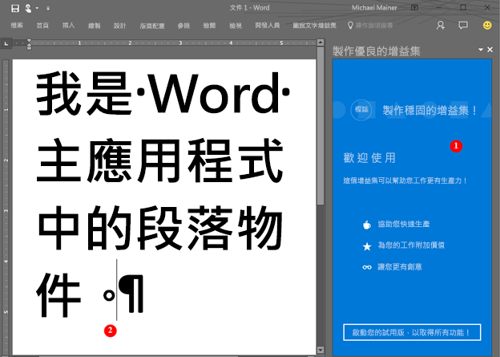

# <a name="word-add-ins-overview"></a>Word 增益集概觀

您是否要建立一個解決方案，擴充 Word 功能 - 例如，牽涉到自動化文件組件，或將 Word 文件中的資料繫結至其他資料來源以及從中存取？您可以使用 Office 增益集平台，包括 Word JavaScript API 和適用於 Office 的 JavaScript API，來擴充在 Windows 桌上型電腦、Mac 或是在雲端中執行的 Word 用戶端。

Word 增益集是您在 [Office 增益集平台](../overview/office-add-ins.md)上擁有的許多開發選項之一。您可以使用增益集命令，來擴充 Word UI，並啟動工作窗格，它會執行 JavaScript，與 Word 文件中的內容互動。您可以在瀏覽器中執行的任何程式碼都可以在 Word 增益集中執行。與 Word 文件中的內容互動的增益集會建立要求以在 Word 物件上執行，並且同步處理物件狀態。 

>**附註：**建立增益集時，如果您打算[發佈](../publish/publish.md)增益集至 Office 市集中，請確定您符合 [Office 市集驗證原則](https://msdn.microsoft.com/en-us/library/jj220035.aspx)。例如，若要通過驗證，增益集必須可以在所有的平台上運作，其平台支援您在資訊清單內 Requirements 元素中所定義的方法 (請參閱 [區段 4.12](https://msdn.microsoft.com/en-us/library/jj220035.aspx#Anchor_3))。

下圖顯示在工作窗格中執行的 Word 增益集的範例。

**圖 1。在 Word 的工作窗格中執行的增益集**



Word 增益集 (1) 可以將要求傳送至 Word 文件 (2)，並且可以使用 JavaScript 存取段落物件和更新、刪除或移動段落。例如，下列程式碼示範如何將新句子附加至該段落。

```js
Word.run(function (context) {
    var paragraphs = context.document.getSelection().paragraphs;
    paragraphs.load();
    return context.sync().then(function () {
        paragraphs.items[0].insertText(' New sentence in the paragraph.',
                                       Word.InsertLocation.end);
    }).then(context.sync);
});

```

您可以使用任何 Web 伺服器技術來裝載您的 Word 增益集，例如 ASP.NET、NodeJS 或 Python。使用您最愛的用戶端架構 - Ember、Backbone、Angular、React - 或與 VanillaJS 一起來開發您的解決方案，並且可以使用像是 Azure 的服務以[驗證](../develop/use-the-oauth-authorization-framework-in-an-office-add-in.md)和裝載應用程式。

Word JavaScript API 可讓您的應用程式存取在 Word 文件中找到的的物件和中繼資料。您可以使用這些 API 來建立以下列項目為目標的增益集︰

* Word 2013 for Windows
* Word 2016 for Windows
* Word Online
* Word 2016 for Mac
* Word for iOS

撰寫增益集一次，它會跨多個平台在所有版本的 Word 中執行。如需詳細資訊，請參閱 [Office 增益集主應用程式和平台可用性](https://dev.office.com/add-in-availability)。

## <a name="javascript-apis-for-word"></a>適用於 Word 的 JavaScript API

您可以使用兩個 JavaScript API 集合與 Word 文件中的物件和中繼資料進行互動︰第一個是[適用於 Office 的 JavaScript API](https://dev.office.com/reference/add-ins/javascript-api-for-office?product=word)，它在 Office 2013 中推出。這是共用的 API - 許多物件可以在兩個或多個 Office 用戶端所裝載的增益集中使用。此 API 會廣泛地使用回呼。 

第二個是 [Word JavaScript API](../../reference/word/word-add-ins-reference-overview.md)。這是一種強型別物件模型，您可以使用它來建立目標為 Word 2016 Mac 和 Windows 的 Word 增益集。這個物件模型使用承諾，並提供 Word 特定物件的存取權，例如 [本文](../../reference/word/body.md)、[內容控制項](../../reference/word/contentcontrol.md)、[內嵌圖片](../../reference/word/inlinepicture.md)和[段落](../../reference/word/paragraph.md)。Word JavaScript API 包含 TypeScript 定義和 vsdoc 檔案，如此您可以在您的 IDE 中取得程式碼提示。

目前所有 Word 用戶端都支援適用於 Office 的共用 JavaScript API，大多數用戶端支援 Word JavaScript API。如需有關支援的用戶端的詳細資訊，請參閱 [API 參考文件](https://dev.office.com/reference/add-ins/javascript-api-for-office?product=word)。

我們建議您從 Word JavaScript API 開始，因為物件模型較容易使用。使用 Word JavaScript API，如果您需要：

* 存取 Word 文件中的物件。

使用適用於 Office 的共用 JavaScript API，如果您需要：

* 以 Word 2013 為目標。
* 執行應用程式的初始動作。
* 檢查支援的需求集合。
* 存取文件的中繼資料、設定和環境資訊。
* 繫結至文件中的區段和擷取事件。
* 使用自訂 XML 組件。
* 開啟對話方塊。

## <a name="next-steps"></a>後續步驟

準備建立第一個 Word 增益集？請參閱[建立第一個 Word 增益集](word-add-ins.md)。您也可以嘗試我們的互動式[開始使用經驗](http://dev.office.com/getting-started/addins?product=Word)。使用[增益集資訊清單](../overview/add-in-manifests.md)以說明您的增益集裝載的位置以及顯示方式，並且定義權限和其他資訊。

若要深入了解如何設計世界級 Word 增益集，為您的使用者建立令人讚嘆的經驗，請參閱[設計指導方針](../design/add-in-design.md)和[最佳作法](../design/add-in-development-best-practices.md)。

開發您的增益集之後，您可以將其[發佈](../publish/publish.md)至網路共用、應用程式目錄或 Office 市集。

## <a name="whats-coming-up-for-word-add-ins"></a>Word 增益集接下來是什麼？

我們設計和開發新的 Word 增益集 API 時，我們會將其放在[開放式 API 規格](../../reference/openspec.md)頁面中，可供您提出意見反應。了解 Word JavaScript API 即將推出的新功能，並對我們的設計規格提出意見反應。

您也可以在[變更記錄檔](http://dev.office.com/changelog)頁面上查看 Word JavaScript API 的新功能。

## <a name="additional-resources"></a>其他資源

* [Office 增益集平台概觀](../overview/office-add-ins.md)
* [Word JavaScript API 參考資料](../../reference/word/word-add-ins-reference-overview.md)

