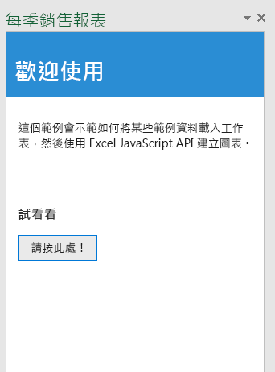

# 建立第一個 Excel 增益集

_適用版本：Excel 2016、Office 2016_

下列步驟會引導您建置一個簡單的工作窗格增益集，此增益集會在 Excel 2016 中將一些資料載入工作表中，並建立一個基本圖表。


首先使用 HTML 和 JQuery 建立一個 Web 應用程式。接著建立 XML 資訊清單檔案，在其中指定您的 Web 應用程式的放置位置，以及在 Excel 中的顯示方式。 


### Code it

1- 在本機磁碟機上建立名為 QuarterlySalesReport 的資料夾 (例如 C:\\QuarterlySalesReport)。將下列步驟建立的所有檔案儲存至這個資料夾。

2- 建立要載入至工作窗格增益集的 HTML 網頁。將檔案命名為 **Home.html**，並將下列程式碼貼至此檔案中。

```html
	
	<!DOCTYPE html>
    <html>
    <head>
        <meta charset="UTF-8" />
        <meta http-equiv="X-UA-Compatible" content="IE=Edge" />
        <title>Quarterly Sales Report</title>   

        <script src="http://ajax.aspnetcdn.com/ajax/jQuery/jquery-2.1.4.min.js"></script>

        <link href="Office.css" rel="stylesheet" type="text/css" />

        <script src="https://appsforoffice.microsoft.com/lib/1.1/hosted/office.js" type="text/javascript"></script>

        <link href="Common.css" rel="stylesheet" type="text/css" />
        <script src="Notification.js" type="text/javascript"></script>

        <script src="Home.js" type="text/javascript"></script>

        <link rel="stylesheet" href="https://appsforoffice.microsoft.com/fabric/1.0/fabric.min.css">
        <link rel="stylesheet" href="https://appsforoffice.microsoft.com/fabric/1.0/fabric.components.min.css">

    </head>
    <body class="ms-font-m">
        <div id="content-header">
            <div class="padding">
                <h1>Welcome</h1>
            </div>
        </div>
        <div id="content-main">
            <div class="padding">
                <p>This sample shows how to load some sample data into the worksheet, and then create a chart using the Excel JavaScript API.</p>
                <br />
                <h3>Try it out</h3>
                <button class="ms-Button" id="load-data-and-create-chart">Click me!</button>
            </div>
        </div>
    </body>
    </html>	

```  

3- 建立一個名為 **Common.css** 的檔案，用於儲存您的自訂樣式，並將下列程式碼貼至此檔案中。

```css
	/* Common app styling */

    #content-header {
        background: #2a8dd4;
        color: #fff;
        position: absolute;
        top: 0;
        left: 0;
        width: 100%;
        height: 80px; /* Fixed header height */
        overflow: hidden; /* Disable scrollbars for header */
    }

    #content-main {
        background: #fff;
        position: fixed;
        top: 80px; /* Same value as #content-header's height */
        left: 0;
        right: 0;
        bottom: 0;
        overflow: auto; /* Enable scrollbars within main content section */
    }

    .padding {
        padding: 15px;
    }

    #notification-message {
        background-color: #818285;
        color: #fff;
        position: absolute;
        width: 100%;
        min-height: 80px;
        right: 0;
        z-index: 100;
        bottom: 0;
        display: none; /* Hidden until invoked */
    }

        #notification-message #notification-message-header {
            font-size: medium;
            margin-bottom: 10px;
        }

        #notification-message #notification-message-close {
            background-image: url("../Images/Close.png");
            background-repeat: no-repeat;
            width: 24px;
            height: 24px;
            position: absolute;
            right: 5px;
            top: 5px;
            cursor: pointer;
        }

	
```

4- 建立一個檔案，其中包含 jQuery 的增益集程式設計邏輯。將檔案命名為 **Home.js**，並將下列指令碼貼至此檔案中。
	
```js
    
    (function () {
        "use strict";

        // The initialize function must be run each time a new page is loaded
        Office.initialize = function (reason) {
            $(document).ready(function () {
                app.initialize();

                $('#load-data-and-create-chart').click(loadDataAndCreateChart);
            });
        };

        // Load some sample data into the worksheet and then create a chart
        function loadDataAndCreateChart() {
            // Run a batch operation against the Excel object model
            Excel.run(function (ctx) {

                // Create a proxy object for the active worksheet
                var sheet = ctx.workbook.worksheets.getActiveWorksheet();

                //Queue commands to set the report title in the worksheet
                sheet.getRange("A1").values = "Quarterly Sales Report";
                sheet.getRange("A1").format.font.name = "Century";
                sheet.getRange("A1").format.font.size = 26;

                //Create an array containing sample data
                var values = [["Product", "Qtr1", "Qtr2", "Qtr3", "Qtr4"],
                              ["Frames", 5000, 7000, 6544, 4377],
                              ["Saddles", 400, 323, 276, 651],
                              ["Brake levers", 12000, 8766, 8456, 9812],
                              ["Chains", 1550, 1088, 692, 853],
                              ["Mirrors", 225, 600, 923, 544],
                              ["Spokes", 6005, 7634, 4589, 8765]];

                //Queue a command to write the sample data to the specified range
                //in the worksheet and bold the header row
                var range = sheet.getRange("A2:E8");
                range.values = values;
                sheet.getRange("A2:E2").format.font.bold = true;

                //Queue a command to add a new chart
                var chart = sheet.charts.add("ColumnClustered", range, "auto");

                //Queue commands to set the properties and format the chart
                chart.setPosition("G1", "L10");
                chart.title.text = "Quarterly sales chart";
                chart.legend.position = "right"
                chart.legend.format.fill.setSolidColor("white");
                chart.dataLabels.format.font.size = 15;
                chart.dataLabels.format.font.color = "black";
                var points = chart.series.getItemAt(0).points;
                points.getItemAt(0).format.fill.setSolidColor("pink");
                points.getItemAt(1).format.fill.setSolidColor('indigo');

                //Run the queued commands, and return a promise to indicate task completion
                return ctx.sync();
            })
              .then(function () {
                  app.showNotification("Success");
                  console.log("Success!");
              })
            .catch(function (error) {
                // Always be sure to catch any accumulated errors that bubble up from the Excel.run execution
                app.showNotification("Error: " + error);
                console.log("Error: " + error);
                if (error instanceof OfficeExtension.Error) {
                    console.log("Debug info: " + JSON.stringify(error.debugInfo));
                }
            });
        }
    })();
```


5- 建立一個檔案，其中包含發生錯誤時在增益集內提供通知的程式設計邏輯。偵錯時這會很有幫助。將檔案命名為 **Notification.js**，並將下列指令碼貼至此檔案中。
	
```js
    
    /* Notification functionality */

    var app = (function () {
        "use strict";

        var app = {};

        // Initialization function (to be called from each page that needs notification)
        app.initialize = function () {
            $('body').append(
                '<div id="notification-message">' +
                    '<div class="padding">' +
                        '<div id="notification-message-close"></div>' +
                        '<div id="notification-message-header"></div>' +
                        '<div id="notification-message-body"></div>' +
                    '</div>' +
                '</div>');

            $('#notification-message-close').click(function () {
                $('#notification-message').hide();
            });


            // After initialization, expose a common notification function
            app.showNotification = function (header, text) {
                $('#notification-message-header').text(header);
                $('#notification-message-body').text(text);
                $('#notification-message').slideDown('fast');
            };
        };

        return app;
    })();
```

6- 建立 XML 資訊清單檔案，用來指定 Web 應用程式所在的位置以及如何在 Excel 中顯示。將檔案命名為 **QuarterlySalesReportManifest.xml**，並將下列 XML 貼至此檔案中。
    
	```xml
	<?xml version="1.0" encoding="UTF-8"?>
    <!--Created:cb85b80c-f585-40ff-8bfc-12ff4d0e34a9-->
    <OfficeApp xmlns="http://schemas.microsoft.com/office/appforoffice/1.0" xmlns:xsi="http://www.w3.org/2001/XMLSchema-instance" xsi:type="TaskPaneApp">
      <Id>ab2991e7-fe64-465b-a2f1-c865247ef434</Id>
      <Version>1.0.0.0</Version>
      <ProviderName>Microsoft</ProviderName>
      <DefaultLocale>en-US</DefaultLocale>
      <DisplayName DefaultValue="Quarterly Sales Report Sample" />
      <Description DefaultValue="Quarterly Sales Report Sample"/>
      <Capabilities>
        <Capability Name="Workbook" />
      </Capabilities>
      <DefaultSettings>
        <SourceLocation DefaultValue="\\MyShare\QuarterlySalesReport\Home.html" />
      </DefaultSettings>
      <Permissions>ReadWriteDocument</Permissions>
    </OfficeApp>
	```

7- 使用您選擇的線上產生器，產生 GUID。然後，使用此 GUID 取代上一個步驟中顯示之 **Id** 標記中的值。 

8-	儲存所有檔案。您現在已寫好第一個 Excel 增益集了。 

### 進行測試

部署及測試增益集的最簡單方式，是將檔案複製到網路共用。

1- 在網路共用中建立資料夾 (例如 \\\MyShare\\QuarterlySalesReport)，並將所有檔案都複製到該資料夾。  

2 編輯資訊清單檔案的 **SourceLocation** 項目，讓它指向步驟 1 中 .html 網頁的共用位置。 

3- 將資訊清單 (QuarterlySalesReportManifest.xml) 複製到網路共用 (例如 \\\MyShare\\MyManifests)。

4- 在 Excel 中，將包含資訊清單的共用位置新增為受信任的應用程式目錄。

      a-  Launch Excel and open a blank spreadsheet.  
    
      b-  Choose the **File** tab, and then choose **Options**.
    
      c-  Choose **Trust Center**, and then choose the **Trust Center Settings** button.
    
      d-  Choose **Trusted Add-in Catalogs**.
    
      e-  In the **Catalog Url** box, enter the path to the network share you created in step 3, and then choose **Add Catalog**.
    
      f-  Select the **Show in Menu** check box, and then choose **OK**. A message appears to inform you that your settings will be applied the next time you start Office. 
        
5- 測試並執行增益集。 

      a-  On the **Insert tab** in Excel 2016, choose **My Add-ins**. 
      
      b-  In the **Office Add-ins** dialog box, choose **Shared Folder**.
      
      c-  Choose **Quarterly Sales Report Sample**>**Insert**. The add-in opens in a task pane to the right of the current worksheet, as shown in the following figure.
 
 
   
      d-  Click the **Click me!** button to render the data and the chart inside the worksheet, as shown in the following figure.  To see the chart update dynamically, just change the data in the range. 
        


### 其他資源
 

*  [Excel 增益集程式設計概觀](excel-add-ins-programming-overview.md)
*  [Excel 的程式碼片段總管](http://officesnippetexplorer.azurewebsites.net/#/snippets/excel)
*  [Excel 增益集程式碼範例](excel-add-ins-code-samples.md) 
*  [Excel 增益集 JavaScript API 參考](excel-add-ins-javascript-reference.md)
