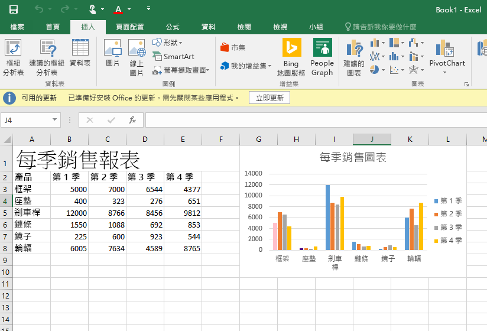

# Excel 增益集程式碼範例

_適用版本：Excel 2016、Office 2016_

以下列出在 Excel 2016 中使用 JavaScript API 的增益集程式碼範例，以供快速參考。 

**[每季銷售報表範例](https://github.com/OfficeDev/Excel-Add-in-JS-QuarterlySalesReport)**：一個簡單的工作窗格增益集，可在 Excel 2016 中將一些資料載入工作表中，並建立一個基本圖表。 

**[大學預算追蹤器範例](https://github.com/OfficeDev/Excel-Add-in-JS-CollegeBudgetTracker)**：一個工作窗格增益集，示範如何使用 Excel 2016 中的 JavaScript API 來建立大學預算追蹤器。 

**[大學學分追蹤器範例](https://github.com/OfficeDev/Excel-Add-in-JS-CollegeCreditsTracker)**：一個工作窗格增益集，示範如何使用 Excel 2016 中的 JavaScript API 來建立大學學分追蹤器。 

**[工作表切換器範例](https://github.com/OfficeDev/Excel-Add-in-JS-SheetSwitcher)**：一個工作窗格增益集，提供在 Excel 2016 中加入新工作表至活頁簿並加以瀏覽的方法。 

**[綜合銷售報表範例](https://github.com/OfficeDev/Excel-Add-in-JS-ConsolidatedSalesReport)**：一個工作窗格增益集，示範如何使用 Excel 2016 中的 JavaScript API，合併多個工作表中的資料。 

**[範圍螢光筆範例](https://github.com/OfficeDev/Excel-Add-in-JS-RangeHighlighter)**：一個工作窗格增益集，示範如何使用 Excel 2016 中的 Range API 來執行一般作業。

您可以使用 [Office 2016 JavaScript 程式碼片段總管](http://officesnippetexplorer.azurewebsites.net/#/snippets/excel)，瀏覽常見案例的程式碼範例，並了解新 API 的運作方式。 

### 其他資源

Excel JavaScript API 還有其他許多功能，可供您用於開發增益集。以下列出其中幾個可用的資源。 

*  [建立第一個 Excel 增益集](build-your-first-excel-add-in.md)
*  [Excel 增益集程式設計概觀](excel-add-ins-programming-overview.md)
*  [Excel 增益集 JavaScript API 參考](excel-add-ins-javascript-reference.md)
