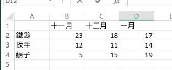

# 工作表函數
做為可從 JavaScript 或 REST 中呼叫之 Microsoft Excel 工作表函數的容器。

## 傳回類型	
工作表函數會傳回 FunctionResult 物件。FunctionResult 物件有兩個屬性。

| 屬性       | 類型	    |描述|備註 |
|:---------------|:--------|:----------|:-----|
|value|string|傳回套用指定的工作表函數的結果。||
|錯誤|string|套用指定的工作表函數時傳回錯誤資訊。||


## 語法
```js
workbook.functions.functionMethod();
```

## 範例
以下是 Excel 中不同工具的範例資料表追蹤銷售。我們將使用此表格中的資料，來說明工作表函數的運作方式。




下列範例將 vlookup 函數套用到上述資料表，並尋找 11 月份銷售的 Wrench 單位。
```js
    Excel.run(function (ctx) {
        var range = ctx.workbook.worksheets.getItem("Sheet1").getRange("A1:D4");
        var unitSoldInNov = ctx.workbook.functions.vlookup("Wrench", range, 2, false);
        unitSoldInNov.load();
        return ctx.sync()
        .then(function () {
            console.log(unitSoldInNov.value);
        });
    })
    .catch(function(error) {
        console.log("Error: " + error);
        if (error instanceof OfficeExtension.Error) {
            console.log("Debug info: " + JSON.stringify(error.debugInfo));
        }
    });
```


下列範例會使用 vlookup 函數，首先尋找分別在 11 月份和 12 月份銷售的 Wrench 單位。然後套用 sum 函數來取得這兩個月份銷售的單位總和。請注意，您只需要載入最後的結果，套用最後的公式時，會計算和使用任何中間結果。

```js
    Excel.run(function (ctx) {
        var range = ctx.workbook.worksheets.getItem("Sheet1").getRange("A1:D4");
        var sumOfTwoLookups = ctx.workbook.functions.sum(
            ctx.workbook.functions.vlookup("Wrench", range, 2, false), 
            ctx.workbook.functions.vlookup("Wrench", range, 3, false)
            );
        sumOfTwoLookups.load();
        return ctx.sync()
        .then(function () {
            console.log(sumOfTwoLookups.value);
        });
    })
    .catch(function(error) {
        console.log("Error: " + error);
        if (error instanceof OfficeExtension.Error) {
            console.log("Debug info: " + JSON.stringify(error.debugInfo));
        }
    });


```

## [支援的工作表函數清單](#支援的工作表函數清單)

| 方法           | 傳回類型    |描述|附註 |
|:---------------|:--------|:----------|:-----|
|[ABS 函數](https://support.office.com/en-us/article/ABS-function-3420200f-5628-4e8c-99da-c99d7c87713c)| FunctionResult |會傳回數字的絕對值|
|[ACCRINT 函數](https://support.office.com/en-us/article/ACCRINT-function-fe45d089-6722-4fb3-9379-e1f911d8dc74)| FunctionResult |會傳回支付定期利息之證券的應計利息|
|[ACCRINTM 函數](https://support.office.com/en-us/article/ACCRINTM-function-f62f01f9-5754-4cc4-805b-0e70199328a7)| FunctionResult |會傳回到期時給付利息的證券所累積的利息|
|[ACOS 函數](https://support.office.com/en-us/article/ACOS-function-cb73173f-d089-4582-afa1-76e5524b5d5b)| FunctionResult |會傳回數字的反餘弦|
|[ACOSH 函數](https://support.office.com/en-us/article/ACOSH-function-e3992cc1-103f-4e72-9f04-624b9ef5ebfe)| FunctionResult |會傳回數字的反雙曲餘弦。|
|[ACOT 函數](https://support.office.com/en-us/article/ACOT-function-dc7e5008-fe6b-402e-bdd6-2eea8383d905)| FunctionResult |會傳回數字的反餘切。|
|[ACOTH 函數](https://support.office.com/en-us/article/ACOTH-function-cc49480f-f684-4171-9fc5-73e4e852300f)| FunctionResult |會傳回數字的雙曲餘切。|
|[AMORDEGRC 函數](https://support.office.com/en-us/article/AMORDEGRC-function-a14d0ca1-64a4-42eb-9b3d-b0dededf9e51)| FunctionResult |使用的折舊係數，傳回每個會計週期的折舊|
|[AMORLINC 函數](https://support.office.com/en-us/article/AMORLINC-function-7d417b45-f7f5-4dba-a0a5-3451a81079a8)| FunctionResult |傳回每個會計週期的折舊|
|[AND 函數](https://support.office.com/en-us/article/AND-function-5f19b2e8-e1df-4408-897a-ce285a19e9d9)| FunctionResult |如果其所有引數都為 TRUE，則傳回 TRUE|
|[ARABIC 函數](https://support.office.com/en-us/article/ARABIC-function-9a8da418-c17b-4ef9-a657-9370a30a674f)| FunctionResult |將羅馬數字轉換為阿拉伯數字|
|[AREAS 函數](https://support.office.com/en-us/article/AREAS-function-8392ba32-7a41-43b3-96b0-3695d2ec6152)| FunctionResult |傳回參照的區域數目。|
|[ASC 函數](https://support.office.com/en-us/article/ASC-function-0b6abf1c-c663-4004-a964-ebc00b723266)| FunctionResult |將全形 (雙位元組) 英文字母或字元字串中的片假名變更為半形 (單一位元組) 字元|
|[ASIN 函數](https://support.office.com/en-us/article/ASIN-function-81fb95e5-6d6f-48c4-bc45-58f955c6d347)| FunctionResult |會傳回數字的反正弦|
|[ASINH 函數](https://support.office.com/en-us/article/ASINH-function-4e00475a-067a-43cf-926a-765b0249717c)| FunctionResult |會傳回數字的反雙曲正弦。|
|[ATAN 函數](https://support.office.com/en-us/article/ATAN-function-50746fa8-630a-406b-81d0-4a2aed395543)| FunctionResult |會傳回數字的反正切|
|[ATAN2 函數](https://support.office.com/en-us/article/ATAN2-function-c04592ab-b9e3-4908-b428-c96b3a565033)| FunctionResult |從 x 和 y 座標傳回反正切值|
|[ATANH 函數](https://support.office.com/en-us/article/ATANH-function-3cd65768-0de7-4f1d-b312-d01c8c930d90)| FunctionResult |會傳回數字的反雙曲正切。|
|[AVEDEV 函數](https://support.office.com/en-us/article/AVEDEV-function-58fe8d65-2a84-4dc7-8052-f3f87b5c6639)| FunctionResult |會從資料點的平均值中傳回資料點的平均絕對差|
|[AVERAGE 函數](https://support.office.com/en-us/article/AVERAGE-function-047bac88-d466-426c-a32b-8f33eb960cf6)| FunctionResult |傳回其引數的平均值|
|[AVERAGEA 函數](https://support.office.com/en-us/article/AVERAGEA-function-f5f84098-d453-4f4c-bbba-3d2c66356091)| FunctionResult |傳回其引數的平均值，包括數字、文字和邏輯值|
|[AVERAGEIF 函數](https://support.office.com/en-us/article/AVERAGEIF-function-faec8e2e-0dec-4308-af69-f5576d8ac642)| FunctionResult |會傳回符合指定準則的範圍中所有儲存格的平均 (算術平均數)|
|[AVERAGEIFS 函數](https://support.office.com/en-us/article/AVERAGEIFS-function-48910c45-1fc0-4389-a028-f7c5c3001690)| FunctionResult |會傳回符合多個準則的所有儲存格的平均 (算術平均數)|
|[BAHTTEXT 函數](https://support.office.com/en-us/article/BAHTTEXT-function-5ba4d0b4-abd3-4325-8d22-7a92d59aab9c)| FunctionResult |將數字轉換成文字，使用 β (泰銖) 的貨幣格式|
|[BASE 函數](https://support.office.com/en-us/article/BASE-function-2ef61411-aee9-4f29-a811-1c42456c6342)| FunctionResult |將數字轉換成具有指定基數 (基本) 的文字表示|
|[BESSELI 函數](https://support.office.com/en-us/article/BESSELI-function-8d33855c-9a8d-444b-98e0-852267b1c0df)| FunctionResult |會傳回修改過的 Bessel 函數 In(x)|
|[BESSELJ 函數](https://support.office.com/en-us/article/BESSELJ-function-839cb181-48de-408b-9d80-bd02982d94f7)| FunctionResult |會傳回 Bessel 函數 Jn(x)|
|[BESSELK 函數](https://support.office.com/en-us/article/BESSELK-function-606d11bc-06d3-4d53-9ecb-2803e2b90b70)| FunctionResult |會傳回 Bessel 函數 Kn(x)|
|[BESSELY 函數](https://support.office.com/en-us/article/BESSELY-function-f3a356b3-da89-42c3-8974-2da54d6353a2)| FunctionResult |會傳回 Bessel 函數 Yn(x)|
|[BETA.DIST 函數](https://support.office.com/en-us/article/BETADIST-function-11188c9c-780a-42c7-ba43-9ecb5a878d31)| FunctionResult |會傳回 Beta 累加分配函數|
|[BETA.INV 函數](https://support.office.com/en-us/article/BETAINV-function-e84cb8aa-8df0-4cf6-9892-83a341d252eb)| FunctionResult |會為指定的 Beta 分配傳回累加分配函數的反函數。|
|[BIN2DEC 函數](https://support.office.com/en-us/article/BIN2DEC-function-63905b57-b3a0-453d-99f4-647bb519cd6c)| FunctionResult |會將二進位數字轉換成十進位|
|[BIN2HEX 函數](https://support.office.com/en-us/article/BIN2HEX-function-0375e507-f5e5-4077-9af8-28d84f9f41cc)| FunctionResult |會將二進位數字轉換成十六進位|
|[BIN2OCT 函數](https://support.office.com/en-us/article/BIN2OCT-function-0a4e01ba-ac8d-4158-9b29-16c25c4c23fd)| FunctionResult |會將二進位數字轉換成八進位|
|[BINOM.DIST 函數](https://support.office.com/en-us/article/BINOMDIST-function-c5ae37b6-f39c-4be2-94c2-509a1480770c)| FunctionResult |會傳回在特定次數之二項分配實驗中，實驗成功的機率|
|[BINOM.DIST.RANGE 函數](https://support.office.com/en-us/article/BINOMDISTRANGE-function-17331329-74c7-4053-bb4c-6653a7421595)| FunctionResult |會使用二項分配傳回試用版結果機率|
|[BINOM.INV 函數](https://support.office.com/en-us/article/BINOMINV-function-80a0370c-ada6-49b4-83e7-05a91ba77ac9)| FunctionResult |會傳回累加二項分配小於或等於臨界值的最小值|
|[BITAND 函數](https://support.office.com/en-us/article/BITAND-function-8a2be3d7-91c3-4b48-9517-64548008563a)| FunctionResult |傳回兩個數字的「位元 And」|
|[BITLSHIFT 函數](https://support.office.com/en-us/article/BITLSHIFT-function-c55bb27e-cacd-4c7c-b258-d80861a03c9c)| FunctionResult |傳回向左位移 shift_amount 位元的值數字|
|[BITOR 函數](https://support.office.com/en-us/article/BITOR-function-f6ead5c8-5b98-4c9e-9053-8ad5234919b2)| FunctionResult |傳回兩個數字的「位元 OR」|
|[BITRSHIFT 函數](https://support.office.com/en-us/article/BITRSHIFT-function-274d6996-f42c-4743-abdb-4ff95351222c)| FunctionResult |傳回向右位移 shift_amount 位元的值數字|
|[BITXOR 函數](https://support.office.com/en-us/article/BITXOR-function-c81306a1-03f9-4e89-85ac-b86c3cba10e4)| FunctionResult |傳回兩個數字的「位元互斥 Or」|
|[CEILING.MATH 函數](https://support.office.com/en-us/article/CEILINGMATH-function-80f95d2f-b499-4eee-9f16-f795a8e306c8)| FunctionResult |會無條件進位為最接近之整數的數字，或無條件進位為最接近之基數倍數的數字|
|[CEILING.PRECISE 函數](https://support.office.com/en-us/article/CEILINGPRECISE-function-f366a774-527a-4c92-ba49-af0a196e66cb)| FunctionResult |會無條件進位為最接近之整數的數字，或無條件進位為最接近之基數倍數的數字。不論數字符號，數值都會進位。|
|[CHAR 函數](https://support.office.com/en-us/article/CHAR-function-bbd249c8-b36e-4a91-8017-1c133f9b837a)| FunctionResult |傳回代碼所指定的字元|
|[CHISQ.DIST 函數](https://support.office.com/en-us/article/CHISQDIST-function-8486b05e-5c05-4942-a9ea-f6b341518732)| FunctionResult |傳回累加 beta 機率密度函數|
|[CHISQ.DIST.RT 函數](https://support.office.com/en-us/article/CHISQDISTRT-function-dc4832e8-ed2b-49ae-8d7c-b28d5804c0f2)| FunctionResult |會傳回卡方分配的單側機率|
|[CHISQ.INV 函數](https://support.office.com/en-us/article/CHISQINV-function-400db556-62b3-472d-80b3-254723e7092f)| FunctionResult |傳回累加 beta 機率密度函數|
|[CHISQ.INV.RT 函數](https://support.office.com/en-us/article/CHISQINVRT-function-435b5ed8-98d5-4da6-823f-293e2cbc94fe)| FunctionResult |會傳回卡方分配之單側機率的反函數|
|[CHOOSE 函數](https://support.office.com/en-us/article/CHOOSE-function-fc5c184f-cb62-4ec7-a46e-38653b98f5bc)| FunctionResult |從值清單中選取一個值|
|[CLEAN 函數](https://support.office.com/en-us/article/CLEAN-function-26f3d7c5-475f-4a9c-90e5-4b8ba987ba41)| FunctionResult |會移除文字中所有無法列印的字元|
|[CODE 函數](https://support.office.com/en-us/article/CODE-function-c32b692b-2ed0-4a04-bdd9-75640144b928)| FunctionResult |傳回文字字串中第一個字元的數字碼|
|[COLUMNS 函數](https://support.office.com/en-us/article/COLUMNS-function-4e8e7b4e-e603-43e8-b177-956088fa48ca)| FunctionResult |傳回參照的資料行數目|
|[COMBIN 函數](https://support.office.com/en-us/article/COMBIN-function-12a3f276-0a21-423a-8de6-06990aaf638a)| FunctionResult |傳回指定物件數的組合數|
|[COMBINA 函數](https://support.office.com/en-us/article/COMBINA-function-efb49eaa-4f4c-4cd2-8179-0ddfcf9d035d)| FunctionResult |傳回指定物件數具有重複的組合數|
|[COMPLEX 函數](https://support.office.com/en-us/article/COMPLEX-function-f0b8f3a9-51cc-4d6d-86fb-3a9362fa4128)| FunctionResult |將實係數及虛係數轉換成複數|
|[CONCATENATE 函數](https://support.office.com/en-us/article/CONCATENATE-function-8f8ae884-2ca8-4f7a-b093-75d702bea31d)| FunctionResult |聯結多個文字項目到一個文字項目|
|[CONFIDENCE.NORM 函數](https://support.office.com/en-us/article/CONFIDENCENORM-function-7cec58a6-85bb-488d-91c3-63828d4fbfd4)| FunctionResult |會傳回母體平均數的信賴區間|
|[CONFIDENCE.T 函數](https://support.office.com/en-us/article/CONFIDENCET-function-e8eca395-6c3a-4ba9-9003-79ccc61d3c53)| FunctionResult |會使用 Student's 式 T 分配傳回母體平均數的信賴區間|
|[CONVERT 函數](https://support.office.com/en-us/article/CONVERT-function-d785bef1-808e-4aac-bdcd-666c810f9af2)| FunctionResult |將數字從一個度量系統轉換到另一個|
|[COS 函數](https://support.office.com/en-us/article/COS-function-0fb808a5-95d6-4553-8148-22aebdce5f05)| FunctionResult |會傳回數字的餘弦|
|[COSH 函數](https://support.office.com/en-us/article/COSH-function-e460d426-c471-43e8-9540-a57ff3b70555)| FunctionResult |會傳回數字的雙曲線餘弦|
|[COT 函數](https://support.office.com/en-us/article/COT-function-c446f34d-6fe4-40dc-84f8-cf59e5f5e31a)| FunctionResult |會傳回角度的餘切值|
|[COTH 函數](https://support.office.com/en-us/article/COTH-function-2e0b4cb6-0ba0-403e-aed4-deaa71b49df5)| FunctionResult |會傳回數字的雙曲餘切|
|[COUNT 函數](https://support.office.com/en-us/article/COUNT-function-a59cd7fc-b623-4d93-87a4-d23bf411294c)| FunctionResult |計算引數清單中有多少數字|
|[COUNTA 函數](https://support.office.com/en-us/article/COUNTA-function-7dc98875-d5c1-46f1-9a82-53f3219e2509)| FunctionResult |計算引數清單中有多少值|
|[COUNTBLANK 函數](https://support.office.com/en-us/article/COUNTBLANK-function-6a92d772-675c-4bee-b346-24af6bd3ac22)| FunctionResult |會統計範圍內的空白儲存格|
|[COUNTIF 函數](https://support.office.com/en-us/article/COUNTIF-function-e0de10c6-f885-4e71-abb4-1f464816df34)| FunctionResult |會統計符合指定準則的範圍內的儲存格|
|[COUNTIFS 函數](https://support.office.com/en-us/article/COUNTIFS-function-dda3dc6e-f74e-4aee-88bc-aa8c2a866842)| FunctionResult |會統計符合多個準則之範圍內的儲存格|
|[COUPDAYBS 函數](https://support.office.com/en-us/article/COUPDAYBS-function-eb9a8dfb-2fb2-4c61-8e5d-690b320cf872)| FunctionResult |會傳回從票息週期的開始到交割日之間的日數|
|[COUPDAYS 函數](https://support.office.com/en-us/article/COUPDAYS-function-cc64380b-315b-4e7b-950c-b30b0a76f671)| FunctionResult |會傳回包含交割日之票息週期中的日數|
|[COUPDAYSNC 函數](https://support.office.com/en-us/article/COUPDAYSNC-function-5ab3f0b2-029f-4a8b-bb65-47d525eea547)| FunctionResult |會傳回從交割日到下一個票息日期之間的日數|
|[COUPNCD 函數](https://support.office.com/en-us/article/COUPNCD-function-fd962fef-506b-4d9d-8590-16df5393691f)| FunctionResult |會傳回交割日之後的下一個票息日期|
|[COUPNUM 函數](https://support.office.com/en-us/article/COUPNUM-function-a90af57b-de53-4969-9c99-dd6139db2522)| FunctionResult |會傳回可在交割日和到期日期之間支付的票息數字|
|[COUPPCD 函數](https://support.office.com/en-us/article/COUPPCD-function-2eb50473-6ee9-4052-a206-77a9a385d5b3)| FunctionResult |會傳回交割日前的上一個票息日期|
|[CSC 函數](https://support.office.com/en-us/article/CSC-function-07379361-219a-4398-8675-07ddc4f135c1)| FunctionResult |會傳回角度的餘割值|
|[CSCH 函數](https://support.office.com/en-us/article/CSCH-function-f58f2c22-eb75-4dd6-84f4-a503527f8eeb)| FunctionResult |會傳回角度的雙曲餘割值|
|[CUMIPMT 函數](https://support.office.com/en-us/article/CUMIPMT-function-61067bb0-9016-427d-b95b-1a752af0e606)| FunctionResult |會傳回兩個期間之間的累積支付利息|
|[CUMPRINC 函數](https://support.office.com/en-us/article/CUMPRINC-function-94a4516d-bd65-41a1-bc16-053a6af4c04d)| FunctionResult |會傳回兩個期間之間的累積支付本金|
|[DATE 函數](https://support.office.com/en-us/article/DATE-function-e36c0c8c-4104-49da-ab83-82328b832349)| FunctionResult |會傳回特定日期的序號|
|[DATEVALUE 函數](https://support.office.com/en-us/article/DATEVALUE-function-df8b07d4-7761-4a93-bc33-b7471bbff252)| FunctionResult |將文字形式的日期轉換為序號|
|[DAVERAGE 函數](https://support.office.com/en-us/article/DAVERAGE-function-a6a2d5ac-4b4b-48cd-a1d8-7b37834e5aee)| FunctionResult |會傳回選取資料庫項目的平均值|
|[DAY 函數](https://support.office.com/en-us/article/DAY-function-8a7d1cbb-6c7d-4ba1-8aea-25c134d03101)| FunctionResult |將序列值轉換為一個月中的第幾天|
|[DAYS 函數](https://support.office.com/en-us/article/DAYS-function-57740535-d549-4395-8728-0f07bff0b9df)| FunctionResult |會傳回兩個日期之間的天數|
|[DAYS360 函數](https://support.office.com/en-us/article/DAYS360-function-b9a509fd-49ef-407e-94df-0cbda5718c2a)| FunctionResult |根據一年 360 天計算兩個日期之間的天數|
|[DB 函數](https://support.office.com/en-us/article/DB-function-354e7d28-5f93-4ff1-8a52-eb4ee549d9d7)| FunctionResult |會傳回資產在指定期間內使用定率餘額遞減法所計算的折舊|
|[DBCS 函數](https://support.office.com/en-us/article/DBCS-function-a4025e73-63d2-4958-9423-21a24794c9e5)| FunctionResult |將半形 (單一位元組) 英文字母或字元字串中的片假名變更為全形 (雙位元組) 字元|
|[DCOUNT 函數](https://support.office.com/en-us/article/DCOUNT-function-c1fc7b93-fb0d-4d8d-97db-8d5f076eaeb1)| FunctionResult |統計包含資料庫中的數字的儲存格|
|[DCOUNTA 函數](https://support.office.com/en-us/article/DCOUNTA-function-00232a6d-5a66-4a01-a25b-c1653fda1244)| FunctionResult |統計資料庫中的非空白儲存格|
|[DDB 函數](https://support.office.com/en-us/article/DDB-function-519a7a37-8772-4c96-85c0-ed2c209717a5)| FunctionResult |會傳回資產在指定期間內使用倍率餘額遞減法或其他指定方法所計算的折舊|
|[DEC2BIN 函數](https://support.office.com/en-us/article/DEC2BIN-function-0f63dd0e-5d1a-42d8-b511-5bf5c6d43838)| FunctionResult |會將十進位數字轉換成二進位|
|[DEC2HEX 函數](https://support.office.com/en-us/article/DEC2HEX-function-6344ee8b-b6b5-4c6a-a672-f64666704619)| FunctionResult |會將十進位數字轉換成十六進位|
|[DEC2OCT 函數](https://support.office.com/en-us/article/DEC2OCT-function-c9d835ca-20b7-40c4-8a9e-d3be351ce00f)| FunctionResult |會將十進位數字轉換成八進位|
|[DECIMAL 函數](https://support.office.com/en-us/article/DECIMAL-function-ee554665-6176-46ef-82de-0a283658da2e)| FunctionResult |將指定基數的數字的文字表示轉換為十進位數字|
|[DEGREES 函數](https://support.office.com/en-us/article/DEGREES-function-4d6ec4db-e694-4b94-ace0-1cc3f61f9ba1)| FunctionResult |會將弧度轉換成度|
|[DELTA 函數](https://support.office.com/en-us/article/DELTA-function-2f763672-c959-4e07-ac33-fe03220ba432)| FunctionResult |測試兩個值是否相等|
|[DEVSQ 函數](https://support.office.com/en-us/article/DEVSQ-function-8b739616-8376-4df5-8bd0-cfe0a6caf444)| FunctionResult |會傳回偏差的平方和|
|[DGET 函數](https://support.office.com/en-us/article/DGET-function-455568bf-4eef-45f7-90f0-ec250d00892e)| FunctionResult |從資料庫中擷取符合指定準則的單筆記錄|
|[DISC 函數](https://support.office.com/en-us/article/DISC-function-71fce9f3-3f05-4acf-a5a3-eac6ef4daa53)| FunctionResult |會傳回證券的貼現率|
|[DMAX 函數](https://support.office.com/en-us/article/DMAX-function-f4e8209d-8958-4c3d-a1ee-6351665d41c2)| FunctionResult |會傳回選取資料庫項目的最大值|
|[DMIN 函數](https://support.office.com/en-us/article/DMIN-function-4ae6f1d9-1f26-40f1-a783-6dc3680192a3)| FunctionResult |會傳回選取資料庫項目的最小值|
|[DOLLAR 函數](https://support.office.com/en-us/article/DOLLAR-function-a6cd05d9-9740-4ad3-a469-8109d18ff611)| FunctionResult |將數字轉換成文字，使用 $ (美元) 的貨幣格式|
|[DOLLARDE 函數](https://support.office.com/en-us/article/DOLLARDE-function-db85aab0-1677-428a-9dfd-a38476693427)| FunctionResult |將以分數表示的價格轉換為以小數表示。|
|[DOLLARFR 函數](https://support.office.com/en-us/article/DOLLARFR-function-0835d163-3023-4a33-9824-3042c5d4f495)| FunctionResult |將以小數表示的價格轉換為以分數表示|
|[DPRODUCT 函數](https://support.office.com/en-us/article/DPRODUCT-function-4f96b13e-d49c-47a7-b769-22f6d017cb31)| FunctionResult |將符合資料庫中準則的特定記錄欄位中的值相乘|
|[DSTDEV 函數](https://support.office.com/en-us/article/DSTDEV-function-026b8c73-616d-4b5e-b072-241871c4ab96)| FunctionResult |根據選取的資料庫項目的樣本估計標準差|
|[DSTDEVP 函數](https://support.office.com/en-us/article/DSTDEVP-function-04b78995-da03-4813-bbd9-d74fd0f5d94b)| FunctionResult |根據選取的資料庫項目的總體估計標準差|
|[DSUM 函數](https://support.office.com/en-us/article/DSUM-function-53181285-0c4b-4f5a-aaa3-529a322be41b)| FunctionResult |將資料庫中符合準則的記錄欄位資料行中的數字相加|
|[DURATION 函數](https://support.office.com/en-us/article/DURATION-function-b254ea57-eadc-4602-a86a-c8e369334038)| FunctionResult |傳回定期支付利息的證券每年持續時間|
|[DVAR 函數](https://support.office.com/en-us/article/DVAR-function-d6747ca9-99c7-48bb-996e-9d7af00f3ed1)| FunctionResult |根據選取的資料庫項目的樣本估計差異|
|[DVARP 函數](https://support.office.com/en-us/article/DVARP-function-eb0ba387-9cb7-45c8-81e9-0394912502fc)| FunctionResult |根據選取的資料庫項目的總體估計差異|
|[EDATE 函數](https://support.office.com/en-us/article/EDATE-function-3c920eb2-6e66-44e7-a1f5-753ae47ee4f5)| FunctionResult |傳回開始日期之前或之後的指定月數的日期序號|
|[EFFECT 函數](https://support.office.com/en-us/article/EFFECT-function-910d4e4c-79e2-4009-95e6-507e04f11bc4)| FunctionResult |傳回有效年利率|
|[EOMONTH 函數](https://support.office.com/en-us/article/EOMONTH-function-7314ffa1-2bc9-4005-9d66-f49db127d628)| FunctionResult |傳回指定月數之前或之後的當月最後一天的序號|
|[ERF 函數](https://support.office.com/en-us/article/ERF-function-c53c7e7b-5482-4b6c-883e-56df3c9af349)| FunctionResult |會傳回錯誤函數|
|[ERF.PRECISE 函數](https://support.office.com/en-us/article/ERFPRECISE-function-9a349593-705c-4278-9a98-e4122831a8e0)| FunctionResult |會傳回錯誤函數|
|[ERFC 函數](https://support.office.com/en-us/article/ERFC-function-736e0318-70ba-4e8b-8d08-461fe68b71b3)| FunctionResult |傳回補充錯誤函數|
|[ERFC.PRECISE 函數](https://support.office.com/en-us/article/ERFCPRECISE-function-e90e6bab-f45e-45df-b2ac-cd2eb4d4a273)| FunctionResult |會傳回 x 和無限之間整合的補充 ERF 函數|
|[ERROR.TYPE 函數](https://support.office.com/en-us/article/ERRORTYPE-function-10958677-7c8d-44f7-ae77-b9a9ee6eefaa)| FunctionResult |傳回對應至錯誤類型的數字|
|[EVEN 函數](https://support.office.com/en-us/article/EVEN-function-197b5f06-c795-4c1e-8696-3c3b8a646cf9)| FunctionResult |將數字進位至最接近偶數整數|
|[EXACT 函數](https://support.office.com/en-us/article/EXACT-function-d3087698-fc15-4a15-9631-12575cf29926)| FunctionResult |檢查兩個文字值是否相同|
|[EXP 函數](https://support.office.com/en-us/article/EXP-function-c578f034-2c45-4c37-bc8c-329660a63abe)| FunctionResult |傳回指數的 number 乘方值|
|[EXPON.DIST 函數](https://support.office.com/en-us/article/EXPONDIST-function-4c12ae24-e563-4155-bf3e-8b78b6ae140e)| FunctionResult |傳回指數分配|
|[F.DIST 函數](https://support.office.com/en-us/article/FDIST-function-a887efdc-7c8e-46cb-a74a-f884cd29b25d)| FunctionResult |傳回 F 機率分配|
|[F.DIST.RT 函數](https://support.office.com/en-us/article/FDISTRT-function-d74cbb00-6017-4ac9-b7d7-6049badc0520)| FunctionResult |傳回 F 機率分配|
|[F.INV 函數](https://support.office.com/en-us/article/FINV-function-0dda0cf9-4ea0-42fd-8c3c-417a1ff30dbe)| FunctionResult |傳回 F 機率分配的反函數值|
|[F.INV.RT 函數](https://support.office.com/en-us/article/FINVRT-function-d371aa8f-b0b1-40ef-9cc2-496f0693ac00)| FunctionResult |傳回 F 機率分配的反函數值|
|[FACT 函數](https://support.office.com/en-us/article/FACT-function-ca8588c2-15f2-41c0-8e8c-c11bd471a4f3)| FunctionResult |會傳回數字的階乘|
|[FACTDOUBLE 函數](https://support.office.com/en-us/article/FACTDOUBLE-function-e67697ac-d214-48eb-b7b7-cce2589ecac8)| FunctionResult |會傳回數字的雙階乘|
|[FALSE 函數](https://support.office.com/en-us/article/FALSE-function-2d58dfa5-9c03-4259-bf8f-f0ae14346904)| FunctionResult |傳回邏輯值 FALSE|
|[FIND、FINDB 函數](https://support.office.com/en-us/article/FIND-FINDB-functions-c7912941-af2a-4bdf-a553-d0d89b0a0628)| FunctionResult |在另一個文字值中尋找文字值 (區分大小寫)|
|[FISHER 函數](https://support.office.com/en-us/article/FISHER-function-d656523c-5076-4f95-b87b-7741bf236c69)| FunctionResult |傳回費雪轉換|
|[FISHERINV 函數](https://support.office.com/en-us/article/FISHERINV-function-62504b39-415a-4284-a285-19c8e82f86bb)| FunctionResult |傳回費雪轉換的反函數值|
|[FIXED 函數](https://support.office.com/en-us/article/FIXED-function-ffd5723c-324c-45e9-8b96-e41be2a8274a)| FunctionResult |將數字格式化為具有固定小數位數字的文字|
|[FLOOR 函數](https://support.office.com/en-us/article/FLOOR-function-14bb497c-24f2-4e04-b327-b0b4de5a8886)| FunctionResult |會將數字以趨近零的方式無條件捨去|
|[FLOOR.MATH 函數](https://support.office.com/en-us/article/FLOORMATH-function-c302b599-fbdb-4177-ba19-2c2b1249a2f5)| FunctionResult |會無條件捨去為最接近之整數的數字，或無條件捨去為最接近之基數倍數的數字|
|[FLOOR.PRECISE 函數](https://support.office.com/en-us/article/FLOORPRECISE-function-f769b468-1452-4617-8dc3-02f842a0702e)| FunctionResult |會無條件捨去為最接近之整數的數字，或無條件捨去為最接近之基數倍數的數字。不論數字符號，數值都會捨去。|
|[FORECAST 函數](https://support.office.com/en-us/article/FORECAST-function-50ca49c9-7b40-4892-94e4-7ad38bbeda99)| FunctionResult |傳回線性趨勢值|
|[FORECAST.ETS 函數](https://support.office.com/en-us/article/FORECASTETS-function-897a2fe9-6595-4680-a0b0-93e0308d5f6e)| FunctionResult |使用 AAA 版本的指數平滑 (ETS) 演算法，根據現有 (歷史) 值傳回未來值|
|[FORECAST.ETS.CONFINT 函數](https://support.office.com/en-us/article/FORECASTETSCONFINT-function-897a2fe9-6595-4680-a0b0-93e0308d5f6e)| FunctionResult |傳回在指定目標日期的預測值的信賴區間|
|[FORECAST.ETS.SEASONALITY 函數](https://support.office.com/en-us/article/FORECASTETSSEASONALITY-function-897a2fe9-6595-4680-a0b0-93e0308d5f6e)| FunctionResult |傳回 Excel 針對指定時間序列偵測到的重複模式長度|
|[FORECAST.ETS.STAT 函數](https://support.office.com/en-us/article/FORECASTETSSTAT-function-897a2fe9-6595-4680-a0b0-93e0308d5f6e)| FunctionResult |傳回時間序列預測結果的統計值|
|[FORECAST.LINEAR 函數](https://support.office.com/en-us/article/FORECASTLINEAR-function-897a2fe9-6595-4680-a0b0-93e0308d5f6e)| FunctionResult |傳回根據現有值的未來值|
|[FV 函數](https://support.office.com/en-us/article/FV-function-2eef9f44-a084-4c61-bdd8-4fe4bb1b71b3)| FunctionResult |傳回投資的未來值|
|[FVSCHEDULE 函數](https://support.office.com/en-us/article/FVSCHEDULE-function-bec29522-bd87-4082-bab9-a241f3fb251d)| FunctionResult |傳回一筆本金在經過一系列複利計算後的本利和。|
|[GAMMA 函數](https://support.office.com/en-us/article/GAMMA-function-ce1702b1-cf55-471d-8307-f83be0fc5297)| FunctionResult |會傳回 Gamma 函數值|
|[GAMMA.DIST 函數](https://support.office.com/en-us/article/GAMMADIST-function-9b6f1538-d11c-4d5f-8966-21f6a2201def)| FunctionResult |會傳回伽瑪分配|
|[GAMMA.INV 函數](https://support.office.com/en-us/article/GAMMAINV-function-74991443-c2b0-4be5-aaab-1aa4d71fbb18)| FunctionResult |傳回伽瑪累加分配的反函數值|
|[GAMMALN 函數](https://support.office.com/en-us/article/GAMMALN-function-b838c48b-c65f-484f-9e1d-141c55470eb9)| FunctionResult |會傳回伽瑪函數的自然對數 Γ(x)|
|[GAMMALN.PRECISE 函數](https://support.office.com/en-us/article/GAMMALNPRECISE-function-5cdfe601-4e1e-4189-9d74-241ef1caa599)| FunctionResult |會傳回伽瑪函數的自然對數 Γ(x)|
|[GAUSS 函數](https://support.office.com/en-us/article/GAUSS-function-069f1b4e-7dee-4d6a-a71f-4b69044a6b33)| FunctionResult |傳回 0.5 小於標準常態累加分配|
|[GCD 函數](https://support.office.com/en-us/article/GCD-function-d5107a51-69e3-461f-8e4c-ddfc21b5073a)| FunctionResult |傳回最大公因數|
|[GEOMEAN 函數](https://support.office.com/en-us/article/GEOMEAN-function-db1ac48d-25a5-40a0-ab83-0b38980e40d5)| FunctionResult |傳回幾何平均數|
|[GESTEP 函數](https://support.office.com/en-us/article/GESTEP-function-f37e7d2a-41da-4129-be95-640883fca9df)| FunctionResult |測試數字是否大於臨界值|
|[HARMEAN 函數](https://support.office.com/en-us/article/HARMEAN-function-5efd9184-fab5-42f9-b1d3-57883a1d3bc6)| FunctionResult |傳回調和平均數|
|[HEX2BIN 函數](https://support.office.com/en-us/article/HEX2BIN-function-a13aafaa-5737-4920-8424-643e581828c1)| FunctionResult |會將十六進位數字轉換成二進位|
|[HEX2DEC 函數](https://support.office.com/en-us/article/HEX2DEC-function-8c8c3155-9f37-45a5-a3ee-ee5379ef106e)| FunctionResult |會將十六進位數字轉換成十進位|
|[HEX2OCT 函數](https://support.office.com/en-us/article/HEX2OCT-function-54d52808-5d19-4bd0-8a63-1096a5d11912)| FunctionResult |會將十六進位數字轉換成八進位|
|[HLOOKUP 函數](https://support.office.com/en-us/article/HLOOKUP-function-a3034eec-b719-4ba3-bb65-e1ad662ed95f)| FunctionResult |在陣列的第一列尋找並傳回指示的儲存格的值|
|[HOUR 函數](https://support.office.com/en-us/article/HOUR-function-a3afa879-86cb-4339-b1b5-2dd2d7310ac7)| FunctionResult |將序列值轉換為時數|
|[HYPERLINK 函數](https://support.office.com/en-us/article/HYPERLINK-function-333c7ce6-c5ae-4164-9c47-7de9b76f577f)| FunctionResult |建立一個捷徑或跳躍點，開啟儲存在網路伺服器、內部網路或網際網路上的文件|
|[HYPGEOM.DIST 函數](https://support.office.com/en-us/article/HYPGEOMDIST-function-6dbd547f-1d12-4b1f-8ae5-b0d9e3d22fbf)| FunctionResult |傳回超幾何分配|
|[IF 函數](https://support.office.com/en-us/article/IF-function-69aed7c9-4e8a-4755-a9bc-aa8bbff73be2)| FunctionResult |指定要執行的邏輯測試|
|[IMABS 函數](https://support.office.com/en-us/article/IMABS-function-b31e73c6-d90c-4062-90bc-8eb351d765a1)| FunctionResult |會傳回複數的絕對值 (模數)|
|[IMAGINARY 函數](https://support.office.com/en-us/article/IMAGINARY-function-dd5952fd-473d-44d9-95a1-9a17b23e428a)| FunctionResult |會傳回複數的虛係數|
|[IMARGUMENT 函數](https://support.office.com/en-us/article/IMARGUMENT-function-eed37ec1-23b3-4f59-b9f3-d340358a034a)| FunctionResult |傳回引數樞紐角度，以弧度表示的角度|
|[IMCONJUGATE 函數](https://support.office.com/en-us/article/IMCONJUGATE-function-2e2fc1ea-f32b-4f9b-9de6-233853bafd42)| FunctionResult |會傳回複數的共軛複數|
|[IMCOS 函數](https://support.office.com/en-us/article/IMCOS-function-dad75277-f592-4a6b-ad6c-be93a808a53c)| FunctionResult |會傳回複數的餘弦|
|[IMCOSH 函數](https://support.office.com/en-us/article/IMCOSH-function-053e4ddb-4122-458b-be9a-457c405e90ff)| FunctionResult |會傳回複數的雙曲餘弦|
|[IMCOT 函數](https://support.office.com/en-us/article/IMCOT-function-dc6a3607-d26a-4d06-8b41-8931da36442c)| FunctionResult |會傳回複數的餘切|
|[IMCSC 函數](https://support.office.com/en-us/article/IMCSC-function-9e158d8f-2ddf-46cd-9b1d-98e29904a323)| FunctionResult |會傳回複數的餘割|
|[IMCSCH 函數](https://support.office.com/en-us/article/IMCSCH-function-c0ae4f54-5f09-4fef-8da0-dc33ea2c5ca9)| FunctionResult |會傳回複數的雙曲餘割|
|[IMDIV 函數](https://support.office.com/en-us/article/IMDIV-function-a505aff7-af8a-4451-8142-77ec3d74d83f)| FunctionResult |會傳回兩個複數的商數|
|[IMEXP 函數](https://support.office.com/en-us/article/IMEXP-function-c6f8da1f-e024-4c0c-b802-a60e7147a95f)| FunctionResult |會傳回複數的指數|
|[IMLN 函數](https://support.office.com/en-us/article/IMLN-function-32b98bcf-8b81-437c-a636-6fb3aad509d8)| FunctionResult |會傳回複數的自然對數|
|[IMLOG10 函數](https://support.office.com/en-us/article/IMLOG10-function-58200fca-e2a2-4271-8a98-ccd4360213a5)| FunctionResult |會傳回複數的以 10 為底數的對數|
|[IMLOG2 函數](https://support.office.com/en-us/article/IMLOG2-function-152e13b4-bc79-486c-a243-e6a676878c51)| FunctionResult |會傳回複數的以 2 為底數的對數|
|[IMPOWER 函數](https://support.office.com/en-us/article/IMPOWER-function-210fd2f5-f8ff-4c6a-9d60-30e34fbdef39)| FunctionResult |傳回遞增至整數冪的複數|
|[IMPRODUCT 函數](https://support.office.com/en-us/article/IMPRODUCT-function-2fb8651a-a4f2-444f-975e-8ba7aab3a5ba)| FunctionResult |會傳回 2 到 255 的複數的乘積|
|[IMREAL 函數](https://support.office.com/en-us/article/IMREAL-function-d12bc4c0-25d0-4bb3-a25f-ece1938bf366)| FunctionResult |會傳回複數的實係數|
|[IMSEC 函數](https://support.office.com/en-us/article/IMSEC-function-6df11132-4411-4df4-a3dc-1f17372459e0)| FunctionResult |會傳回複數的正割|
|[IMSECH 函數](https://support.office.com/en-us/article/IMSECH-function-f250304f-788b-4505-954e-eb01fa50903b)| FunctionResult |會傳回複數的雙曲正割|
|[IMSIN 函數](https://support.office.com/en-us/article/IMSIN-function-1ab02a39-a721-48de-82ef-f52bf37859f6)| FunctionResult |會傳回複數的正弦|
|[IMSINH 函數](https://support.office.com/en-us/article/IMSINH-function-dfb9ec9e-8783-4985-8c42-b028e9e8da3d)| FunctionResult |會傳回複數的雙曲正弦|
|[IMSQRT 函數](https://support.office.com/en-us/article/IMSQRT-function-e1753f80-ba11-4664-a10e-e17368396b70)| FunctionResult |會傳回複數的平方根|
|[IMSUB 函數](https://support.office.com/en-us/article/IMSUB-function-2e404b4d-4935-4e85-9f52-cb08b9a45054)| FunctionResult |會傳回兩個複數之間的差異|
|[IMSUM 函數](https://support.office.com/en-us/article/IMSUM-function-81542999-5f1c-4da6-9ffe-f1d7aaa9457f)| FunctionResult |會傳回複數的總和|
|[IMTAN 函數](https://support.office.com/en-us/article/IMTAN-function-8478f45d-610a-43cf-8544-9fc0b553a132)| FunctionResult |會傳回複數的正切|
|[INT 函數](https://support.office.com/en-us/article/INT-function-a6c4af9e-356d-4369-ab6a-cb1fd9d343ef)| FunctionResult |將數字捨去至最接近整數|
|[INTRATE 函數](https://support.office.com/en-us/article/INTRATE-function-5cb34dde-a221-4cb6-b3eb-0b9e55e1316f)| FunctionResult |會傳回完整投資證券的利率|
|[IPMT 函數](https://support.office.com/en-us/article/IPMT-function-5cce0ad6-8402-4a41-8d29-61a0b054cb6f)| FunctionResult |會傳回在指定期間內的投資的利息支付|
|[IRR 函數](https://support.office.com/en-us/article/IRR-function-64925eaa-9988-495b-b290-3ad0c163c1bc)| FunctionResult |會傳回一系列現金流量的內部報酬率|
|[ISERR 函數](https://support.office.com/en-us/article/ISERR-function-0f2d7971-6019-40a0-a171-f2d869135665)| FunctionResult |如果值為 #N/A 以外的任何錯誤值則傳回 TRUE|
|[ISERROR 函數](https://support.office.com/en-us/article/ISERROR-function-0f2d7971-6019-40a0-a171-f2d869135665)| FunctionResult |如果值為任何錯誤值則傳回 TRUE|
|[ISEVEN 函數](https://support.office.com/en-us/article/ISEVEN-function-aa15929a-d77b-4fbb-92f4-2f479af55356)| FunctionResult |如果數字是偶數則傳回 TRUE|
|[ISFORMULA 函數](https://support.office.com/en-us/article/ISFORMULA-function-e4d1355f-7121-4ef2-801e-3839bfd6b1e5)| FunctionResult |如果有包含公式的儲存格參照則傳回 TRUE|
|[ISLOGICAL 函數](https://support.office.com/en-us/article/ISLOGICAL-function-0f2d7971-6019-40a0-a171-f2d869135665)| FunctionResult |如果值為邏輯值則傳回 TRUE|
|[ISNA 函數](https://support.office.com/en-us/article/ISNA-function-0f2d7971-6019-40a0-a171-f2d869135665)| FunctionResult |如果值為 #N/A 錯誤值則傳回 TRUE|
|[ISNONTEXT 函數](https://support.office.com/en-us/article/ISNONTEXT-function-0f2d7971-6019-40a0-a171-f2d869135665)| FunctionResult |如果值不是文字值則傳回 TRUE|
|[ISNUMBER 函數](https://support.office.com/en-us/article/ISNUMBER-function-0f2d7971-6019-40a0-a171-f2d869135665)| FunctionResult |如果值是數字值則傳回 TRUE|
|[ISO.CEILING 函數](https://support.office.com/en-us/article/ISOCEILING-function-e587bb73-6cc2-4113-b664-ff5b09859a83)| FunctionResult |會傳回無條件進位為最接近之整數的數字，或無條件進位為最接近之基數倍數的數字|
|[ISODD 函數](https://support.office.com/en-us/article/ISODD-function-0f2d7971-6019-40a0-a171-f2d869135665)| FunctionResult |如果數字是奇數則傳回 TRUE|
|[ISOWEEKNUM 函數](https://support.office.com/en-us/article/ISOWEEKNUM-function-1c2d0afe-d25b-4ab1-8894-8d0520e90e0e)| FunctionResult |會傳回指定日期的年度 ISO 週數的數字|
|[ISPMT 函數](https://support.office.com/en-us/article/ISPMT-function-fa58adb6-9d39-4ce0-8f43-75399cea56cc)| FunctionResult |計算特定投資期內要支付的利息|
|[ISREF 函數](https://support.office.com/en-us/article/ISREF-function-0f2d7971-6019-40a0-a171-f2d869135665)| FunctionResult |如果值是參考值則傳回 TRUE|
|[ISTEXT 函數](https://support.office.com/en-us/article/ISTEXT-function-0f2d7971-6019-40a0-a171-f2d869135665)| FunctionResult |如果值是文字值則傳回 TRUE|
|[KURT 函數](https://support.office.com/en-us/article/KURT-function-bc3a265c-5da4-4dcb-b7fd-c237789095ab)| FunctionResult |傳回資料集的峰度值|
|[LARGE 函數](https://support.office.com/en-us/article/LARGE-function-3af0af19-1190-42bb-bb8b-01672ec00a64)| FunctionResult |會傳回資料集中第 k 個最大的值|
|[LCM 函數](https://support.office.com/en-us/article/LCM-function-7152b67a-8bb5-4075-ae5c-06ede5563c94)| FunctionResult |會傳回最小公倍數|
|[LEFT、LEFTB 函數](https://support.office.com/en-us/article/LEFT-LEFTB-functions-9203d2d2-7960-479b-84c6-1ea52b99640c)| FunctionResult |會傳回文字值最左邊的字元|
|[LEN、LENB 函數](https://support.office.com/en-us/article/LEN-LENB-functions-29236f94-cedc-429d-affd-b5e33d2c67cb)| FunctionResult |會傳回文字字串中的字元數|
|[LN 函數](https://support.office.com/en-us/article/LN-function-81fe1ed7-dac9-4acd-ba1d-07a142c6118f)| FunctionResult |會傳回數字的自然對數|
|[LOG 函數](https://support.office.com/en-us/article/LOG-function-4e82f196-1ca9-4747-8fb0-6c4a3abb3280)| FunctionResult |將數字的對數傳回至指定的底數。|
|[LOG10 函數](https://support.office.com/en-us/article/LOG10-function-c75b881b-49dd-44fb-b6f4-37e3486a0211)| FunctionResult |傳回以 10 為底數的對數數字|
|[LOGNORM.DIST 函數](https://support.office.com/en-us/article/LOGNORMDIST-function-eb60d00b-48a9-4217-be2b-6074aee6b070)| FunctionResult |會傳回累加對數分配|
|[LOGNORM.INV 函數](https://support.office.com/en-us/article/LOGNORMINV-function-fe79751a-f1f2-4af8-a0a1-e151b2d4f600)| FunctionResult |傳回對數累加分配的反函數值|
|[LOOKUP 函數](https://support.office.com/en-us/article/LOOKUP-function-446d94af-663b-451d-8251-369d5e3864cb)| FunctionResult |在向量或陣列中查詢值|
|[LOWER 函數](https://support.office.com/en-us/article/LOWER-function-3f21df02-a80c-44b2-afaf-81358f9fdeb4)| FunctionResult |將文字轉換成小寫|
|[MATCH 函數](https://support.office.com/en-us/article/MATCH-function-e8dffd45-c762-47d6-bf89-533f4a37673a)| FunctionResult |在參照或陣列中查詢值|
|[MAX 函數](https://support.office.com/en-us/article/MAX-function-e0012414-9ac8-4b34-9a47-73e662c08098)| FunctionResult |傳回引數清單中的最大值|
|[MAXA 函數](https://support.office.com/en-us/article/MAXA-function-814bda1e-3840-4bff-9365-2f59ac2ee62d)| FunctionResult |傳回引數清單中的最大值，包括數字、文字和邏輯值|
|[MDURATION 函數](https://support.office.com/en-us/article/MDURATION-function-b3786a69-4f20-469a-94ad-33e5b90a763c)| FunctionResult |傳回假定面額為 100 元之證券的 Macauley 修正有效期間|
|[MEDIAN 函數](https://support.office.com/en-us/article/MEDIAN-function-d0916313-4753-414c-8537-ce85bdd967d2)| FunctionResult |傳回指定數字的中位數|
|[MID, MIDB 函數](https://support.office.com/en-us/article/MID-MIDB-functions-d5f9e25c-d7d6-472e-b568-4ecb12433028)| FunctionResult |從您指定的文字字串位置開始傳回特定字元數|
|[MIN 函數](https://support.office.com/en-us/article/MIN-function-61635d12-920f-4ce2-a70f-96f202dcc152)| FunctionResult |傳回引數清單中的最小值|
|[MINA 函數](https://support.office.com/en-us/article/MINA-function-245a6f46-7ca5-4dc7-ab49-805341bc31d3)| FunctionResult |傳回引數清單中的最小值，包括數字、文字和邏輯值|
|[MINUTE 函數](https://support.office.com/en-us/article/MINUTE-function-af728df0-05c4-4b07-9eed-a84801a60589)| FunctionResult |將序列值轉換為分鐘數|
|[MIRR 函數](https://support.office.com/en-us/article/MIRR-function-b020f038-7492-4fb4-93c1-35c345b53524)| FunctionResult |傳回內部報酬率，其中正負現金流是使用不同的費率|
|[MOD 函數](https://support.office.com/en-us/article/MOD-function-9b6cd169-b6ee-406a-a97b-edf2a9dc24f3)| FunctionResult |傳回除數的餘數|
|[MONTH 函數](https://support.office.com/en-us/article/MONTH-function-579a2881-199b-48b2-ab90-ddba0eba86e8)| FunctionResult |將序列值轉換為月份數|
|[MROUND 函數](https://support.office.com/en-us/article/MROUND-function-c299c3b0-15a5-426d-aa4b-d2d5b3baf427)| FunctionResult |會將數字取為給定的某數之最接近該數的倍數|
|[MULTINOMIAL 函數](https://support.office.com/en-us/article/MULTINOMIAL-function-6fa6373c-6533-41a2-a45e-a56db1db1bf6)| FunctionResult |傳回數字集的多項式|
|[N 函數](https://support.office.com/en-us/article/N-function-a624cad1-3635-4208-b54a-29733d1278c9)| FunctionResult |傳回值，轉換為數字|
|[NA 函數](https://support.office.com/en-us/article/NA-function-5469c2d1-a90c-4fb5-9bbc-64bd9bb6b47c)| FunctionResult |會傳回錯誤值 #N/A|
|[NEGBINOM.DIST 函數](https://support.office.com/en-us/article/NEGBINOMDIST-function-c8239f89-c2d0-45bd-b6af-172e570f8599)| FunctionResult |傳回負二項分配|
|[NETWORKDAYS 函數](https://support.office.com/en-us/article/NETWORKDAYS-function-48e717bf-a7a3-495f-969e-5005e3eb18e7)| FunctionResult |傳回兩個日期之間的全部工作日數|
|[NETWORKDAYS.INTL 函數](https://support.office.com/en-us/article/NETWORKDAYSINTL-function-a9b26239-4f20-46a1-9ab8-4e925bfd5e28)| FunctionResult |會使用參數傳回兩個日期之間的全部工作日數，以指出有哪些天以及有幾天是週末|
|[NOMINAL 函數](https://support.office.com/en-us/article/NOMINAL-function-7f1ae29b-6b92-435e-b950-ad8b190ddd2b)| FunctionResult |傳回年度名義利率|
|[NORM.DIST 函數](https://support.office.com/en-us/article/NORMDIST-function-edb1cc14-a21c-4e53-839d-8082074c9f8d)| FunctionResult |會傳回常態累加分配|
|[NORM.INV 函數](https://support.office.com/en-us/article/NORMINV-function-54b30935-fee7-493c-bedb-2278a9db7e13)| FunctionResult |傳回常態累加分配的反函數值|
|[NORM.S.DIST 函數](https://support.office.com/en-us/article/NORMSDIST-function-1e787282-3832-4520-a9ae-bd2a8d99ba88)| FunctionResult |傳回標準常態累加分配|
|[NORM.S.INV 函數](https://support.office.com/en-us/article/NORMSINV-function-d6d556b4-ab7f-49cd-b526-5a20918452b1)| FunctionResult |傳回標準常態累加分配的反函數值|
|[NOT 函數](https://support.office.com/en-us/article/NOT-function-9cfc6011-a054-40c7-a140-cd4ba2d87d77)| FunctionResult |將引數的邏輯值反轉|
|[NOW 函數](https://support.office.com/en-us/article/NOW-function-3337fd29-145a-4347-b2e6-20c904739c46)| FunctionResult |會傳回目前日期和時間的序號|
|[NPER 函數](https://support.office.com/en-us/article/NPER-function-240535b5-6653-4d2d-bfcf-b6a38151d815)| FunctionResult |傳回投資的期數|
|[NPV 函數](https://support.office.com/en-us/article/NPV-function-8672cb67-2576-4d07-b67b-ac28acf2a568)| FunctionResult |在已知連續週期現金流量及貼現率的條件下，傳回某項投資的淨現值|
|[NUMBERVALUE 函數](https://support.office.com/en-us/article/NUMBERVALUE-function-1b05c8cf-2bfa-4437-af70-596c7ea7d879)| FunctionResult |以與地區設定無關的方式，將文字轉換為數字|
|[OCT2BIN 函數](https://support.office.com/en-us/article/OCT2BIN-function-55383471-3c56-4d27-9522-1a8ec646c589)| FunctionResult |將八進位數字轉換為二進位|
|[OCT2DEC 函數](https://support.office.com/en-us/article/OCT2DEC-function-87606014-cb98-44b2-8dbb-e48f8ced1554)| FunctionResult |將八進位數字轉換為十進位|
|[OCT2HEX 函數](https://support.office.com/en-us/article/OCT2HEX-function-912175b4-d497-41b4-a029-221f051b858f)| FunctionResult |將八進位數字轉換為十六進位數字|
|[ODD 函數](https://support.office.com/en-us/article/ODD-function-deae64eb-e08a-4c88-8b40-6d0b42575c98)| FunctionResult |將數字進位至最接近奇數整數|
|[ODDFPRICE 函數](https://support.office.com/en-us/article/ODDFPRICE-function-d7d664a8-34df-4233-8d2b-922bcf6a69e1)| FunctionResult |傳回具有奇數第一個週期的證券每 $100 面額的價格|
|[ODDFYIELD 函數](https://support.office.com/en-us/article/ODDFYIELD-function-66bc8b7b-6501-4c93-9ce3-2fd16220fe37)| FunctionResult |傳回具有奇數第一個週期的證券收益|
|[ODDLPRICE 函數](https://support.office.com/en-us/article/ODDLPRICE-function-fb657749-d200-4902-afaf-ed5445027fc4)| FunctionResult |傳回具有奇數前次週期之證券每 $100 面額的價格|
|[ODDLYIELD 函數](https://support.office.com/en-us/article/ODDLYIELD-function-c873d088-cf40-435f-8d41-c8232fee9238)| FunctionResult |傳回具有奇數最後週期的證券收益|
|[OR 函數](https://support.office.com/en-us/article/OR-function-7d17ad14-8700-4281-b308-00b131e22af0)| FunctionResult |如果任一引數為 TRUE 則傳回 TRUE|
|[PDURATION 函數](https://support.office.com/en-us/article/PDURATION-function-44f33460-5be5-4c90-b857-22308892adaf)| FunctionResult |傳回投資達到指定值時所需的週期數|
|[PERCENTILE.EXC 函數](https://support.office.com/en-us/article/PERCENTILEEXC-function-bbaa7204-e9e1-4010-85bf-c31dc5dce4ba)| FunctionResult |傳回範圍中位於第 k 個百分比的數值，k 是在 0 到 1 的範圍之內，且不含 0 及 1|
|[PERCENTILE.INC 函數](https://support.office.com/en-us/article/PERCENTILEINC-function-680f9539-45eb-410b-9a5e-c1355e5fe2ed)| FunctionResult |傳回範圍中位於第 k 個百分比的數值|
|[PERCENTRANK.EXC 函數](https://support.office.com/en-us/article/PERCENTRANKEXC-function-d8afee96-b7e2-4a2f-8c01-8fcdedaa6314)| FunctionResult |傳回某數值在一個資料組中的百分比 (介於 0 與 1 之間，不包含 0 與 1) 的等級|
|[PERCENTRANK.INC 函數](https://support.office.com/en-us/article/PERCENTRANKINC-function-149592c9-00c0-49ba-86c1-c1f45b80463a)| FunctionResult |傳回某數值在一個資料組中的百分比的等級|
|[PERMUT 函數](https://support.office.com/en-us/article/PERMUT-function-3bd1cb9a-2880-41ab-a197-f246a7a602d3)| FunctionResult |傳回指定數量物件的排列方式的數目|
|[PERMUTATIONA 函數](https://support.office.com/en-us/article/PERMUTATIONA-function-6c7d7fdc-d657-44e6-aa19-2857b25cae4e)| FunctionResult |傳回從所有物件選取指定數量的物件時 (包括重複選取物件)，所有可能排列方式的數目|
|[PHI 函數](https://support.office.com/en-us/article/PHI-function-23e49bc6-a8e8-402d-98d3-9ded87f6295c)| FunctionResult |傳回標準常態分配的密度函數值|
|[PI 函數](https://support.office.com/en-us/article/PI-function-264199d0-a3ba-46b8-975a-c4a04608989b)| FunctionResult |傳回 Pi 的值|
|[PMT 函數](https://support.office.com/en-us/article/PMT-function-0214da64-9a63-4996-bc20-214433fa6441)| FunctionResult |傳回年金的定期付款|
|[POISSON.DIST 函數](https://support.office.com/en-us/article/POISSONDIST-function-8fe148ff-39a2-46cb-abf3-7772695d9636)| FunctionResult |傳回波式分配|
|[POWER 函數](https://support.office.com/en-us/article/POWER-function-d3f2908b-56f4-4c3f-895a-07fb519c362a)| FunctionResult |會傳回數字乘方的結果|
|[PPMT 函數](https://support.office.com/en-us/article/PPMT-function-c370d9e3-7749-4ca4-beea-b06c6ac95e1b)| FunctionResult |會傳回在指定期間內的投資的本金支付|
|[PRICE 函數](https://support.office.com/en-us/article/PRICE-function-3ea9deac-8dfa-436f-a7c8-17ea02c21b0a)| FunctionResult |傳回證券每 $100 面額的價格，該證券會定期支付利息|
|[PRICEDISC 函數](https://support.office.com/en-us/article/PRICEDISC-function-d06ad7c1-380e-4be7-9fd9-75e3079acfd3)| FunctionResult |傳回貼現證券每 $100 面額的價格|
|[PRICEMAT 函數](https://support.office.com/en-us/article/PRICEMAT-function-52c3b4da-bc7e-476a-989f-a95f675cae77)| FunctionResult |傳回證券每個 $100 面額的價格，該證券在到期時支付利息|
|[PROB 函數](https://support.office.com/en-us/article/PROB-function-9ac30561-c81c-4259-8253-34f0a238fc49)| FunctionResult |傳回落在兩個限制之間的機率值|
|[PRODUCT 函數](https://support.office.com/en-us/article/PRODUCT-function-8e6b5b24-90ee-4650-aeec-80982a0512ce)| FunctionResult |乘以其引數|
|[PROPER 函數](https://support.office.com/en-us/article/PROPER-function-52a5a283-e8b2-49be-8506-b2887b889f94)| FunctionResult |每個文字值單字的第一個字母轉換成大寫字母|
|[PV 函數](https://support.office.com/en-us/article/PV-function-23879d31-0e02-4321-be01-da16e8168cbd)| FunctionResult |傳回投資的現值|
|[QUARTILE.EXC 函數](https://support.office.com/en-us/article/QUARTILEEXC-function-5a355b7a-840b-4a01-b0f1-f538c2864cad)| FunctionResult |會傳回資料組的四分位數，以介於 0 與 1 之間 (不包含 0 與 1) 的百分位數值為基礎|
|[QUARTILE.INC 函數](https://support.office.com/en-us/article/QUARTILEINC-function-1bbacc80-5075-42f1-aed6-47d735c4819d)| FunctionResult |傳回資料點的四分位數|
|[QUOTIENT 函數](https://support.office.com/en-us/article/QUOTIENT-function-9f7bf099-2a18-4282-8fa4-65290cc99dee)| FunctionResult |傳回除法的整數部分|
|[RADIANS 函數](https://support.office.com/en-us/article/RADIANS-function-ac409508-3d48-45f5-ac02-1497c92de5bf)| FunctionResult |將角度轉換為弧度|
|[RAND 函數](https://support.office.com/en-us/article/RAND-function-4cbfa695-8869-4788-8d90-021ea9f5be73)| FunctionResult |傳回介於 0 到 1 之間的亂數|
|[RANDBETWEEN 函數](https://support.office.com/en-us/article/RANDBETWEEN-function-4cc7f0d1-87dc-4eb7-987f-a469ab381685)| FunctionResult |傳回您指定的數字之間的隨機數字|
|[RANK.AVG 函數](https://support.office.com/en-us/article/RANKAVG-function-bd406a6f-eb38-4d73-aa8e-6d1c3c72e83a)| FunctionResult |傳回某數字在某串列數字中之順序|
|[RANK.EQ 函數](https://support.office.com/en-us/article/RANKEQ-function-284858ce-8ef6-450e-b662-26245be04a40)| FunctionResult |傳回某數字在某串列數字中之順序|
|[RATE 函數](https://support.office.com/en-us/article/RATE-function-9f665657-4a7e-4bb7-a030-83fc59e748ce)| FunctionResult |傳回年金每個時期的利率|
|[RECEIVED 函數](https://support.office.com/en-us/article/RECEIVED-function-7a3f8b93-6611-4f81-8576-828312c9b5e5)| FunctionResult |傳回完整投資證券在到期時收到的數量|
|[REPLACE、REPLACEB 函數](https://support.office.com/en-us/article/REPLACE-REPLACEB-functions-8d799074-2425-4a8a-84bc-82472868878a)| FunctionResult |取代文字中的字元|
|[REPT 函數](https://support.office.com/en-us/article/REPT-function-04c4d778-e712-43b4-9c15-d656582bb061)| FunctionResult |以指定的次數重複文字|
|[RIGHT、RIGHTB 函數](https://support.office.com/en-us/article/RIGHT-RIGHTB-functions-240267ee-9afa-4639-a02b-f19e1786cf2f)| FunctionResult |會傳回文字值最右邊的字元|
|[ROMAN 函數](https://support.office.com/en-us/article/ROMAN-function-d6b0b99e-de46-4704-a518-b45a0f8b56f5)| FunctionResult |將阿拉伯數字轉成羅馬字並以文字型態顯示|
|[ROUND 函數](https://support.office.com/en-us/article/ROUND-function-c018c5d8-40fb-4053-90b1-b3e7f61a213c)| FunctionResult |將數字四捨五入到指定的位數|
|[ROUNDDOWN 函數](https://support.office.com/en-us/article/ROUNDDOWN-function-2ec94c73-241f-4b01-8c6f-17e6d7968f53)| FunctionResult |會將數字以趨近零的方式無條件捨去|
|[ROUNDUP 函數](https://support.office.com/en-us/article/ROUNDUP-function-f8bc9b23-e795-47db-8703-db171d0c42a7)| FunctionResult |將一數字以背離於零之方式進位|
|[ROWS 函數](https://support.office.com/en-us/article/ROWS-function-b592593e-3fc2-47f2-bec1-bda493811597)| FunctionResult |傳回參照範圍的列數|
|[RRI 函數](https://support.office.com/en-us/article/RRI-function-6f5822d8-7ef1-4233-944c-79e8172930f4)| FunctionResult |傳回投資成長的對等利率|
|[RTD 函數](https://support.office.com/en-us/article/RTD-function-e0cc001a-56f0-470a-9b19-9455dc0eb593)| FunctionResult |從支援 COM Automation 的程式中取出即時資料|
|[SEC 函數](https://support.office.com/en-us/article/SEC-function-ff224717-9c87-4170-9b58-d069ced6d5f7)| FunctionResult |傳回角度的正割值|
|[SECH 函數](https://support.office.com/en-us/article/SECH-function-e05a789f-5ff7-4d7f-984a-5edb9b09556f)| FunctionResult |傳回角度的雙曲正割值|
|[SECOND 函數](https://support.office.com/en-us/article/SECOND-function-740d1cfc-553c-4099-b668-80eaa24e8af1)| FunctionResult |將序列值轉換為秒鐘數|
|[SERIESSUM 函數](https://support.office.com/en-us/article/SERIESSUM-function-a3ab25b5-1093-4f5b-b084-96c49087f637)| FunctionResult |傳回依據公式的冪級數總和|
|[SHEET 函數](https://support.office.com/en-us/article/SHEET-function-44718b6f-8b87-47a1-a9d6-b701c06cff24)| FunctionResult |傳回參照工作表的工作表號碼|
|[SHEETS 函數](https://support.office.com/en-us/article/SHEETS-function-770515eb-e1e8-45ce-8066-b557e5e4b80b)| FunctionResult |傳回參照中的工作表數目|
|[SIGN 函數](https://support.office.com/en-us/article/SIGN-function-109c932d-fcdc-4023-91f1-2dd0e916a1d8)| FunctionResult |傳回代表數字正負號的代碼|
|[SIN 函數](https://support.office.com/en-us/article/SIN-function-cf0e3432-8b9e-483c-bc55-a76651c95602)| FunctionResult |傳回給定角度的正弦值|
|[SINH 函數](https://support.office.com/en-us/article/SINH-function-1e4e8b9f-2b65-43fc-ab8a-0a37f4081fa7)| FunctionResult |傳回數值的雙曲正弦值|
|[SKEW 函數](https://support.office.com/en-us/article/SKEW-function-bdf49d86-b1ef-4804-a046-28eaea69c9fa)| FunctionResult |傳回一個分配的偏態|
|[SKEW.P 函數](https://support.office.com/en-us/article/SKEWP-function-76530a5c-99b9-48a1-8392-26632d542fcb)| FunctionResult |傳回以某個母體為基礎的分配偏態，所謂偏態是指一個分配的不對稱情形|
|[SLN 函數](https://support.office.com/en-us/article/SLN-function-cdb666e5-c1c6-40a7-806a-e695edc2f1c8)| FunctionResult |傳回某項固定資產按直線折舊法所計算的每期折舊金額|
|[SMALL 函數](https://support.office.com/en-us/article/SMALL-function-17da8222-7c82-42b2-961b-14c45384df07)| FunctionResult |回資料組中第 k 小的值|
|[SQRT 函數](https://support.office.com/en-us/article/SQRT-function-654975c2-05c4-4831-9a24-2c65e4040fdf)| FunctionResult |傳回數值的正平方根|
|[SQRTPI 函數](https://support.office.com/en-us/article/SQRTPI-function-1fb4e63f-9b51-46d6-ad68-b3e7a8b519b4)| FunctionResult |傳回 (number * pi) 的平方根|
|[STANDARDIZE 函數](https://support.office.com/en-us/article/STANDARDIZE-function-81d66554-2d54-40ec-ba83-6437108ee775)| FunctionResult |傳回標準化的值|
|[STDEV.P 函數](https://support.office.com/en-us/article/STDEVP-function-6e917c05-31a0-496f-ade7-4f4e7462f285)| FunctionResult |根據母體計算標準差|
|[STDEV.S 函數](https://support.office.com/en-us/article/STDEVS-function-7d69cf97-0c1f-4acf-be27-f3e83904cc23)| FunctionResult |根據樣本估計標準差|
|[STDEVA 函數](https://support.office.com/en-us/article/STDEVA-function-5ff38888-7ea5-48de-9a6d-11ed73b29e9d)| FunctionResult |根據樣本估計標準差，包括數字、文字和邏輯值|
|[STDEVPA 函數](https://support.office.com/en-us/article/STDEVPA-function-5578d4d6-455a-4308-9991-d405afe2c28c)| FunctionResult |根據整個母體計算標準差，包括數字、文字和邏輯值|
|[SUBSTITUTE 函數](https://support.office.com/en-us/article/SUBSTITUTE-function-6434944e-a904-4336-a9b0-1e58df3bc332)| FunctionResult |用新文字取代文字字串中的舊文字|
|[SUBTOTAL 函數](https://support.office.com/en-us/article/SUBTOTAL-function-7b027003-f060-4ade-9040-e478765b9939)| FunctionResult |傳回清單或資料庫內之小計|
|[SUM 函數](https://support.office.com/en-us/article/SUM-function-043e1c7d-7726-4e80-8f32-07b23e057f89)| FunctionResult |加上其引數|
|[SUMIF 函數](https://support.office.com/en-us/article/SUMIF-function-169b8c99-c05c-4483-a712-1697a653039b)| FunctionResult |將滿足給定條件的儲存格的值相加|
|[SUMIFS 函數](https://support.office.com/en-us/article/SUMIFS-function-c9e748f5-7ea7-455d-9406-611cebce642b)| FunctionResult |會將符合多個準則的範圍中的儲存格相加|
|[SUMSQ 函數](https://support.office.com/en-us/article/SUMSQ-function-e3313c02-51cc-4963-aae6-31442d9ec307)| FunctionResult |傳回引數的平方和|
|[SYD 函數](https://support.office.com/en-us/article/SYD-function-069f8106-b60b-4ca2-98e0-2a0f206bdb27)| FunctionResult |按年數合計法計算，傳回某固定資產在某一指定期間的折舊金額|
|[T 函數](https://support.office.com/en-us/article/T-function-fb83aeec-45e7-4924-af95-53e073541228)| FunctionResult |將其引數轉換成文字|
|[T.DIST 函數](https://support.office.com/en-us/article/TDIST-function-4329459f-ae91-48c2-bba8-1ead1c6c21b2)| FunctionResult |傳回 Student t 分配的百分比點 (機率)|
|[T.DIST.2T 函數](https://support.office.com/en-us/article/TDIST2T-function-198e9340-e360-4230-bd21-f52f22ff5c28)| FunctionResult |傳回 Student t 分配的百分比點 (機率)|
|[T.DIST.RT 函數](https://support.office.com/en-us/article/TDISTRT-function-20a30020-86f9-4b35-af1f-7ef6ae683eda)| FunctionResult |傳回 Student 的 t 分配|
|[T.INV 函數](https://support.office.com/en-us/article/TINV-function-2908272b-4e61-4942-9df9-a25fec9b0e2e)| FunctionResult |會傳回 t 分配的 t 值，做為機率函數及自由度的依據|
|[T.INV.2T 函數](https://support.office.com/en-us/article/TINV2T-function-ce72ea19-ec6c-4be7-bed2-b9baf2264f17)| FunctionResult |傳回 Student 的 t 分配的反函數值|
|[TAN 函數](https://support.office.com/en-us/article/TAN-function-08851a40-179f-4052-b789-d7f699447401)| FunctionResult |傳回數字的正切|
|[TANH 函數](https://support.office.com/en-us/article/TANH-function-017222f0-a0c3-4f69-9787-b3202295dc6c)| FunctionResult |回數值的雙曲正切值|
|[TBILLEQ 函數](https://support.office.com/en-us/article/TBILLEQ-function-2ab72d90-9b4d-4efe-9fc2-0f81f2c19c8c)| FunctionResult |傳回國庫券的債券約當收益率|
|[TBILLPRICE 函數](https://support.office.com/en-us/article/TBILLPRICE-function-eacca992-c29d-425a-9eb8-0513fe6035a2)| FunctionResult |傳回國庫卷每 $100 面額的價格|
|[TBILLYIELD 函數](https://support.office.com/en-us/article/TBILLYIELD-function-6d381232-f4b0-4cd5-8e97-45b9c03468ba)| FunctionResult |傳回國庫卷的收益|
|[TEXT 函數](https://support.office.com/en-us/article/TEXT-function-20d5ac4d-7b94-49fd-bb38-93d29371225c)| FunctionResult |格式化數字並將它轉換成文字|
|[TIME 函數](https://support.office.com/en-us/article/TIME-function-9a5aff99-8f7d-4611-845e-747d0b8d5457)| FunctionResult |傳回特定時間的序列值|
|[TIMEVALUE 函數](https://support.office.com/en-us/article/TIMEVALUE-function-0b615c12-33d8-4431-bf3d-f3eb6d186645)| FunctionResult |將文字形式的時間轉換為序號|
|[TODAY 函數](https://support.office.com/en-us/article/TODAY-function-5eb3078d-a82c-4736-8930-2f51a028fdd9)| FunctionResult |會傳回今天日期的序號|
|[TRIM 函數](https://support.office.com/en-us/article/TRIM-function-410388fa-c5df-49c6-b16c-9e5630b479f9)| FunctionResult |移除文字中的空格|
|[TRIMMEAN 函數](https://support.office.com/en-us/article/TRIMMEAN-function-d90c9878-a119-4746-88fa-63d988f511d3)| FunctionResult |傳回資料集內部的平均數|
|[TRUE 函數](https://support.office.com/en-us/article/TRUE-function-7652c6e3-8987-48d0-97cd-ef223246b3fb)| FunctionResult |傳回邏輯值 TRUE|
|[TRUNC 函數](https://support.office.com/en-us/article/TRUNC-function-8b86a64c-3127-43db-ba14-aa5ceb292721)| FunctionResult |將數值的小數部分截去|
|[TYPE 函數](https://support.office.com/en-us/article/TYPE-function-45b4e688-4bc3-48b3-a105-ffa892995899)| FunctionResult |傳回數字，表示值的資料類型|
|[UNICHAR 函數](https://support.office.com/en-us/article/UNICHAR-function-ffeb64f5-f131-44c6-b332-5cd72f0659b8)| FunctionResult |傳回指定數值所參考的 Unicode 字元|
|[UNICODE 函數](https://support.office.com/en-us/article/UNICODE-function-adb74aaa-a2a5-4dde-aff6-966e4e81f16f)| FunctionResult |傳回對應至文字的第一個字元的數字 (字碼指標)|
|[UPPER 函數](https://support.office.com/en-us/article/UPPER-function-c11f29b3-d1a3-4537-8df6-04d0049963d6)| FunctionResult |將文字轉換成大寫|
|[VALUE 函數](https://support.office.com/en-us/article/VALUE-function-257d0108-07dc-437d-ae1c-bc2d3953d8c2)| FunctionResult |將文字引數轉換成數字|
|[VAR.P 函數](https://support.office.com/en-us/article/VARP-function-73d1285c-108c-4843-ba5d-a51f90656f3a)| FunctionResult |根據整個母體，計算變異數|
|[VAR.S 函數](https://support.office.com/en-us/article/VARS-function-913633de-136b-449d-813e-65a00b2b990b)| FunctionResult |根據樣本來估計變異數|
|[VARA 函數](https://support.office.com/en-us/article/VARA-function-3de77469-fa3a-47b4-85fd-81758a1e1d07)| FunctionResult |根據樣本來估計變異數，包括數字、文字和邏輯值|
|[VARPA 函數](https://support.office.com/en-us/article/VARPA-function-59a62635-4e89-4fad-88ac-ce4dc0513b96)| FunctionResult |根據整個母體計算變異數，包括數字、文字和邏輯值|
|[VDB 函數](https://support.office.com/en-us/article/VDB-function-dde4e207-f3fa-488d-91d2-66d55e861d73)| FunctionResult |會傳回資產在指定或部分期間內使用餘額遞減法所計算的折舊|
|[VLOOKUP 函數](https://support.office.com/en-us/article/VLOOKUP-function-0bbc8083-26fe-4963-8ab8-93a18ad188a1)| FunctionResult |在陣列的第一欄尋找某一列，並傳回該列之儲存格中的數值|
|[WEEKDAY 函數](https://support.office.com/en-us/article/WEEKDAY-function-60e44483-2ed1-439f-8bd0-e404c190949a)| FunctionResult |將序列值轉換為一週中的第幾天|
|[WEEKNUM 函數](https://support.office.com/en-us/article/WEEKNUM-function-e5c43a03-b4ab-426c-b411-b18c13c75340)| FunctionResult |將序列值轉換成數字，表示週數數值上落在年份的哪個位置|
|[WEIBULL.DIST 函數](https://support.office.com/en-us/article/WEIBULLDIST-function-4e783c39-9325-49be-bbc9-a83ef82b45db)| FunctionResult |傳回 Weibull 分配|
|[WORKDAY 函數](https://support.office.com/en-us/article/WORKDAY-function-f764a5b7-05fc-4494-9486-60d494efbf33)| FunctionResult |傳回指定的工作日數目之前或之後，日期的數列數字|
|[WORKDAY.INTL 函數](https://support.office.com/en-us/article/WORKDAYINTL-function-a378391c-9ba7-4678-8a39-39611a9bf81d)| FunctionResult |會使用參數傳回指定的工作日數目之前或之後的日期的數列數字，以指出有哪些天以及有幾天是週末|
|[XIRR 函數](https://support.office.com/en-us/article/XIRR-function-de1242ec-6477-445b-b11b-a303ad9adc9d)| FunctionResult |傳回現金流量排程 (不一定為週期性) 的內部報酬率|
|[XNPV 函數](https://support.office.com/en-us/article/XNPV-function-1b42bbf6-370f-4532-a0eb-d67c16b664b7)| FunctionResult |會傳回現金流量時程的淨現值，該現金流量不一定是定期的流量|
|[XOR 函數](https://support.office.com/en-us/article/XOR-function-1548d4c2-5e47-4f77-9a92-0533bba14f37)| FunctionResult |傳回所有引數的邏輯 Exclusive OR|
|[YEAR 函數](https://support.office.com/en-us/article/YEAR-function-c64f017a-1354-490d-981f-578e8ec8d3b9)| FunctionResult |將序列值轉換為年份數|
|[YEARFRAC 函數](https://support.office.com/en-us/article/YEARFRAC-function-3844141e-c76d-4143-82b6-208454ddc6a8)| FunctionResult |傳回代表在 start_date 和 end_date 之間所有日期數字的年份分數|
|[YIELD 函數](https://support.office.com/en-us/article/YIELD-function-f5f5ca43-c4bd-434f-8bd2-ed3c9727a4fe)| FunctionResult |傳回定期支付利息的證券收益|
|[YIELDDISC 函數](https://support.office.com/en-us/article/YIELDDISC-function-a9dbdbae-7dae-46de-b995-615faffaaed7)| FunctionResult |傳回貼現證券的年收益；例如，國庫債券|
|[YIELDMAT 函數](https://support.office.com/en-us/article/YIELDMAT-function-ba7d1809-0d33-4bcb-96c7-6c56ec62ef6f)| FunctionResult |傳回證券的年收益，該證券在到期時支付利息|
|[Z.TEST 函數](https://support.office.com/en-us/article/ZTEST-function-d633d5a3-2031-4614-a016-92180ad82bee)| FunctionResult |傳回 Z 檢定的單尾機率值|
