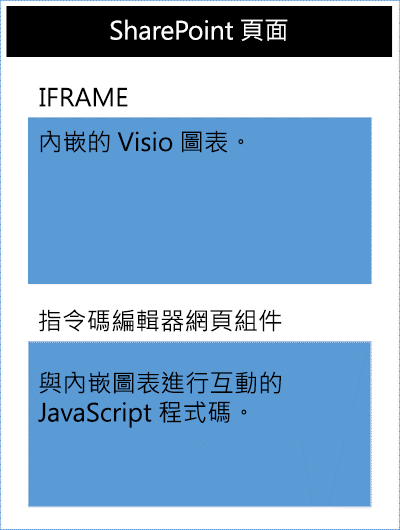

# <a name="visio-javascript-apis-reference"></a>Visio JavaScript API 參考資料

>**附註：**Visio JavaScript API 目前在預覽或生產環境中不提供使用。 

您可以使用 Visio JavaScript API 以在 SharePoint Online 中內嵌 Visio 圖表。內嵌 Visio 圖表是儲存在 SharePoint 文件庫及顯示在 SharePoint 頁面上的圖表。若要內嵌 Visio 圖表，可將圖表顯示在 HTML &lt;Iframe&gt; 元素中。然後，您可以使用 Visio JavaScript API 以程式設計方式與內嵌圖表搭配使用。



您可以使用 Visio JavaScript API 執行下列動作：

* 與 Visio 圖表元素 (如頁面、圖形等) 互動 
* 在 Visio 圖表畫布上建立視覺標記 
* 撰寫適用於繪圖中滑鼠事件的自訂處理常式。 
* 在您的解決方案下公開圖表資料，例如圖形文字、圖形資料和超連結。

本文說明如何透過 Visio Online 使用 Visio JavaScript API 來建立您的 SharePoint Online 解決方案。這會介紹使用 API 的基礎關鍵概念，例如 **EmbeddedContext**、**RequestContext** 和 JavaScript Proxy 物件以及 **sync()**、**Visio.run()** 和 **load()** 方法。此程式碼範例會說明如何套用這些概念。

## <a name="embeddedcontext"></a>EmbeddedContext

EmbeddedContext 物件會初始化開發人員框架和 Visio Online 框架間的通訊。

```js
OfficeExtension.Embedded.getEmbeddedContext({
                sessionInfo: sessionInfo,
                timeoutInMilliseconds: 60000,
                forceRefresh: true
            })
```

## <a name="requestcontext"></a>RequestContext

RequestContext 物件可協助向 Visio 應用程式提出要求。因為開發人員框架與 Visio Online 應用程式是在兩個不同的 Iframe 中執行，因此要取得 Visio 和相關物件 (如頁面和圖形) 的存取權時需要要求內容。下列範例會說明如何建立要求內容。

```js
var ctx = new Visio.RequestContext();
```

## <a name="proxy-objects"></a>Proxy 物件

在增益集中宣告和使用的 Visio JavaScript 物件，是 Visio 文件中實際物件的 Proxy 物件。除非同步處理文件狀態，否則對 Proxy 物件採取的所有動作都不會在 Visio 中實現，而 Visio 文件的狀態也不會在 Proxy 物件中實現。執行 ```context.sync()``` 時就會同步處理文件狀態。

例如，本機 JavaScript 物件 getActivePage 宣告為參考選取的頁面。這可用來佇列其屬性設定以及叫用方法。直到執行 sync() 方法後，才會實現對此類物件執行的動作。

```js
var activePage = ctx.document.getActivePage();
```

## <a name="sync"></a>sync()

要求內容可用的 **sync()** 方法會透過執行在內容中排入佇列的指示以及擷取已載入供程式碼使用之 Office 物件的屬性，來同步處理 JavaScript proxy 物件和 Visio 中實際物件之間的狀態。此方法會傳回承諾，同步處理完成時就會將其解決。 

## <a name="visiorunfunctioncontext--batch-"></a>Visio.run(function(context) { batch })

**Visio.run()** 會執行批次指令碼，以對 Visio 物件模型執行動作。批次命令包括本機 JavaScript proxy 物件的定義，以及同步處理本機、Visio 物件及承諾解決之間狀態的 **sync()** 方法。在 **Visio.run()** 中批次處理要求的優點是，當承諾已解決時，任何在執行期間所配置的追蹤頁面物件就會自動釋出。Run 方法發生在 RequestContext 中，並傳回一項承諾 (通常就是 **ctx.sync()** 的結果)。也有可能在 **Visio.run()** 外部執行批次作業。不過，在這種情況下，將需要手動追蹤並管理頁面物件參考。 

## <a name="load"></a>load()

**Load()** 方法是用於填入在增益集 JavaScript 層中建立的 Proxy 物件。當嘗試擷取物件 (如文件) 時，會先在 JavaScript 層中建立一個本機 Proxy 物件。這種物件可用來佇列其屬性設定以及叫用方法。不過，若要讀取物件屬性或關聯，則需先叫用 **load()** 和 **sync()** 方法。Load() 方法會發生在屬性中以及在呼叫 **sync()** 方法時需要載入的關聯中。

以下會說明 **load** 方法的語法。

```js
object.load(string: properties); //or object.load(array: properties); //or object.load({loadOption});
```

1. **屬性**是要載入的屬性和/或關聯性名稱清單，以逗點分隔的字串或名稱陣列來指定。如需詳細資訊，請參閱每個物件下方的 **.load()** 方法。
2. **loadOption** 指定的物件用於描述 selection、expansion、top 和 skip 選項。如需詳細資訊，請參閱物件載入[選項](loadoption)。

## <a name="example-printing-all-shapes-text-in-active-page"></a>範例：列印使用中頁面的所有圖形文字

下列範例會說明如何從陣列圖形物件列印圖形文字值。**Visio.run()** 方法包含指示批次。作為此批次的一部分，Proxy 物件會建立來參考使用中文件的圖形。所有這些命令都會排入佇列，並在呼叫 **ctx.sync()** 後執行。 **sync()** 方法會傳回一項可用來將其鏈結至其他作業的承諾。

```js
Visio.run(function (ctx) {
   var page = ctx.document.getActivePage();
   var shapes = page.shapes;
   shapes.load();
   return ctx.sync().then(function () {
        for(var i=0; i<shapes.items.length;i++)
 {
            var shape = shapes.items[i];
     console.log("Shape Text: " + shape.text );
 }
});
}).catch(function(error) {
  richApiLog("Error: " + error);
  if (error instanceof OfficeExtension.Error) {
       console.log ("Debug info: " + JSON.stringify(error.debugInfo));
  }
});
```

## <a name="error-messages"></a>錯誤訊息

傳回錯誤時是使用包含代碼和訊息的 error 物件來傳回。下表提供可能發生的錯誤狀況清單。

| error.code            | error.message |
|-----------------------|----------------------------------------------------------------|
|  InvalidArgument      | 引數無效或遺失，或格式不正確。 |
| GeneralException      | 處理要求時發生內部錯誤。 |
| NotImplemented        | 要求的功能未實作。  |
| UnsupportedOperation  | 不支援所嘗試的操作。 |
| AccessDenied          | 您不能執行要求的作業。 |
| ItemNotFound          | 要求的資源不存在。 |

## <a name="get-started"></a>開始使用

您可以使用本節中的範例來開始使用。此範例將說明如何顯示選取圖形的圖形文字。若要開始，請在 SharePoint Online 內建立頁面，或編輯現有頁面。在頁面上新增指令碼編輯器網頁組件，然後複製並貼上下列程式碼。然後，您只需要新增儲存在 SharePoint Online 中的 Visio 圖表 URL。

```js
<script src='https://visioonlineapi.azurewebsites.net/visio.embed.js' type='text/javascript'/> </script> 
 
Enter Visio File Url:<br/> 
<script language="javascript"> 
document.write("<input type='text' id='fileUrl' size='120'/>"); 
document.write("<input type='button' value='InitEmbeddedFrame' onclick='initEmbeddedFrame()' />"); 
document.write("<br />"); 
document.write("<input type='button' value='SelectedShapeText' onclick='getSelectedShapeText()' />"); 
document.write("<textarea id='ResultOutput' style='width:350px;height:60px'> </textarea>"); 
document.write("<div id='iframeHost' />"); 
 
var textArea; 
// Loads the Visio application and Initializes communication between developer frame and Visio online frame 
function initEmbeddedFrame() { 
        textArea = document.getElementById('ResultOutput'); 
 var sessionInfo = Math.random().toString(); 
 var origin = window.location["origin"] || window.location.protocol + "//" + window.location.host; 
 var iframeElement =  document.createElement("iframe"); 
 iframeElement.id = "embed-iframe"; 
 iframeElement.style.height = "900px"; 
 iframeElement.style.width = "100%"; 
 var url = document.getElementById('fileUrl').value; 
 if (!url) { 
     window.alert("File URL should not be empty"); 
 } 
 // APIs are enabled for EmbedView action only.    
 url = url.replace("action=view","action=embedview"); 
 url = url.replace("action=interactivepreview","action=embedview"); 
     
 iframeElement.src = url + "&EmbeddingPageOrigin=" + encodeURIComponent(origin) + "&EmbeddingPageSessionInfo=" + encodeURIComponent(sessionInfo); 
     // load the Visio online application in Iframe     
 document.getElementById("iframeHost").appendChild(iframeElement);   
          
      OfficeExtension.Embedded.getEmbeddedContext({ 
      sessionInfo: sessionInfo, 
     timeoutInMilliseconds: 60000, 
      forceRefresh: true 
 }).then(function (context) { 
     // Initilization is successful  
     OfficeExtension.Embedded._initInternalConfiguration("webembedrichapi.debug.js"); 
     textArea.value  = "Initilization is successful"; 
  }).catch(function (ex) { 
           // Initilization is failed :-( 
     textArea.value  = "Initilization is failed :-("; 
        }); 
     } 
 
// Code for getting selected Shape Text using the shapes collection object 
function getSelectedShapeText() { 
    Visio.run(function (ctx) {   
    var page = ctx.document.getActivePage(); 
     var shapes = page.shapes; 
       shapes.load(); 
           return ctx.sync().then(function () { 
          textArea.value = "Please select a Shape in the Diagram"; 
          for(var i=0; i<shapes.items.length;i++) 
      { 
         var shape = shapes.items[i]; 
                if ( shape.select == true) 
            { 
             textArea.value = shape.text; 
                 return; 
                } 
      } 
   }); 
     }).catch(function(error) { 
  textArea.value = "Error: "; 
  if (error instanceof OfficeExtension.Error) { 
   textArea.value += "Debug info: " + JSON.stringify(error.debugInfo); 
  } 
    }); 
} 
</script>
```

## <a name="open-api-specifications"></a>開放式 API 規格

我們設計和開發新 API 時，會將其放在[開放式 API 規格](https://dev.office.com/reference/add-ins/openspec)頁面中，可供您提出意見反應。了解即將推出的新功能，並對我們的設計規格提出意見反應。 
