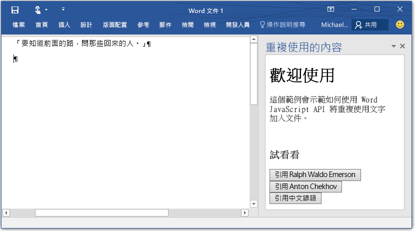

# Word 增益集

_適用版本：Word 2016、Word for iPad、Word for Mac_

歡迎使用 Word 增益集 JavaScript API 文件。Word JavaScript API 屬於 Office 增益集程式設計模型的一部分，用於延伸 Microsoft Office 應用程式。增益集程式設計模型會使用 Web 應用程式來將您的延伸模組裝載至 Word。您現在可以利用您偏好的任何 Web 平台或語言來延伸 Word。 

## API 概觀

在我們開始詳細解說適用於 Word 的 JavaScript API 之前，請務必了解這個新的 Word 增益集物件模型不同於 Office 2013 中的 Word 模型。Office 2013 增益集模型不具型別，同時提供可延伸 Office 用戶端的泛型 API。舊模型仍然適用於 Word 2016，但我們也建議您可以開始使用新的 Word 物件模型。如果還不熟悉增益集平台，建議您先閱讀[平台概觀](https://msdn.microsoft.com/EN-US/library/office/jj220082.aspx)。 

全新的適用於 Word 的 JavaScript API 改變了您與文件、段落等物件互動的方式。新的 API 不是提供個別非同步 API 來擷取和更新各物件，而是提供對應到 Word 中執行之實際物件的「代理」("proxy") JavaScript 物件。您可以直接與這些 proxy 物件互動，方法是同步讀取和寫入其屬性，以及呼叫同步方法以在其上執行作業。與 proxy 物件的互動不會在執行中指令碼內立即實現，因此我們提供一個稱為 **sync()** 的 context 方法。此 context.sync 方法會透過執行在指令碼中排入佇列的指示以及擷取已載入供指令碼使用之 Word 物件的屬性，來同步處理執行中 JavaScript 和 Office 中實際物件之間的狀態。  

## 建立第一個 Word 增益集

Word 增益集在 Word 內執行，並可使用 Word 2016 提供的新 Word JavaScript API 來與文件內容互動。在幕後，建立增益集包含兩個部分：1) 可裝載於任何地方的 Web 應用程式，以及 2) Word 用來探索 Web 應用程式裝載位置的[增益集資訊清單](https://msdn.microsoft.com/EN-US/library/office/fp161044.aspx) (資訊清單所提供的資訊不只於此，您可以在[程式設計概觀](word-add-ins-programming-guide.md)中閱讀更多資訊)。

&gt;**Word 增益集 = manifest.xml + Web 應用程式**

### 進行設定
本節中，您將建立一個簡單 Web 應用程式以及應用程式資訊清單。此 Web 應用程式可讓您在 Word 文件中加入重複使用文字。 

1- 在本機磁碟機上建立名為 BoilerplateAddin 的的資料夾 (例如 C:\\BoilerplateAddin)。將下列步驟建立的所有檔案儲存至這個資料夾。

2- 為增益集檢視建立名為 home.html 的檔案。此增益集將有三個按鈕，選取按鈕時就會加入重複使用文字。將下列程式碼貼至 home.html 中。

```html
    <!DOCTYPE html>
    <html>
      <head>
        <meta charset="UTF-8" />
        <meta http-equiv="X-UA-Compatible" content="IE=Edge" />
        <title>Boilerplate text app</title>    
        <script src="https://ajax.aspnetcdn.com/ajax/jQuery/jquery-2.1.4.min.js"></script>
        <script src="https://appsforoffice.microsoft.com/lib/1/hosted/office.js" type="text/javascript"></script>
        <script src="home.js" type="text/javascript"></script>
        </head>
        <body>
            <div>
                    <h1>Welcome</h1>
            </div>
            <div>
                    <p>This sample shows how to add boilerplate text to a document by using the Word JavaScript API.</p>
                    <br />
                    <h3>Try it out</h3>
                    <button id="emerson">Add quote from Ralph Waldo Emerson</button>
                    <button id="checkhov">Add quote from Anton Chekhov</button>
                    <button id="proverb">Add Chinese proverb</button>
            </div>
            <h3><div id="supportedVersion"/></h3>
        </body>
    </html>
```

3- 建立名為 home.js 的檔案，並將下列程式碼貼至該檔案中。這裡包含初始化程式碼，以及可在 Word 文件中進行變更的所有增益集程式碼。這段程式碼會根據游標或 Word 文件中的選取範圍而插入文字。 

```javascript
    (function () {
        "use strict";

        // The initialize function is run each time the page is loaded.
        Office.initialize = function (reason) {
            $(document).ready(function () {
                
                // Use this to check whether the API is supported in the Word client.
                if (Office.context.requirements.isSetSupported('WordApi', 1.1)) {
                    // Do something that is only available via the new APIs
                    $('#emerson').click(insertEmersonQuoteAtSelection);
                    $('#checkhov').click(insertChekhovQuoteAtTheBeginning);
                    $('#proverb').click(insertChineseProverbAtTheEnd);
                    $('#supportedVersion').html('This code is using Word 2016 or greater.');
                }
                else {
                    // Just letting you know that this code will not work with your version of Word.
                    $('#supportedVersion').html('This code requires Word 2016 or greater.');
                }    
            });
        };

        function insertEmersonQuoteAtSelection() {
            Word.run(function (context) {

                // Create a proxy object for the document.
                var thisDocument = context.document;

                // Queue a command to get the current selection. 
                // Create a proxy range object for the selection.
                var range = thisDocument.getSelection();

                // Queue a command to replace the selected text.
                range.insertText('"Hitch your wagon to a star."\n', Word.InsertLocation.replace);

                // Synchronize the document state by executing the queued commands, 
                // and return a promise to indicate task completion.
                return context.sync().then(function () {
                    console.log('Added a quote from Ralph Waldo Emerson.');
                });  
            })
            .catch(function (error) {
                console.log('Error: ' + JSON.stringify(error));
                if (error instanceof OfficeExtension.Error) {
                    console.log('Debug info: ' + JSON.stringify(error.debugInfo));
                }
            });
        }

        function insertChekhovQuoteAtTheBeginning() {
            Word.run(function (context) {

                // Create a proxy object for the document body.
                var body = context.document.body;

                // Queue a command to insert text at the start of the document body.
                body.insertText('"Knowledge is of no value unless you put it into practice."\n', Word.InsertLocation.start);

                // Synchronize the document state by executing the queued commands, 
                // and return a promise to indicate task completion.
                return context.sync().then(function () {
                    console.log('Added a quote from Anton Chekhov.');
                });  
            })
            .catch(function (error) {
                console.log('Error: ' + JSON.stringify(error));
                if (error instanceof OfficeExtension.Error) {
                    console.log('Debug info: ' + JSON.stringify(error.debugInfo));
                }
            });
        }    

        function insertChineseProverbAtTheEnd() {
            Word.run(function (context) {

                // Create a proxy object for the document body.
                var body = context.document.body;

                // Queue a command to insert text at the end of the document body.
                body.insertText('"To know the road ahead, ask those coming back."\n', Word.InsertLocation.end);

                // Synchronize the document state by executing the queued commands, 
                // and return a promise to indicate task completion.
                return context.sync().then(function () {
                    console.log('Added a quote from a Chinese proverb.');
                });  
            })
            .catch(function (error) {
                console.log('Error: ' + JSON.stringify(error));
                if (error instanceof OfficeExtension.Error) {
                    console.log('Debug info: ' + JSON.stringify(error.debugInfo));
                }
            });
        }    
    })();
```

4- 建立名為 BoilerplateManifest.xml 的 XML 檔案，並將下列程式碼貼至該檔案中。這是 Word 用來探索增益集相關資訊 (例如其位置或顯示名稱) 的資訊清單檔案。
```xml
<?xml version="1.0" encoding="UTF-8"?>
    <OfficeApp xmlns="http://schemas.microsoft.com/office/appforoffice/1.1" 
               xmlns:xsi="http://www.w3.org/2001/XMLSchema-instance" 
               xsi:type="TaskPaneApp">
        <Id>2b88100c-656e-4bab-9f1e-f6731d86e464</Id>
        <Version>1.0.0.0</Version>
        <ProviderName>Microsoft</ProviderName>
        <DefaultLocale>en-US</DefaultLocale>
        <DisplayName DefaultValue="Boilerplate content" />
        <Description DefaultValue="Insert boilerplate content into a Word document." />
        <Hosts>
            <Host Name="Document"/>
        </Hosts>
        <DefaultSettings>
            <SourceLocation DefaultValue="\\MyShare\boilerplate\home.html" />
        </DefaultSettings>
        <Permissions>ReadWriteDocument</Permissions>
    </OfficeApp>
```

5- 產生 GUID，並使用您的 GUID 取代 <code>OfficeApp/Id</code> 項目中的值。

6- 儲存所有檔案。您現在已寫好第一個 Word 增益集了。 

7- 建立網路資料夾 (例如 \\\MyShare\boilerplate) 或[對網路共用資料夾](https://technet.microsoft.com/zh-tw/library/cc770880.aspx)，並將 home.js、home.html 和 BoilerplateManifest.xml 複製到該位置。

8- 編輯 BoilerplateManifest.xml 中的 <code>SourceLocation</code> 項目，讓它指向 home.html 的位置。 

到目前為止，您已部署好您的第一個增益集。現在，您需要讓 Word 知道哪裡可以找到此增益集。

1. 啟動 Word 並開啟一個文件。
2. 選擇 [檔案]<e /> 索引標籤，然後選擇 [選項]<e />。
3. 選擇 [信任中心]<e />，然後選擇 [信任中心設定]<e /> 按鈕。
4. 選擇 [受信任的增益集目錄]<e />。
5. 在 [目錄 URL]<e /> 方塊中，輸入包含 BoilerplateManifest.xml 的資料夾共用的路徑，然後選擇 [新增目錄]<e />。
6. 選取 [顯示於功能表中]<e /> 核取方塊，然後選擇 [確定]<e />。
7. 接著會顯示訊息，通知您下次啟動 Office 時就會套用您的設定。關閉並重新啟動 Word。 

### 進行測試

現在您可以執行您建立的增益集了。依照下列步驟，查看它如何運作：

1. 開啟 Word 文件。 
2. 在 Word 2016 的 [插入]<e /> 索引標籤上，選擇 [我的增益集]<e />。 
3. 選取 [共用資料夾]<e /> 索引標籤。
4. 選擇 [Boilerplate content]<e />，然後選取 [插入]<e />。
5. 增益集會在一個工作窗格中載入。請參閱圖 1，了解其載入後的外觀。
6. 選取按鈕，即可將重複使用文字輸入 Word 文件中。


**圖 1. 載入至 Word 的 Boilerplate content 增益集。**


## Learn more

閱讀 [Word 增益集程式設計指南](word-add-ins-programming-guide.md)，深入了解如何延伸 Word。閱讀 [Word 增益集 JavaScript 參考](word-add-ins-javascript-reference.md)，深入了解您可以存取的物件。

## 歡迎您提供意見

我們很重視您的意見。 

* 查看文件，並在此存放庫中直接[送出問題](https://github.com/OfficeDev/office-js-docs/issues)，即可告知我們您找到的任何問題。
* 請告訴我們您的程式設計經驗、您希望未來版本提供哪些功能、程式碼範例等等。使用[這個網站](http://officespdev.uservoice.com/)可輸入您的建議和想法。

## 其他資源

* [Office 增益集](https://msdn.microsoft.com/en-us/library/office/jj220060.aspx)
* [Office 增益集入門](http://dev.office.com/getting-started/addins)
* &lt;a herf="https://github.com/OfficeDev?utf8=%E2%9C%93&amp;query=Word"&gt;GitHub 上的 Word 增益集&lt;/a&gt;
